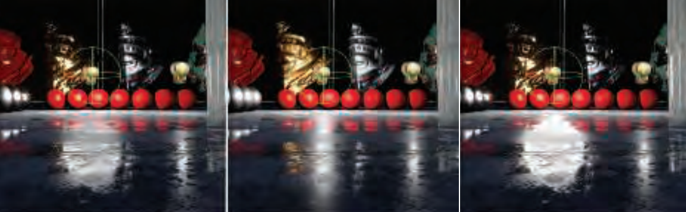

# Chapter 10 局部光照

迄今为止，我们只讨论了点光源和方向光源。现实中的光源更加复杂。例如，由于太阳光的散射，天空也是一种重要的光源。其重要性参考下图的月球（没有天空光）：

现实中没有精确光源。为了更精确地模拟现实光源，我们需要在表面半球上对BRDF进行积分。在实时渲染中，我们更倾向于通过找到闭式解或者近似解来解决积分问题。我们通常会避免对多个采样（射线）进行平均，因为这种方法很慢。如下图：

本章将BRDF的计算拓展到非精确光源。这通常需要近似光发射器和BRDF。我们也需要一个感知框架来评估最终的着色结果。

我们首先从面积光源开始。这种光源在场景中占主要地位，贡献了绝大多数的光强度。对于这种光源，阴影也需要特别计算，否则会发生光泄露。我们之后探讨任意光环境的表达方式，它包含了入射半球上的任意分布。在这种情况下，我们可以接受更大程度的近似。环境光用于大的，复杂的，不太亮的光，例如天空，云，和间接光（*indirect light*）。缺少这种光源，场景会变得太暗。注意，即使我们考虑了间接光，我们仍然不在全局光照（*global illumination*）的领域内。全局光照需要直到场景中其他表面的信息。

## 10.1 面积光源

下图显示了精确光源和面积光源的区别：

左图的光源使用了【s9.4】中的定义。其光方向是$\mathbf{l}_{c}$。其亮度使用其颜色$\mathbf{c}_{light}$表示。点光源或者方向光源在$\mathbf{v}$方向贡献的出射辐射率$L_{o}(\mathbf{v})$是$\pi f\left(\mathbf{l}_{c}, \mathbf{v}\right) \mathbf{c}_{\text {light }}\left(\mathbf{n} \cdot \mathbf{l}_{c}\right)^{+}$。右图中，面积光源的亮度是$L_{l}$。面积光源朝表面位置的方向形成了一个立体角$\omega_{l}$。其在$\mathbf{v}$方向贡献的出射辐射率是$f(l, \mathbf{v}) L_{l}(\mathbf{n} \cdot l)^{+}$在$\omega_{l}$上的积分。

精确光源使用的一个基本近似如下：
$$L_{o}(\mathbf{v})=\int_{l \in \omega_{l}} f(\mathbf{l}, \mathbf{v}) L_{l}(\mathbf{n} \cdot \mathbf{l})^{+} d \mathbf{l} \approx \pi f\left(\mathbf{l}_{c}, \mathbf{v}\right) \mathbf{c}_{\operatorname{light}}\left(\mathbf{n} \cdot \mathbf{l}_{c}\right)^{+}$$

面积光源对于表面位置的照明的贡献是其辐射率$L_{l}$和尺寸$\omega_{l}$的函数。点光和方向光在现实中无法实现的原因是其立体角为零，这意味着无限的辐射率。理解这种近似所造成的视觉误差可以帮助我们知道何时使用它们，以及不能使用的时候该用什么策略。这些误差基于两个因素：光源的大小，使用立体角衡量，以及表面的光滑度。

下图显示了高光的尺寸和形状依赖于材质的粗糙度和光源的尺寸。从左到右，材质的粗糙度增加，使用GGX BRDF。最右面的图是最左面图的复制，但是上下颠倒。可以看到，大尺寸圆盘光在一个低粗糙度的材质上形成的高光与小尺寸光源在一个高粗糙度的材质上形成的高光很近似。

当光源比较小，或者材质比较粗糙时，光源尺寸的影响比较小。通常，射向表面某一点的面积光和表面BRDF的镜叶都是球函数。视觉错误中的决定性因素正比于出射角相对于BRDF镜面高光立体角的尺寸。

面积光源产生的高光可以通过使用精确光源和提升表面粗糙度来近似。这解释了为什么一些只使用精确光源的实时渲染应用可以产生不错的结果：美术弥补了这一错误。但是这种做法是是有害的，因为它将材质属性和特定的光源设定绑定起来。当光照场景改变时，效果就会变化。

对于特殊的兰伯特表面，使用点光源来代替面积光可以获得准确的结果。对于这种表面，出射辐射率正比于辐照度：
$$L_{o}(\mathbf{v})=\frac{\rho_{\mathrm{ss}}}{\pi} E$$

其中$\rho_{\mathrm{ss}}$是表面的次表面散射率，也叫漫反射颜色【s9.9.1】。这一关系使得计算辐照度的过程大大简化：
$$E=\int_{1 \in \omega_{l}} L_{l}(\mathbf{n} \cdot \mathbf{l})^{+} d \mathbf{l} \approx \pi \mathbf{c}_{\operatorname{light}}\left(\mathbf{n} \cdot \mathbf{l}_{c}\right)^{+}$$

向量辐照度（*vector irradiance*）对于理解面积光下辐照度的行为很有用。它原先叫光向量（*light vector*）。使用向量辐照度，任意尺寸和形状的面积光都可以被准确转换为一个点光源或者方向光源。

想象一个辐射率$L_i$的分布进入空间中的一点$\mathbf{p}$。如下图：

我们假定$L_i$是波长独立的，因此可以用一个标量来表示。一个入射方向$\mathbf{l}$对应一个无限小的立体角$d\mathbf{l}$。对于每一个入射方向，我们构造一个向量，它跟$\mathbf{l}$对齐，长度等于辐射率（标量）和$d\mathbf{l}$的乘积。最后，所有这些向量加起来就得到了向量辐照度$\mathbf{e}$：
$$\mathbf{e}(\mathbf{p})=\int_{l \in \Theta} L_{i}(\mathbf{p}, l) 1 d \mathbf{l}$$

其中$\Theta$表示对整个球进行积分。

向量辐照度$\mathbf{e}$可以用来得到穿过任意朝向平面上一点$\mathbf{p}$的最终辐照度：
$$E(\mathbf{p}, \mathbf{n})-E(\mathbf{p},-\mathbf{n})=\mathbf{n} \cdot \mathbf{e}(\mathbf{p})$$

其中$\mathbf{n}$是平面的法向量。穿过一个平面的最终辐照度等于正面的辐照度流减去背面的辐照度流。最终辐照度本身并不能用于着色。但是，如果背面没有射出辐射率，那么$E(\mathbf{p},-\mathbf{n})=0$，并且：
$$E(\mathbf{p}, \mathbf{n})=\mathbf{n} \cdot \mathbf{e}(\mathbf{p})$$

图示如下：

如果$L_i$是波长独立的假设不成立，那么我们无法定义单个向量$\mathbf{e}$。但是，通常有色灯光在所有点处的光谱分布相同，因此我们可以将$L_i$分解为一个颜色$c'$和一个波长独立的辐射率分布$L_{i}^{\prime}$。这样我们计算$L_{i}^{\prime}$的$\mathbf{e}$，并拓展上式，用$c'$乘以$\mathbf{n} \cdot \mathbf{e}$。然后使用下式将任意的面积光转换成一个方向光：
$$\begin{aligned}
\mathrm{I}_{c} &=\frac{\mathbf{e}(\mathbf{p})}{\|\mathbf{e}(\mathbf{p})\|} \\
\mathbf{c}_{\text {light }} &=\mathbf{c}^{\prime} \frac{\|\mathbf{e}(\mathbf{p})\|}{\pi}
\end{aligned}$$

对于一个球形光，中心在$\mathbf{p}_l$，半径是$r_l$。球面上每一点朝所有方向发射恒定的辐射率$\mathbf{L}_l$。有：
$$\begin{aligned}
\mathrm{l}_{c} &=\frac{\mathbf{p}_{l}-\mathbf{p}}{\left\|\mathbf{p}_{l}-\mathbf{p}\right\|} \\
\mathbf{c}_{\text {light }} &=\frac{r_{l}^{2}}{\left\|\mathbf{p}_{l}-\mathbf{p}\right\|^{2}} L_{l}
\end{aligned}$$

上面的讨论要求背面没有辐照度。如果要将遮挡考虑在内的话会很复杂。

之前看到，面积光对于粗糙表面的影响很小。这允许我们使用一种不太符合物理但是更加高效的方法来建模兰伯特表面的面积光效果：*wrap lighting*。在这种技术中，$\mathbf{n} \cdot \mathbf{l}$的值在截断前会做简单的修改。如：
$$E=\pi \mathbf{c}_{\text {light }}\left(\frac{(\mathbf{n} \cdot \mathbf{l})+k_{\text {wrap }}}{1+k_{\text {wrap }}}\right)^{+}$$

其中$k_{\text {wrap }}$从0（表示点光源）到1（覆盖整个半球的面积光）。另一种模拟大范围面积光的方法是：
$$E=\pi \mathbf{c}_{\text {light }}\left(\frac{(\mathbf{n} \cdot \mathbf{l})+1}{2}\right)^{2}$$

通常，当计算面积光时，我们也要修改阴影的计算。

### 10.1.1 光滑材质

面积光对非兰伯特表面的影响更加复杂。实际中需要近似。

面积光对光滑材质的影响主要是高光。高光的尺寸和形状与面积光类似，高光的边缘依据表面的粗糙度呈现模糊。这产生许多经验上的近似。例如，可以修改高光计算，增加一个阈值来创造一个更大的平坦的高光。这对球形光很有效，如下图。光滑物体的高光更加锐利。左图使用了近似，右图没有近似。

绝大多数在实时渲染中实际使用的面积光的近似基于如下思想：对于每一个着色点，找到一个等价的精确光设定，来模拟面积光的效果。这种近似方法通常很廉价，因为只要修改着色方程的输入。

一种早期的近似是粗糙度修改（*roughness modication*），用于Unreal的Elemental demo。示例图如下，原理见原文。

将上述思想应用于GGX/TrowbridgeReitz BRDF和一个球形面积光，得到如下的粗糙度修改：
$$\alpha_{g}^{\prime}=\left(\alpha_{g}+\frac{r_{l}}{2\left\|\mathbf{p}_{l}-\mathbf{p}\right\|}\right)^{\mp}$$

该近似效果不错，计算量很小。但是对于光泽的近似镜面的材质近似效果不佳。效果图如下。从左到右分别是使用数值积分的参考效果，粗糙度修改技术和代表点技术。

除了修改粗糙度，另一种方法是使用一个随着色点不同而变化的光方向来表达面积光。这叫做最佳代表点（*most representative point*）。它修改光向量，使得其朝向面积光源上对着色点贡献最多能量的点。一些方法见原文。相关图示如下：

最佳代表点技术很方便，被用于多种光源形状。需要理解其背后的理论基础。这些方法类似于蒙特卡洛积分中的重要性采样（*importance sampling*），即对积分域上的多个采样进行平均来计算定积分的数值解。一个更加严格的解释依赖于定积分的均值定理（*mean value theorem*），详见原文。

一些改进见原文。

### 10.1.2 一般光源形状

现实世界的光源通常不是球形的，也不是均匀发光体，如下图：

一种对球形光的最简单的拓展是灯管，如下图：

对于兰伯特BRDF，光照积分有一个闭式解，其等价于计算灯管两端的两个使用合适的衰减方程的点光的光照：
$$\int_{\mathbf{p}_{0}}^{\mathbf{p}_{1}}\left(\mathbf{n} \cdot \frac{\mathbf{x}}{\|\mathbf{x}\|}\right) \frac{1}{\|\mathbf{x}\|^{2}} d \mathbf{x}=\frac{\frac{\mathbf{n} \cdot \mathbf{p}_{0}}{\left\|\mathbf{p}_{0}\right\|^{2}}+\frac{\mathbf{n} \cdot \mathbf{p}_{1}}{\left\|\mathbf{p}_{1}\right\|^{2}}}{\left\|\mathbf{p}_{0}\right\|\left\|\mathbf{p}_{1}\right\|+\left(\mathbf{p}_{0} \cdot \mathbf{p}_{1}\right)}$$

其中$\mathbf{p}_{0}$和$\mathbf{p}_{1}$是灯管的两个端点，$\mathbf{n}$是表面法向量。

其他光源形状的代表点近似可以很容易地计算出来，如环形和贝塞尔线段。但是我们不想在shader中引入过多的分支。一些好的光源形状可以表示多种实际光源。其中最重要的就是平面面积光（*planar area lights*）。它可以用于广告牌，电视机屏幕，柔光箱，反光板，甚至是一些更加复杂的光源。

一种卡片光（*card lights*）的近似使用了代表点技术。原理见原文，图示如下：

对于多边形面积光（*polygonal area lights*），也有相应的解法，见原文。另一种方法使用了LTCs（*linearly transformed cosines*）。详见原文。相关图示如下：

以及：

LTCs比代表点技术计算量更大，但是结果更加准确。

## 10.2 环境光照

环境光对场景效果的影响很大，见下图：

注意，我们这里讨论的间接光照和环境光照并不在全局光照的范围内。

背景光（*ambient light*）是对环境光照的最简单的建模，其辐射率恒定为$L_A$。即使是这种最简单的形式也会大大提高图像的质量。

背景光的精确效果依赖于BRDF。对于兰伯特表面，固定的辐射率$L_A$意味着贡献固定的出射辐射率：
$$L_{o}(\mathbf{v})=\frac{\rho_{\mathrm{ss}}}{\pi} L_{A} \int_{\mathrm{I} \in \Omega}(\mathbf{n} \cdot \mathbf{l}) d \mathbf{l}=\rho_{\mathrm{ss}} L_{A}$$

当计算着色时，这一固定出射辐射率贡献可以被加到直接光源的贡献中。对于任意的BRDF，等价方程是：
$$L_{o}(\mathbf{v})=L_{A} \int_{l \in \Omega} f(\mathbf{l}, \mathbf{v})(\mathbf{n} \cdot \mathbf{l}) d \mathbf{l}$$

该方程的积分等于方向反射率$R(\mathbf{v})$【s9.3】。因此上式等价于$L_{o}(\mathbf{v})=L_{A} R(\mathbf{v})$。早期的实时渲染应用中假定$R(\mathbf{v})$是定值，叫做背景颜色（*ambient color*）$\mathbf{c}_{amb}$。这进一步将方程简化为$L_{o}(\mathbf{v})=\mathbf{c}_{\mathrm{amb}} L_{A}$。

该反射方程忽略了遮挡，这会减少一些现实感，这对环境光照尤其明显。下一章会讨论解决办法。

## 10.3 球函数和半球函数

为了拓展环境光照，我们需要一种方式来表达从任意方向射入某一点的辐射率。这使用球函数（*spherical functions*）表示。与此相关的是半球函数（*hemisphere functions*），适用于平面背面没有入射辐射率的情况。

我们把这些表达方式叫做球基（*spherical bases*）。将一个函数转换为一个给定的表达叫做投影（*projection,*），从给定的表达计算函数的值叫做重建（*reconstruction.*）。

每种表达都有自己的优缺点。

### 10.3.1 简单表格形式

这种方式最直接。它选择几个方向，存储其值。计算函数的过程就是找到一些采样然后插值。只要采样点足够多，误差可以任意小。但是，在球面上确定采样的分布不是简单是事情，如下图：

表格形式缺点很多，只适用于复杂高频且允许误差很小的函数。相关的技术有AC（*ambient cube*）和AD（*ambient dice*）。见原文。

### 10.3.2 球基

通常，当讨论函数空间的基时，意思是，我们有一个函数集合，这些函数的线性组合（加权相加）可以用来表达给定域上的其他函数。例子如下：

#### 球状径向基函数

SRBFs（*spherical radial basis functions*）。

#### 球状高斯

SG（*spherical Gaussian*，*von Mises-Fisher distribution*）。

#### 球谐

SH（*Spherical harmonics*）。图示：

以及：

#### 其他球形表达

略

### 10.3.3 半球基

略

## 10.4 环境影射

略