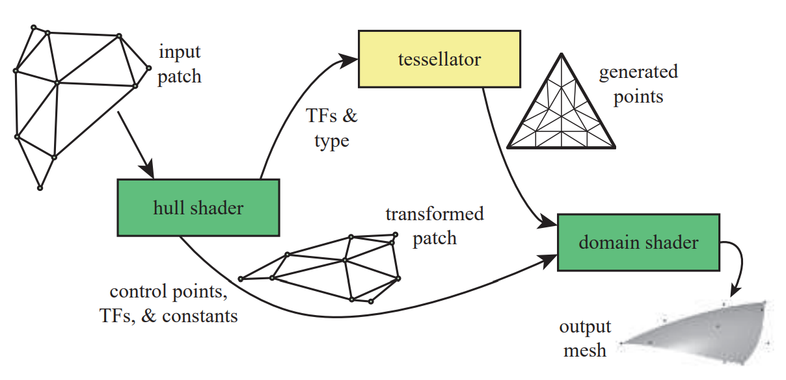
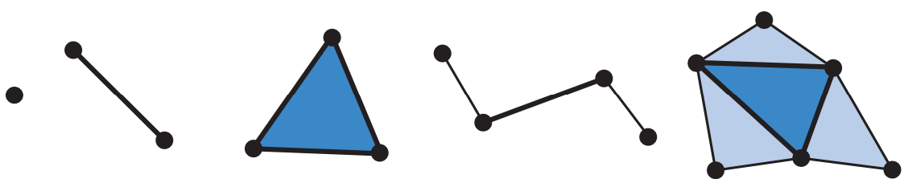
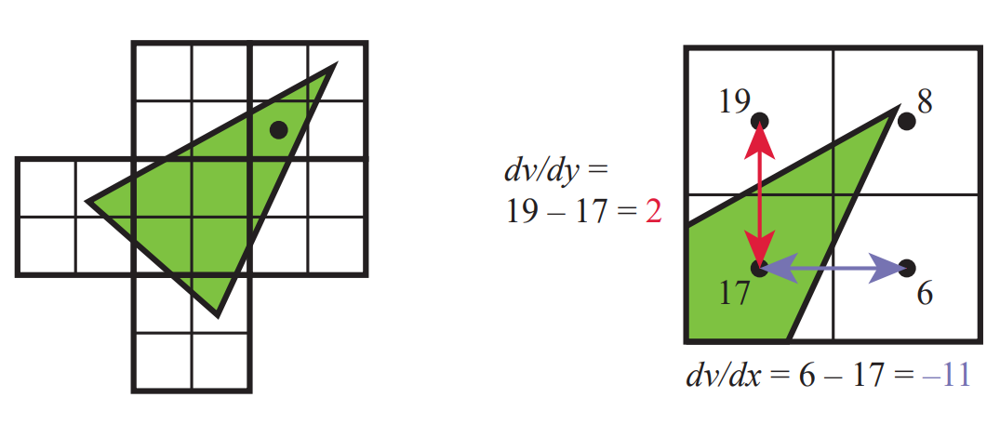

# Chapter 3 GPU

GPU正向着可编程性和灵活性发展。GPU通过大规模并行化实现高速计算。一个着色器核心就是一个小的处理器，可以执行一些行对独立的任务。延迟是每个处理器都要面对的问题。存取内存中的数据比存取局部寄存器中的数据耗时更长。

## 3.1 数据并行结构

CPU有许多优化策略：多核，SIMD，Cache，分支预测，指令重排，寄存器重定向，Cache预获取【r715】.

GPU采用不同的策略。GPU芯片含有大量的处理器，叫做着色器核心，数量可达上千个。GPU是流式处理器，相似的数据轮流被处理。正是由于这种相似性，GPU可以以大规模并行的方式处理这些数据。另一个重要的元素是，这些处理任务彼此相互独立，不需要等待对方的结果，或者是共享内存。

GPU的优化目标是吞吐量，即处理数据的最大速度。然而，由于缓冲内存和控制逻辑的减少，每个着色器核心的延迟通常要比CPU高得多【r462】。

假设要处理2000个像素，一个像素着色器需要被调用2000次。假设有一个GPU，只有一个着色器核心。该着色器核心在本地寄存器上进行数学运算。寄存器速度极快，不会有延迟。之后着色器核心遇到一个纹理采样指令。纹理是不同的资源，不在局部寄存器中。从内存中获取纹理资源会消耗成百上千的时钟周期。在此期间处理器闲置。为了改善这种情况，每个像素被赋予一定的存储空间来存储寄存器中的数据。当遇到纹理获取指令时，着色器核心切换到另一个像素继续执行。切换的速度很快。同样，着色器核心会在遇到纹理资源获取时再次切换到第3个像素。当所有2000个像素像这样被处理后，着色器核心返回第1个像素。此时纹理资源获取完毕，着色器程序继续执行，直到遭遇另一个可能导致延迟的指令，或者程序执行完毕。这样一来，虽然每个像素的执行时间变长了，但是总的执行时间大大减少。

在上述结构中，通过使GPU保持忙碌来减少延迟。GPU通过将指令执行逻辑与数据分割来进一步拓展这一设计思想。SIMD，单指令多数据，以同步方式在固定数量的着色器程序上执行相同的指令。SIMD的优势是用于处理数据和切换的晶体管（和能量）更少。将上述2000像素的例子转换到现代GPU上，那么每个像素着色器调用就是一个线程。该线程与CPU上线程意义不同。它包含一些用于存储输入数据的内存和用于计算的寄存器。运行同一个着色器程序的线程被打包成组，叫做*warps*（NVIDIA）或者*wavefronts*（AMD）。一个*warps*使用SIMD运行在8到64个着色器核心上。每个线程被映射到一个SIMD通道上。

现在有$2000$个像素需要处理。在NVIDIA GPU上，一个*warps*包含32个线程。这需要$2000 / 32=62.5$个*warps*，也即$63$个*warps*。每个*warps*的执行方式与上述单GPU处理器的例子基本类似。着色器程序在32个处理器上同步执行。当遭遇内存获取指令时，该*warps*切换到另外32个线程。这32个处理器会执行另外32个线程。切换的速度很快，因为每个线程的数据不需要变动。每个线程有自己的寄存器，每个*warps*追踪当前执行的指令。切换只是让这些处理器执行不同的线程集合而已，没有其他的消耗。在我们的例子中纹理获取或导致切换，二实际情况下更短的延迟也会造成切换，因为切换的消耗非常小。

着色器程序的结构会显著影响性能。一个主要的因素就是每个线程使用的寄存器数量。在我们的例子中2000个线程同时驻留在GPU上。然而，每个着色器程序需要的寄存器越多，能够贮存的线程和*warps*就越少。过少的*warps*意味着延迟不能通过切换来解决。贮存的*warps*的数量被称作占有量。占有量越低，性能越差。内存获取的频率也会影响性能。【r993】概述了着色器使用的寄存器的数量和共享内存的大小如何影响占有量。【r1911，1914】讨论了最佳占有量如何依赖于着色器进行的操作类型。

另一个影响性能的因素时动态分支，也就是“if”语句和循环。这回产生线程分歧问题。

## 3.2 GPU管线概述

GPU实现第2章描述的几何处理，光栅化和像素处理这3个功能性阶段。一个逻辑模型如下：

注意，逻辑模型与物理模型不一样。物理模型依赖于具体厂商的实现。顶点着色器是完全可编程的，用来实现几何处理阶段。几何着色器也是完全和编程的。它操作原型的顶点，可以进行逐原型的着色操作，摧毁原型或者产生新的原型。曲面细分和几何着色器都是可选的，并非所有的GPU都支持，尤其是移动设备。剪裁，三角形建立，三角形遍历阶段由固定函数硬件实现。屏幕映射受窗口和视口的影响。尽管merger阶段是不可编程的，但却是高度可配置的。它可以修改颜色，$z$缓冲，混合，模板，以及其他任何缓冲。

## 3.3 可编程着色器阶段

现代着色器程序使用统一的设计。这意味着，顶点着色器，像素着色器，几何着色器，以及与曲面细分相关的着色器，都是用同一个编程模型，也即，同一个指令集。实现这种模型的处理器在DirextX中被称作通用着色器核心。拥有这种核心的GPU被认为拥有同意着色器架构。这一设计的背后思想是着色器处理器可以扮演多种角色，GPU可以根据需要分配，以平衡负载。

描绘整个着色器编程模型超出本书的范围，在此不讨论。着色器使用C风格的着色器语言进行编写。这包括DirextX的*High-Level Shading Language*（HLSL）和OpenGL的*OpenGL Shading Language*（GLSL）。HLSL可以被编译为虚拟字节码，以提供硬件独立性。这种字节码被称为中间语言（IL，或者DXIL）。这种中间表示使得着色器程序可以被离线编译和存储。驱动负责将中间语言转换到指定GPU的指令集。终端程序通常省略中间语言的步骤，因为运行终端程序的系统的指令集只有一个。

基本的数据类型是32位单精度浮点标量和向量，其中向量只是着色器代码的一部分，并非被硬件原生支持。现代GPU也支持32位整数和64位浮点数。浮点数向量通常用来表示位置（$xyzw$），法向量，矩阵行，颜色（$rgba$），以及纹理坐标（$uvwq$）。整数主要用来表示计数器，索引和位掩码。结构，数组和矩阵之类的聚合形数据也是支持的。

一个*draw call*调用图形API来绘制一组原型，引发渲染管线执行着色器。每个可编程着色器阶段包含两种类型的输入：一致输入和可变输入。一致输入的值在一个*draw call*中保持不变。可变输入来自于三角形的顶点或者光栅化。例如，在像素着色器中，光源的颜色是一致输入，而三角形表面的位置随每个像素而改变，因此是可变输入。纹理是一种特殊类型的一致输入。

底层虚拟机为不同类型的输入和输出提供了特殊的寄存器。用于一致输入的常量寄存器（*constant registers*）的数量要远大于用于可变输入和输出的寄存器的数量。这是因为可变输入和输出需要针对每个顶点和像素单独存储，因此数量受限。虚拟机也提供通用临时寄存器（*temporary registers*）。所有类型的寄存器都可以使用临时寄存器中的整数进行数组索引。下图显示了一个着色器虚拟机。该图基于着色器模型4.0。3个用斜线分开的数字表示顶点，几何和像素着色器的限制。

流控制指代代码中的分支指令。着色器支持两种类型的分支指令。静态流控制基于一致输入的值。这意味着代码流在一个*draw call*中不变。静态流控制的主要优点是允许用一个着色器用于不同的场景，如不同数量的光。这并不会产生线程分歧。动态流控制基于可变输入。它更加强大，但会影响性能。

## 3.4 可编程着色和API的演进

图形API和硬件的时间线如下图：

可编程着色最早可追溯到着色树（*shade trees*）。从中发展出了*RenderMan Shading Language*，改语言至今被电影工业所使用。*Open Shading Language*（OSL）也是同时代的产物。*Voodoo*显卡使用固定函数管线进行渲染。*NVIDIA*的*GeForce256*是第一个被称为GPU的硬件。2001年*NVIDIA*发布的*GeForce3*是第一个支持可编程顶点着色器的GPU。

DirectX定义了着色器模型（*Shader Model*，SM）的概念。*Shader Model 2.0*发布于2002年，拥有真正意义上的可编程顶点着色器可像素着色器。*DirectX9.0*发布了HLSL。同年，OpenGL ARB发布了GLSL。2004年发布的*Shader Model 3.0*增加了动态流控制，并指有限制地支持在顶点着色器中读取纹理。2006年，*Shader Model 4.0*随着*DirectX 10.0*发布，引入了几何着色器和流输出，也引入了之前所述的统一着色器编程模型。OpenGL 3.3的GLSL 3.30提供了类似的着色器模型。2009年发布的DirextX 11和*Shader Model 5.0*增加了曲面细分和计算着色器（也叫*DirectCompute*），并专注于更高效地支持CPU多进程处理。OpenGL在4.0版本加入了曲面细分，在4.3版本加入了计算着色器。

AMD在2013年发布的Mantle API引导了API的下一个巨大变革。其主要思想是去除图形驱动的大部分负载，并将这些控制权直接交给开发者，同时进一步支持高效的CPU多线程处理。微软吸收了这种思想，并在2015年发布了DirectX 12。DirectX 12并不专注于引入新的GPU功能，其硬件特性与DirectX 11.3相同。DirectX 12是对API的激进重构，以更好地映射现代GPU架构。在CPU驱动消耗成为瓶颈，或者使用更多的CPU处理器可以提升图形性能的情况下，低负载的驱动更加有用。

Apple在2014年发布了自己的低负载API叫做Metal。该API拥有自己的着色器语言。基于Mantle，Vulkan被开发出来。Vulkan可以工作在多个操作系统上，它使用一个新的高级中间语言叫做SPIRV。Vulkan也可用于非图形计算。

在移动设备上OpenGL ES是主流。ES表示Embedded System，因为该API主要用于移动设备。发布于2003年的OpenGL ES 1.0是OpenGL 1.3的缩减版，使用固定函数管线。OpenGL ES 2.0发布于2007，提供了可编程着色。OpenGL ES 3.0发布于2012，支持多渲染目标，纹理压缩，变换反馈，实例化，以及更多的纹理格式和模式。它也改进了着色器语言。OpenGL ES 3.1增加了计算着色器，3.2增加了几何着色器和曲面细分，以及其它一些特性。

OpenGL ES的一个分支是基于浏览器的WebGL，它通过JavaScript调用。WebGL的第一个版本发布于2011，支持绝大多数移动设备，并且与OpenGL ES 2.0有等价的功能性。WebGL 2要求支持OpenGL ES 3.0。

一些诸如three.js的效果库提供了各种各样的效果：阴影算法，后处理，PBS，延迟渲染等。

## 3.5 顶点着色器

顶点着色器是功能性管线的第一个阶段。尽管它是第一个可使用程序控制的阶段，一些数据操作发生在该阶段之前。在DirectX的输入装配阶段，一些输入流会被汇聚并组成顶点集合原型集，然后被送入管线。顶点装配支持实例化。

三角网格由顶点集表示，每个顶点关联一个具体的位置。除了位置，还有一些其他的属性：颜色，纹理坐标，法向量，等等。尽管数学上每个三角形都有一个确定的法向量，但在渲染时，三角网格被用来表示潜在的曲面，因此顶点的法向量表示该潜在曲面的方向。

顶点着色器专门负责处理顶点，它不知道任何三角形的信息。顶点着色器必须将顶点从模型空间变换到齐次剪裁空间。顶点着色器很像之前所描述的统一着色器。它无法创造或者销毁顶点，也不能将计算所得的结果传递到另一个顶点着色器。这些特点使得顶点着色器可以实现大规模并行处理。

输入装配阶段通常被放在顶点着色器的前面。这是物理模型和逻辑模型不一致的一个例子。物理上，获取数据来创在顶点可能发生在顶点着色器中，并且驱动会悄悄地为每个着色器准备合适的指令。这些对程序员都是不可见的。

顶点着色器实现的效果包括：
* 关节动画，使用顶点混合
* 轮廓渲染
* 对象产生，通过创建一个网格，然后用顶点着色器对其施加形变
* 人物的躯体动画和面部动画，使用蒙皮和形变技术
* 程序形变，将退化的网格（没有面积）输入到管线，然后根据需要赋予面积
* 透镜扭曲，热浪，涟漪，纸张的褶皱，将整个帧缓冲的内容放在一个使用程序形变的屏幕对齐的网格上
* 地形高度域，使用顶点纹理获取

## 3.6 曲面细分

曲面细分用来绘制曲面。它将表面描述转换为三角形的表示。该阶段是可选的，首次出现在DirextX 11。OpenGL 4.0和OpenGL ES 3.2也支持该特性。

曲面细分有许多好处。曲面的描述信息通常比对应的三角形数据更加紧密。除了内存上的节约，该特性也减缓了CPU和GPU之间的带宽压力，尤其是在人物或者对象的形状每帧都发生改变的情况下。渲染的表面可以根据视角动态调整三角形的数量，以实现高效渲染。

曲面细分阶段包含3个部分。使用DirectX的术语，它们分别是壳着色器（*hull shader*），曲面细分器（*tessellator*）和域着色器（*domain shader*）。在OpenGL中，它们分别叫做曲面细分控制着色器，原型产生器和曲面细分赋值着色器。

第17章详细介绍了曲面细分，这里只做一个简要的介绍。一开始，壳着色器的输入是一个特殊的面片原型（*patch*）。它包含了数个定义细分表面的控制点，Bézier面片，以及其他类型的曲线元素。壳着色器有2个功能。首先，它告诉曲面细分器需要产生多少个三角形，以及相应的产生配置。其次，它对每个控制点进行处理。另外，壳着色器可以选择性地修改面片描述，根据需要增加或者删除控制点。壳着色器将输出的控制点集合，连同曲面细分控制数据，一起传递给域着色器。参见下图

曲面细分器由固定函数实现，只被曲面细分着色器使用。它负责增加新的顶点，以供域着色器处理。壳着色器将曲面细分的类型信息发送给曲面细分器，类型有三角形，四边形和等值线。等值线是线条的集合，有时候被用来渲染头发【r1954】。其他壳着色器发送的重要的值包括曲面细分系数（在OpenGL中被称作曲面细分等级）。这些值有两种类型：内边和外边。2个内边系数控制三角形或者四边形内部的曲面细分程度。一个外边系数控制每一个外边被划分的程度。通过分开控制，我们可以保证两个不同曲面的相邻边的曲面细分程度是一样的，而不用管每个曲面内部是如何细分的。顶点会被赋予重心坐标。

壳着色器总是输出一个面片和控制点位置的集合。然而，它也可以通过向曲面细分器发送范围外的曲面细分等级（0，负数，或者NaN）来标识一个面片需要被丢弃。否则，曲面细分器产生一个网格，并发送给域着色器。域着色器的每次调用都会使用壳着色器输出的控制点来计算每个顶点的输出值。域着色器的数据流模式类似于顶点着色器，它处理曲面细分器输入的每个顶点，并产生一个相应的输出顶点。构造的三角形被传递到后续的管线。

整个架构之所以设计成这样，主要是为了效率。传递给壳着色器的面片通常只需要很少的修改，甚至不需要修改。壳着色器也可以根据面片的距离或者屏幕大小来计算曲面细分系数，例如地形渲染。壳着色器也可以传递应用所提供的的固定数据。域着色器根据每个点的重心坐标和面片的赋值方程来计算位置，法向量，纹理坐标和其他需要的顶点信息。

## 3.7 几何着色器

几何着色器可以改变原型。例如，将三角形变成三条线，以实现线框效果。还可以把线换成正对视角的四边形来增厚线框的边【r1492】。几何着色器新增于2006年发布的DirectX 10。它位于曲面细分着色器之后，也是可选择的。Shader Model 4.0支持几何着色器。OpenGL 3.2和OpenGL ES 3.2也支持它。

几何着色器的输入是一个单一对象和它相关联的顶点。对象通常包含三角带，线段，或者一个点。拓展的原型也是支持的。特别的，可以传入三角形之外的3个额外顶点，或者折线两端的2个额外顶点，如下图所示。DirectX 11和Shader Model 5.0支持传递更复杂的面片，最多包含32个控制点。尽管如此，曲面细分可以更高效地实现面片产生【r175】。

几何着色器输出0个或多个顶点。这些定点组成点，折线，或者三角带。这意味着几何着色器可以什么都不输出。一个网格可以被选择性地修改顶点，增加或者删除原型。几何着色器可以用来复制输入数据，也可以用来高效地绘制高质量层级阴影贴图。其他利用几何着色器的算法包括可变大小的粒子，沿轮廓伸出鳍状物来渲染毛发，以及查找物体的边缘来用于渲染阴影。

DirectX 11增加了几何着色器使用实例化的能力。几何着色器可以再任意给定的原型上面运行多次。在OpenGL 4.0中可以通过制定调用次数实现相同的功能。几何着色器可以输出到最多4个流中。其中一个流可以被传递到剩余的管线以继续执行。所有这些流都可以选择性地被传递到流输出渲染目标。

几何着色器保证输入和输出的顺序是一致的。这会影响性能，因为在并行处理下，结果需要被存储和排序。受该特性以及一些其他因素的束缚，难以在一个调用中复制或创建大量的几何体。由于几何着色器是完全可编程的，因此其资源和内存使用难以预测。在实际中几何着色器通常很少被使用，因为它不能很好地映射到GPU的能力。在一些移动设备上，几何着色器由软件实现，因此不建议使用。

### 3.7.1 流输出

在传统的管线中，数据总是经过完整的管线，中间结果无法被获取。Shader Model 4.0引入了流输出的思想。在经过顶点着色器处理后（以及可选择的曲面细分和几何着色器），顶点可以以流的形式（即，一个有序数组）输出，而不被传递到光栅化阶段。事实上，光栅化阶段可以被整个关闭掉，管线变成一个纯粹的非图形流处理器。以这种方式处理的数据可以被送回管线，从而实现迭代处理。这可以用来模拟水流和其他粒子效果。也可以用来给模型蒙皮并重用这些顶点。

流输出只返回浮点类型的数据，因此具有一定的内存开销。流输出工作在原型上，而不直接工作在顶点上。如果网格被送入管线，那么每个三角形都会生成自己的3个顶点。任何原始网格中的顶点共用信息都会丢失。给予该原因，一个典型应用就是传递顶点作为原型。在OpenGL中，流输出阶段被称为变换反馈，因为其主要用途就是变换定点并返回，以进行后续处理。原型的输入输出顺序不变，这意味着顶点的顺序也不变。

## 3.8 像素着色器

经过顶点着色器，曲面细分和几何着色器的处理之后，原型被剪裁并准备光栅化。每个三角形决定覆盖了哪些像素。光栅化也会粗略计算三角形覆盖像素的面积大小。被三角形全部或部分覆盖的像素被称为片段（*fragment*）。顶点的值会被插值，这些值被传到像素着色器。在OpenGL中，像素着色器也叫片段着色器。像素着色器制定使用的插值算法的类型。通常使用透视正确的插值算法。其他插值算法也可以，如屏幕空间的插值。DirectX 11可以进一步控制何时使用何种插值算法。

顶点着色器的输出就是像素着色器的输入。但随着GPU的演进，其他的输入也被暴露出来。例如，在Shader Model 3.0中，像素着色器可以访问片段的屏幕位置。三角形哪一个面是可见的也是一个输入标志。有了这些输入，像素着色器通常计算并输出一个颜色。它也可以产生透明度值并可选择地修改深度值。模板值通常无法修改，而是被传递到merge阶段。DirectX 11.3允许修改该值。在Shader Model 4.0中，有关雾的计算和alpha测试从merge阶段被转移到了像素着色器中。

像素着色器有能力丢弃一个片段，也即，不产生任何输出。像素着色器的结果输出到merge阶段，但随着其指令的演化，想在像素着色器通常支持多渲染目标（MRT）。像素着色器可以将多个值的集合输出到不同的缓冲中，每一个缓冲叫做渲染目标。渲染目标通常有相同的大小。一些API允许不同的大小，但渲染区域是其中最小的那一个。一些结构还要求渲染目标有相同位数的深度，甚至相同的数据格式。根据GPU的不同，渲染目标的数量是4或者8。

MRT使得延迟渲染成为可能。在延迟渲染中，第一个pass用来存储每个像素的位置，材质等属性。后续的pass则高效地计算光照和其他效果。

像素着色器的一个主要限制是她只能处理本像素的片段，而不能获取相邻的像素计算结果。多pass可以克服这一限制。但是有一个例外，就是在计算梯度或者导数信息时，像素着色器可以立即获得临近片段的信息。梯度值在进行纹理过滤时特别有用。所有的现代GPU实现这一特性的方式是以$2 \times 2$（叫做quad）为一组处理片段。一个通用核心有能力获取同一个*warp*中不同线程里的数据，因此可以计算梯度信息。这种实现有一个限制，那就是无法在动态控制流中获取梯度信息。所有的片段必须使用相同的指令处理，这样所有的4个片段计算得到的梯度才有意义。这一限制也存在于离线渲染中【r64】。下图是梯度计算的示意图。左图中，三角形被光栅化到quad中。黑点标识的像素的梯度计算显示在右图。quad中每个像素的$v$值显示在像素中间。注意，其中3个像素没有被三角形所覆盖，但它们仍然被GPU所处理，以计算梯度值。

DirectX 11引入了一个新的缓冲类型：UAV（*unordered access view*）。UAV允许写入到任意位置。最初只有像素着色器和计算着色器可以访问UAV，在DirectX 11.1中这一范围被拓展到了所有的着色器。OpenGL 4.3把它叫做SSBO（*shader storage buffer object*）。像素着色器以任意顺序并行运行，而这一缓冲被所有的像素着色器共享。

当多个着色器“竞争”去影响同一个值得时候，需要一些机制来防止数据竞争状态（*data race condition*，也叫*data hazard*），否则会导致结果的不确定。GPU通过专用的原子单元来避免这种问题【r530】。但是，原子性意味着一个着色器可能需要等待另一个着色器。另外，一些算法要求指定的执行顺序。例如，先绘制一个远距离的蓝色半透明三角形，在绘制一个覆盖在其上的一个红色半透明三角形。一个像素可以调用2次着色器程序，并按照一定的顺序完成。在标准的管线中，片段结果在被处理前会现在merge阶段被排序。ROVs（Rasterizer order views）在DirectX 11.3时被引入，以强调执行顺序。Rovs类似于UAV，可以以类似方式被着色器读写。两者的主要区别时ROVs保证数据按照合适的顺序被处理。例如，使用ROVs，像素着色器可以编写自己的混合算法，从而不需要merging阶段【r176】。代价是，当检测到失序的存取，像素着色器会等待。

## 3.9 Merging阶段

DirectX把这一阶段叫做*output merger*，OpenGL则称为*per-sample operations*。如果一个像素在merging阶段被丢弃，那么像素着色器中的计算就是不必要的。为了避免这种浪费，许多GPU会在像素着色器之前进行一些merge测试。片段的$z$值（以及其他任意值，如模板缓冲和裁剪）被用来测试可见性。这被叫做*early-z*【r1220，,542】。像素着色器有能力修改深度值，或者整个地丢弃片段。如果这些类型的操作存在于像素着色器中，那么*early-z*就必须被关掉，从而造成管线低效。DirectX 11和OpenGL 4.2允许像素着色器强制开启*early-z*，但是有许多限制【r530】。

Merging阶段不可编程，但高度可配置。DirectX 10允许使用2个来自像素着色器的颜色与帧缓冲中的颜色进行混合。这一能力被叫做*dual source-color blending*，并且与MRT不兼容。MRT支持混合，并且DirectX 10.1支持在每个不同的缓冲上执行不同的混合操作。最后要重申的是，ROVs和merging阶段都保证绘制顺序。

## 3.10 计算着色器

GPU可用于非图形计算。DirectX 11引入了计算着色器。计算着色器并不固定于图形管线上，而是通过图形API调用。与其他着色器一样，它也使用统一着色器处理器。计算着色器有输入集，也可以访问缓冲（例如纹理）以作为输入或输出。Warp和线程在计算着色器中更加可见。例如，每次调用都会获得一个线程索引。还有一个概念叫做线程组（*thread group*），在DirectX 11中由1024个线程组成。线程组使用$xyz$坐标指定。每个线程组有一小块内存供所有线程共享。在DirectX 11中，大小是32kB。计算着色器由线程组执行，以保证组中的线程是并发的【r1971】。

计算着色器的一个重要优势是它可以访问GPU产生的数据。将数据从GPU传递至CPU会导致延迟。因此，如果处理的结果可以在GPU端驻留的话，性能会有提升。后处理是使用计算着色器的常用例子。共享内存意味着采样的中间结果可以被相邻的线程公用。使用计算着色器计算图像的分布和平均亮度，比使用像素着色器快2倍【r530】。

计算着色器还可以用于粒子系统，面部动画，剔除，图像过滤，改进深度精度，阴影，深度域，以及其他需要大量GPU处理器的任务。【r1884】讨论了计算着色器如何比曲面细分壳着色器更加高效。

## 拓展阅读

略