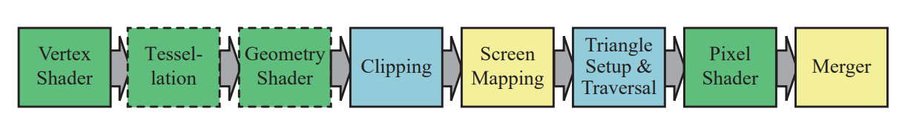
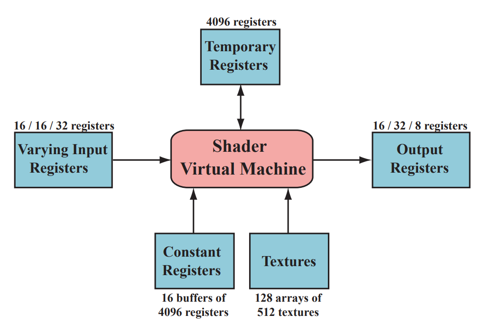
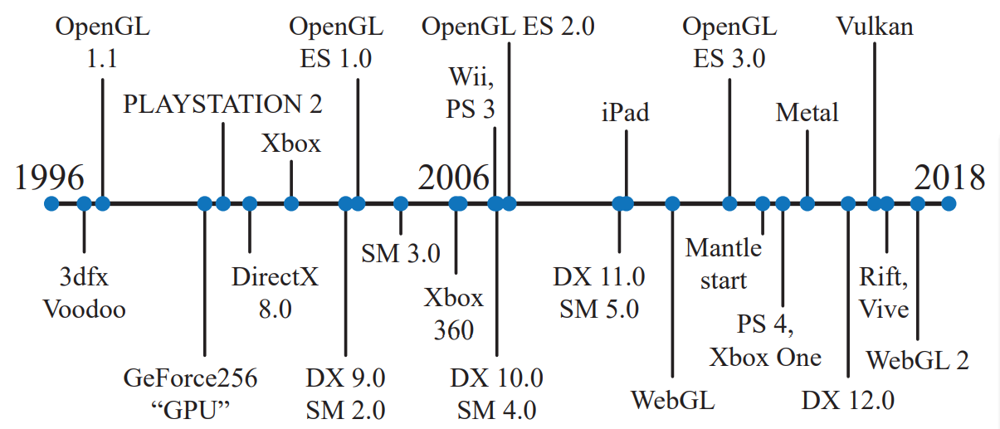

# Chapter 3 GPU

GPU正向着可编程性和灵活性发展。GPU通过大规模并行化实现高速计算。一个着色器核心就是一个小的处理器，可以执行一些行对独立的任务。延迟是每个处理器都要面对的问题。存取内存中的数据比存取局部寄存器中的数据耗时更长。

## 3.1 数据并行结构

CPU有许多优化策略：多核，SIMD，Cache，分支预测，指令重排，寄存器重定向，Cache预获取【r715】.

GPU采用不同的策略。GPU芯片含有大量的处理器，叫做着色器核心，数量可达上千个。GPU是流式处理器，相似的数据轮流被处理。正是由于这种相似性，GPU可以以大规模并行的方式处理这些数据。另一个重要的元素是，这些处理任务彼此相互独立，不需要等待对方的结果，或者是共享内存。

GPU的优化目标是吞吐量，即处理数据的最大速度。然而，由于缓冲内存和控制逻辑的减少，每个着色器核心的延迟通常要比CPU高得多【r462】。

假设要处理2000个像素，一个像素着色器需要被调用2000次。假设有一个GPU，只有一个着色器核心。该着色器核心在本地寄存器上进行数学运算。寄存器速度极快，不会有延迟。之后着色器核心遇到一个纹理采样指令。纹理是不同的资源，不在局部寄存器中。从内存中获取纹理资源会消耗成百上千的时钟周期。在此期间处理器闲置。为了改善这种情况，每个像素被赋予一定的存储空间来存储寄存器中的数据。当遇到纹理获取指令时，着色器核心切换到另一个像素继续执行。切换的速度很快。同样，着色器核心会在遇到纹理资源获取时再次切换到第3个像素。当所有2000个像素像这样被处理后，着色器核心返回第1个像素。此时纹理资源获取完毕，着色器程序继续执行，直到遭遇另一个可能导致延迟的指令，或者程序执行完毕。这样一来，虽然每个像素的执行时间变长了，但是总的执行时间大大减少。

在上述结构中，通过使GPU保持忙碌来减少延迟。GPU通过将指令执行逻辑与数据分割来进一步拓展这一设计思想。SIMD，单指令多数据，以同步方式在固定数量的着色器程序上执行相同的指令。SIMD的优势是用于处理数据和切换的晶体管（和能量）更少。将上述2000像素的例子转换到现代GPU上，那么每个像素着色器调用就是一个线程。该线程与CPU上线程意义不同。它包含一些用于存储输入数据的内存和用于计算的寄存器。运行同一个着色器程序的线程被打包成组，叫做*warps*（NVIDIA）或者*wavefronts*（AMD）。一个*warps*使用SIMD运行在8到64个着色器核心上。每个线程被映射到一个SIMD通道上。

现在有$2000$个像素需要处理。在NVIDIA GPU上，一个*warps*包含32个线程。这需要$2000 / 32=62.5$个*warps*，也即$63$个*warps*。每个*warps*的执行方式与上述单GPU处理器的例子基本类似。着色器程序在32个处理器上同步执行。当遭遇内存获取指令时，该*warps*切换到另外32个线程。这32个处理器会执行另外32个线程。切换的速度很快，因为每个线程的数据不需要变动。每个线程有自己的寄存器，每个*warps*追踪当前执行的指令。切换只是让这些处理器执行不同的线程集合而已，没有其他的消耗。在我们的例子中纹理获取或导致切换，二实际情况下更短的延迟也会造成切换，因为切换的消耗非常小。

着色器程序的结构会显著影响性能。一个主要的因素就是每个线程使用的寄存器数量。在我们的例子中2000个线程同时驻留在GPU上。然而，每个着色器程序需要的寄存器越多，能够贮存的线程和*warps*就越少。过少的*warps*意味着延迟不能通过切换来解决。贮存的*warps*的数量被称作占有量。占有量越低，性能越差。内存获取的频率也会影响性能。【r993】概述了着色器使用的寄存器的数量和共享内存的大小如何影响占有量。【r1911，1914】讨论了最佳占有量如何依赖于着色器进行的操作类型。

另一个影响性能的因素时动态分支，也就是“if”语句和循环。这回产生线程分歧问题。

## 3.2 GPU管线概述

GPU实现第2章描述的几何处理，光栅化和像素处理这3个功能性阶段。一个逻辑模型如下：

注意，逻辑模型与物理模型不一样。物理模型依赖于具体厂商的实现。顶点着色器是完全可编程的，用来实现几何处理阶段。几何着色器也是完全和编程的。它操作原型的顶点，可以进行逐原型的着色操作，摧毁原型或者产生新的原型。曲面细分和几何着色器都是可选的，并非所有的GPU都支持，尤其是移动设备。剪裁，三角形建立，三角形遍历阶段由固定函数硬件实现。屏幕映射受窗口和视口的影响。尽管merger阶段是不可编程的，但却是高度可配置的。它可以修改颜色，$z$缓冲，混合，模板，以及其他任何缓冲。

## 3.3 可编程着色器阶段

现代着色器程序使用统一的设计。这意味着，顶点着色器，像素着色器，几何着色器，以及与曲面细分相关的着色器，都是用同一个编程模型，也即，同一个指令集。实现这种模型的处理器在DirextX中被称作通用着色器核心。拥有这种核心的GPU被认为拥有同意着色器架构。这一设计的背后思想是着色器处理器可以扮演多种角色，GPU可以根据需要分配，以平衡负载。

描绘整个着色器编程模型超出本书的范围，在此不讨论。着色器使用C风格的着色器语言进行编写。这包括DirextX的*High-Level Shading Language*（HLSL）和OpenGL的*OpenGL Shading Language*（GLSL）。HLSL可以被编译为虚拟字节码，以提供硬件独立性。这种字节码被称为中间语言（IL，或者DXIL）。这种中间表示使得着色器程序可以被离线编译和存储。驱动负责将中间语言转换到指定GPU的指令集。终端程序通常省略中间语言的步骤，因为运行终端程序的系统的指令集只有一个。

基本的数据类型是32位单精度浮点标量和向量，其中向量只是着色器代码的一部分，并非被硬件原生支持。现代GPU也支持32位整数和64位浮点数。浮点数向量通常用来表示位置（$xyzw$），法向量，矩阵行，颜色（$rgba$），以及纹理坐标（$uvwq$）。整数主要用来表示计数器，索引和位掩码。结构，数组和矩阵之类的聚合形数据也是支持的。

一个*draw call*调用图形API来绘制一组原型，引发渲染管线执行着色器。每个可编程着色器阶段包含两种类型的输入：一致输入和可变输入。一直输入的值在一个*draw call*中保持不变。可变输入来自于三角形的顶点或者光栅化。例如，在像素着色器中，光源的颜色是一致输入，而三角形表面的位置随每个像素而改变，因此是可变输入。纹理是一种特殊类型的一致输入。

底层虚拟机为不同类型的输入和输出提供了特殊的寄存器。用于一致输入的常量寄存器（*constant registers*）的数量要远大于用于可变输入和输出的寄存器的数量。这是因为可变输入和输出需要针对每个顶点和像素单独存储，因此数量受限。虚拟机也提供通用临时寄存器（*temporary registers*）。所有类型的寄存器都可以使用临时寄存器中的整数进行数组索引。下图显示了一个着色器虚拟机。该图基于着色器模型4.0。3个用斜线分开的数字表示顶点，几何和像素着色器的限制。

流控制指代代码中的分支指令。着色器支持两种类型的分支指令。静态流控制基于一致输入的值。这意味着代码流在一个*draw call*中不变。静态流控制的主要优点是允许用一个着色器用于不同的场景，如不同数量的光。这并不会产生线程分歧。动态流控制基于可变输入。它更加强大，但会影响性能。

## 3.4 可编程着色和API的演进

图形API和硬件的时间线如下图：

可编程着色最早可追溯到着色树（*shade trees*）。从中发展出了*RenderMan Shading Language*，改语言至今被电影工业所使用。*Open Shading Language*（OSL）也是同时代的产物。*Voodoo*显卡使用固定函数管线进行渲染。*NVIDIA*的*GeForce256*是第一个被称为GPU的硬件。2001年*NVIDIA*发布的*GeForce3*是第一个支持可编程顶点着色器的GPU。

DirectX定义了着色器模型（*Shader Model*，SM）的概念。*Shader Model 2.0*发布于2002年，拥有真正意义上的可编程顶点着色器可像素着色器。*DirectX9.0*发布了HLSL。同年，OpenGL ARB发布了GLSL。2004年发布的*Shader Model 3.0*增加了动态流控制，并指有限制地支持在顶点着色器中读取纹理。2006年，*Shader Model 4.0*随着*DirectX 10.0*发布，引入了几何着色器和流输出，也引入了之前所述的统一着色器编程模型。OpenGL 3.3的GLSL 3.30提供了类似的着色器模型。2009年发布的DirextX 11和*Shader Model 5.0*增加了曲面细分和计算着色器（也叫*DirectCompute*），并专注于更高效地支持CPU多进程处理。OpenGL在4.0版本加入了曲面细分，在4.3版本加入了计算着色器。

AMD在2013年发布的Mantle API引导了API的下一个巨大变革。其主要思想是去除图形驱动的大部分负载，并将这些控制权直接交给开发者，同时进一步支持高效的CPU多线程处理。微软吸收了这种思想，并在2015年发布了DirectX 12。DirectX 12并不专注于引入新的GPU功能，其硬件特性与DirectX 11.3相同。DirectX 12是对API的激进重构，以更好地映射现代GPU架构。在CPU驱动消耗成为瓶颈，或者使用更多的CPU处理器可以提升图形性能的情况下，低负载的驱动更加有用。

Apple在2014年发布了自己的低负载API叫做Metal。该API拥有自己的着色器语言。基于Mantle，Vulkan被开发出来。Vulkan可以工作在多个操作系统上，它使用一个新的高级中间语言叫做SPIRV。Vulkan也可用于非图形计算。

在移动设备上OpenGL ES是主流。ES表示Embedded System，因为该API主要用于移动设备。发布于2003年的OpenGL ES 1.0是OpenGL 1.3的缩减版，使用固定函数管线。OpenGL ES 2.0发布于2007，提供了可编程着色。OpenGL ES 3.0发布于2012，支持多渲染目标，纹理压缩，变换反馈，实例化，以及更多的纹理格式和模式。它也改进了着色器语言。OpenGL ES 3.1增加了计算着色器，3.2增加了几何着色器和曲面细分，以及其它一些特性。

OpenGL ES的一个分支是基于浏览器的WebGL，它通过JavaScript调用。WebGL的第一个版本发布于2011，支持绝大多数移动设备，并且与OpenGL ES 2.0有等价的功能性。WebGL 2要求支持OpenGL ES 3.0。

一些诸如three.js的效果库提供了各种各样的效果：阴影算法，后处理，PBS，延迟渲染等。

## 3.5 顶点着色器

