# Chapter 4 变换

线性变换（*linear transform*）保持向量加和标量乘，即：
$$\begin{aligned} \mathbf{f}(\mathbf{x})+\mathbf{f}(\mathbf{y}) &=\mathbf{f}(\mathbf{x}+\mathbf{y}) \\ k \mathbf{f}(\mathbf{x}) &=\mathbf{f}(k \mathbf{x}) \end{aligned}$$
所有用于变换3维向量的线性变换都可以用一个$3 \times 3$矩阵表示。然而，这样的$3 \times 3$矩阵还不够，因为它无法用来表示平移。仿射变换（*affine transform*）可以将线性变换和平移结合起来。仿射变换存储在$4 \times 4$矩阵中。一个仿射变换先进行线性变换，然后进行平移变换。我们使用齐次符号（*homogeneous notation*）来表示点和向量。一个点表示为$\mathbf{v}=\left(\begin{array}{llll}{v_{x}} & {v_{y}} & {v_{z}} & {1}\end{array}\right)^{T}$，一个向量表示为$\mathbf{v}=\left(\begin{array}{llll}{v_{x}} & {v_{y}} & {v_{z}} & {0}\end{array}\right)^{T}$。所有的平移，旋转，放缩，反射和切变换都是仿射变换。仿射变换的特性是保持线的平行性，但不保持长度和角度。一个仿射变换可以使任意个独立的仿射变换的连结。正交矩阵的逆矩阵是其转置矩阵。下表总结了相关符号：

|符号|名称|特性|
|:-|:-|:-|
|$\mathbf{T}(\mathbf{t})$|平移矩阵|移动一个点，仿射|
|$\mathbf{R}_{x}(\rho)$|旋转矩阵|绕$x$轴旋转$\rho$弧度，$y$轴和$z$轴类似，正交，仿射|
|$\mathbf{R}$|旋转矩阵|任意旋转矩阵，正交，仿射|
|$\mathbf{S}(\mathbf{s})$|放缩矩阵|根据$s$沿$x$，$y$，$z$轴放缩，仿射|
|$\mathbf{H}_{i j}(s)$|切变矩阵|根据系数$s$，沿$j$切变$i$|
|$\mathbf{E}(h, p, r)$|欧拉变换|由欧拉角head（yaw），pitch，roll构建的方位矩阵，仿射|
|$\mathbf{P}_{o}(s)$|正交投影|正交投影到一个平面或者体积，仿射|
|$\mathbf{P}_{p}(s)$|透视投影|透视投影到一个平面或者体积|
|$slerp(\hat{\mathbf{q}}, \hat{\mathbf{r}}, t)$|插值变换|在2个四元数之间插值得到一个新的四元数|

## 4.1 基本变换

这部分介绍基本变换

### 4.1.1 平移

变换矩阵用$\mathbf{T}$表示。该矩阵使用一个向量$\mathbf{t}=\left(t_{x}, t_{y}, t_{z}\right)$来进行变换。$\mathbf{T}$定义为：
$$\mathbf{T}(\mathbf{t})=\mathbf{T}\left(t_{x}, t_{y}, t_{z}\right)=\left(\begin{array}{cccc}{1} & {0} & {0} & {t_{x}} \\ {0} & {1} & {0} & {t_{y}} \\ {0} & {0} & {1} & {t_{z}} \\ {0} & {0} & {0} & {1}\end{array}\right)$$
注意向量不受此变换影响。平移矩阵的逆是$\mathbf{T}^{-1}(\mathbf{t})=\mathbf{T}(-\mathbf{t})$。

需要注意的是，在有些地方，平移向量被写在了矩阵的最后一行。例如，DirectX使用这种约定。在这种约定中，矩阵的顺序是倒过来的，即从左往右。使用这种约定的向量和矩阵被称为行优先（*row-major*）形式。在本书中，我们使用列优先（*column-major*）形式。这仅仅是符号上的区别。

## 4.1.2 旋转

旋转变换和平移一样是刚体变换（*rigid-body transform*），即，它保持点之间的距离不变，保持手性不变（即不会造成左右互换）。一个方位矩阵（*orientation matrix*）通常指的就是一个对象的旋转矩阵。该矩阵定义了对象在空间中的方位，即上方向和前方向。

在2维空间中，旋转矩阵很容易获得。假设有一个向量$\mathbf{v}=\left(v_{x}, v_{y}\right)=(r \cos \theta, r \sin \theta)$，如果逆时针旋转$\phi$弧度，会得到$\mathbf{u}=(r \cos (\theta+\phi), r \sin (\theta+\phi))$。有：
$$\begin{aligned} \mathbf{u} &=\left(\begin{array}{c}{r \cos (\theta+\phi)} \\ {r \sin (\theta+\phi)}\end{array}\right)=\left(\begin{array}{c}{r(\cos \theta \cos \phi-\sin \theta \sin \phi)} \\ {r(\sin \theta \cos \phi+\cos \theta \sin \phi)}\end{array}\right) \\ &=\underbrace{\left(\begin{array}{cc}{\cos \phi} & {-\sin \phi} \\ {\sin \phi} & {\cos \phi}\end{array}\right)}_{\mathbf{R}(\phi)} \underbrace{\left(\begin{array}{c}{r \cos \theta} \\ {r \sin \theta}\end{array}\right)}_{\mathbf{v}}=\mathbf{R}(\phi) \mathbf{v} \end{aligned}$$
在3维空间中，通常使用的旋转矩阵是$\mathbf{R}_{x}(\phi)$，$\mathbf{R}_{y}(\phi)$和$\mathbf{R}_{z}(\phi)$。它们将对象分别绕$x$轴，$y$轴和$z$轴旋转$\phi$弧度，定义为：
$$\mathbf{R}_{x}(\phi)=\left(\begin{array}{cccc}{1} & {0} & {0} & {0} \\ {0} & {\cos \phi} & {-\sin \phi} & {0} \\ {0} & {\sin \phi} & {\cos \phi} & {0} \\ {0} & {0} & {0} & {1}\end{array}\right)$$
$$\mathbf{R}_{y}(\phi)=\left(\begin{array}{cccc}{\cos \phi} & {0} & {\sin \phi} & {0} \\ {0} & {1} & {0} & {0} \\ {-\sin \phi} & {0} & {\cos \phi} & {0} \\ {0} & {0} & {0} & {1}\end{array}\right)$$
$$\mathbf{R}_{z}(\phi)=\left(\begin{array}{cccc}{\cos \phi} & {-\sin \phi} & {0} & {0} \\ {\sin \phi} & {\cos \phi} & {0} & {0} \\ {0} & {0} & {1} & {0} \\ {0} & {0} & {0} & {1}\end{array}\right)$$
如果将最底层的行和最右面的列删除，会得到一个$3 \times 3$的矩阵。对于一个任意的$3 \times 3$旋转矩阵$\mathbf{R}$，它的迹（对角线元素的和）只与旋转角度有关：
$$\operatorname{tr}(\mathbf{R})=1+2 \cos \phi$$
3个轴旋转矩阵可以被用来组合成任意旋转矩阵。所有的旋转矩阵的行列式为1，并且都是正交的。逆矩阵为$\mathbf{R}_{i}^{-1}(\phi)=\mathbf{R}_{i}(-\phi)$。

### 4.1.3 放缩

放缩矩阵$\mathbf{S}$定义为：
$$\mathbf{S}(\mathbf{s})=\left(\begin{array}{cccc}{s_{x}} & {0} & {0} & {0} \\ {0} & {s_{y}} & {0} & {0} \\ {0} & {0} & {s_{z}} & {0} \\ {0} & {0} & {0} & {1}\end{array}\right)$$
如果$s_{x}=s_{y}=s_{z}$，那么就是均匀（*uniform*）放缩，否则是非均匀（*nonuniform*）放缩。有时候也会使用各向同性（*isotropic*）和各向异性（*anisotropic*）来指代。逆矩阵是$\mathbf{S}^{-1}(\mathbf{s})=\mathbf{S}\left(1 / s_{x}, 1 / s_{y}, 1 / s_{z}\right)$。

如果$\mathbf{S}$中有1个或3个负值，那么就会产生反射矩阵（*reflection matrix*），也叫作镜子矩阵（*mirror matrix*）。如果只有2个负值，那么会旋转$\pi$弧度。一个旋转矩阵连结一个反射矩阵，结果仍是反射矩阵，例如：
$$\underbrace{\left(\begin{array}{cc}{\cos (\pi / 2)} & {\sin (\pi / 2)} \\ {-\sin (\pi / 2)} & {\cos (\pi / 2)}\end{array}\right)}_{\text {rotation }} \underbrace{\left(\begin{array}{cc}{1} & {0} \\ {0} & {-1}\end{array}\right)}_{\text {reflection }}=\left(\begin{array}{cc}{0} & {-1} \\ {-1} & {0}\end{array}\right)$$
反射矩阵需要特别对待。逆时针绕序的三角形经反射变换作用后会变成顺时针绕序，从而导致错误的光照和剔除。为了检测反射矩阵，可以计算左上角$3 \times 3$矩阵的行列式。如果值为负，那么就是反射矩阵。

### 4.1.4 切变

有6种基本切变矩阵：$\mathbf{H}_{x y}(s), \mathbf{H}_{x z}(s), \mathbf{H}_{y x}(s), \mathbf{H}_{y z}(s), \mathbf{H}_{z x}(s),$和$\mathbf{H}_{z y}(s)$。第一个下标指示被改变的坐标，第二个下标指代执行切变的下标。一个例子如下：
$$\mathbf{H}_{x z}(s)=\left(\begin{array}{cccc}{1} & {0} & {s} & {0} \\ {0} & {1} & {0} & {0} \\ {0} & {0} & {1} & {0} \\ {0} & {0} & {0} & {1}\end{array}\right)$$
注意下标可以用来确定参数$S$的位置。$x$标识第0行，$z$标识第2列。逆矩阵是$\mathbf{H}_{i j}^{-1}(s)=\mathbf{H}_{i j}(-s)$。

另一种切变矩阵的定义为：
$$\mathbf{H}_{x y}^{\prime}(s, t)=\left(\begin{array}{cccc}{1} & {0} & {s} & {0} \\ {0} & {1} & {t} & {0} \\ {0} & {0} & {1} & {0} \\ {0} & {0} & {0} & {1}\end{array}\right)$$
在这里，这2个下标表示这2个坐标会被第3个坐标执行切变。这两种切变矩阵的描述方式的联系是$\mathbf{H}_{i j}^{\prime}(s, t)=\mathbf{H}_{i k}(s) \mathbf{H}_{j k}(t)$，$k$指代第3个坐标的索引。所有切变矩阵的行列式都是1，这意味着切变变换是一个保持体积的变换。

### 4.1.5 变换的连结

矩阵乘法不满足交换律，但是满足交换律。连结矩阵主要是为了效率。通用的连结顺序是$\mathbf{C}=\mathbf{T} \mathbf{R} \mathbf{S}$。

### 4.1.6 刚体变换

只包含平移和旋转的变换被称作刚体变换，它保持长度，角度和手性的不变。任何刚体变换可以写成平移和旋转的连结，即：
$$\mathbf{X}=\mathbf{T}(\mathbf{t}) \mathbf{R}=\left(\begin{array}{cccc}{r_{00}} & {r_{01}} & {r_{02}} & {t_{x}} \\ {r_{10}} & {r_{11}} & {r_{12}} & {t_{y}} \\ {r_{20}} & {r_{21}} & {r_{22}} & {t_{z}} \\ {0} & {0} & {0} & {1}\end{array}\right)$$
逆矩阵是$\mathbf{X}^{-1}=(\mathbf{T}(\mathbf{t}) \mathbf{R})^{-1}=\mathbf{R}^{-1} \mathbf{T}(\mathbf{t})^{-1}=\mathbf{R}^{T} \mathbf{T}(-\mathbf{t})$。另一种计算逆矩阵的方法如下：
$$\overline{\mathbf{R}}=\left(\begin{array}{lll}{\mathbf{r}_{, 0}} & {\mathbf{r}_{, 1}} & {\mathbf{r},_{2}}\end{array}\right)=\left(\begin{array}{c}{\mathbf{r}_{0}^{T}} \\ {\mathbf{r}_{1}^{T}} \\ {\mathbf{r}_{2}^{T}}\end{array}\right)$$
$$\mathbf{x}=\overrightarrow{\left(\begin{array}{cc}
{\overrightarrow{\mathbf{R}}} & {\mathbf{t}} \\
{\mathbf{0}^{T}} & {1}
\end{array}\right)}$$
$$\mathbf{X}^{-1}=\left(\begin{array}{cccc}{\mathbf{r}_{0},} & {\mathbf{r}_{1},} & {\mathbf{r}_{2},} & {-\overline{\mathbf{R}}^{T} \mathbf{t}} \\ {0} & {0} & {0} & {1}\end{array}\right)$$
其中$\mathbf{r}_{,0}$表示第一列，$\mathbf{r}_{0,}^{T}$表示第一行。

### 4.1.7 法向量变换

变换矩阵不能直接作用在法向量上，如下图所示：
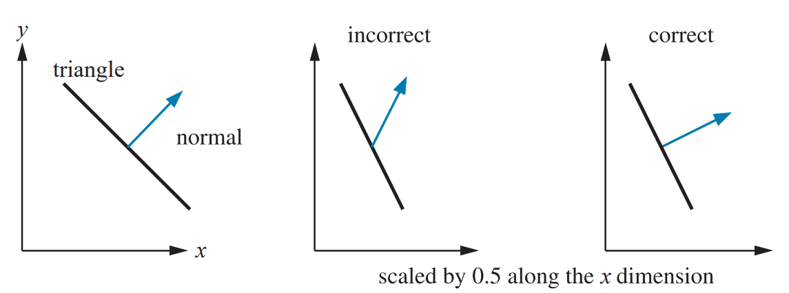

正确的方法是使用矩阵的伴随矩阵的转置【r227】。伴随矩阵总是存在的。向量在变换后可能丧失单位性，需要重新标准化。传统的方法是计算逆矩阵的转置【r1794】。完整计算逆矩阵是不必要的，并且有时候逆矩阵无法计算。逆矩阵是伴随矩阵除以矩阵的行列式。如果行列式为0，那么矩阵是奇异的，不存在逆矩阵。

事实上，计算$4 \times 4$矩阵的伴随矩阵也不是必须的。法向量是向量，不会受平移影响。进一步的，绝大多数模型变换都是仿射变换。这些变换不会修改齐次坐标的$w$分量，即，不包含投影。因此，我们只需要计算左上角$3 \times 3$矩阵的伴随矩阵。不过，计算伴随矩阵也不是必须的。比方说我们知道变换矩阵完全由平移，旋转和均匀放缩连结而成。平移不影响法向量，放缩仅改变法向量的长度。旋转的逆矩阵就是自身的转置矩阵。在上述这些情况下，原始的矩阵可以直接用来变换法向量。

最后，重新标准化法向量也并不总是必须的。如果变换仅包含平移和旋转，那么法向量的长度不会改变。如果还包含均匀放缩，那么放缩系数可直接被用来修改法向量的长度。注意，切向量可以直接使用原始矩阵进行变换。

### 4.1.8 逆的计算

计算逆矩阵主要有3中途径：
* 如果矩阵由给定参数得到，那么逆矩阵可以直接通过取反参数和连结顺序得到。例如，$\mathbf{M}=\mathbf{T}(\mathbf{t}) \mathbf{R}(\phi)$，则$\mathbf{M}^{-1}=\mathbf{R}(-\phi) \mathbf{T}(-\mathbf{t})$。这在渲染大世界时非常重要【r1381】。
* 如果矩阵是正交的，则$\mathbf{M}^{-1}=\mathbf{M}^{T}$
* 通用方法，如伴随矩阵，克莱姆法则，LU分解，高斯消除。克莱姆法则和伴随矩阵通常更可取，因为需要更少的分支操作。
如果逆矩阵只用来变换向量，那么只需要计算左上角$3 \times 3$矩阵的逆矩阵。

## 4.2 特殊的矩阵变换和操作

本节介绍实时渲染中几个重要的矩阵变换和操作：描述方位欧拉变换，从矩阵中抽取基本变换，以及绕任意轴旋转的旋转矩阵。

### 4.2.1 欧拉变换

改变换用来控制方位。首先需要确定一些默认的视角方向。绝大多数情况下面朝负$z$轴，头指向$y$轴，如下图所示：
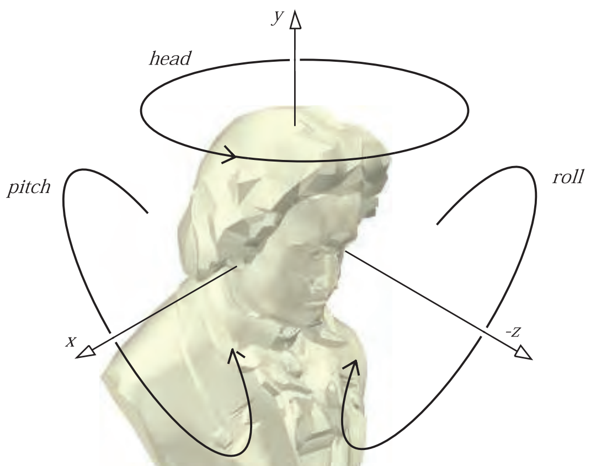
欧拉变换是3个矩阵的乘积，也就是图中的3个旋转变换。即：
$$\mathbf{E}(h, p, r)=\mathbf{R}_{z}(r) \mathbf{R}_{x}(p) \mathbf{R}_{y}(h)$$
矩阵的排列方式有24种【r1636】。这种方式是最常用的。欧拉角$h, p,$和$r$分别对应于head，pitch和roll。有时候这些角被叫做“rolls”，即head是“y-roll”，pitch是“x-roll”。head也叫“yaw”，这常见于飞行模拟中。

注意，有2种关于上方向的约定：$y$轴，或者是$z$轴。绝大多数制造业，包括3D打印，以$z$作为世界空间的上方向。航空航海以负$z$轴作为上方向。建筑和GIS使用$z$轴作为上方向。媒体相关的建模系统使用$y$轴作为上方向。这两者差一个$90^{\circ}$的旋转（还可能有一个反射）。本书中约定$y$轴作为上方向。

欧拉角有一些限制，如难以插值，万向锁。事实上，两个不同的欧拉角可能表示同一个方位。因此，我们通常使用其他的方位表示方法。

### 4.2.2 从欧拉变换中抽取参数

有时候我们需要从一个正交矩阵中抽取欧拉参数$h, p, r$，即：
$$\mathbf{E}(h, p, r)=\left(\begin{array}{ccc}{e_{00}} & {e_{01}} & {e_{02}} \\ {e_{10}} & {e_{11}} & {e_{12}} \\ {e_{20}} & {e_{21}} & {e_{22}}\end{array}\right)=\mathbf{R}_{z}(r) \mathbf{R}_{x}(p) \mathbf{R}_{y}(h)$$
这里我们只取左上角的旋转矩阵。将上式中的旋转矩阵连结起来有：
$$\mathbf{E}=\left(\begin{array}{ccc}{\cos r \cos h-\sin r \sin p \sin h} & {-\sin r \cos p} & {\cos r \sin h+\sin r \sin p \cos h} \\ {\sin r \cos h+\cos r \sin p \sin h} & {\cos r \cos p} & {\sin r \sin h-\cos r \sin p \cos h} \\ {-\cos p \sin h} & {\sin p} & {\cos p \cos h}\end{array}\right)$$
pitch可以很容易地获取$\sin p=e_{21}$，其他2个参数获取方法如下：
$$\frac{e_{01}}{e_{11}}=\frac{-\sin r}{\cos r}=-\tan r \quad \text { and } \quad \frac{e_{20}}{e_{22}}=\frac{-\sin h}{\cos h}=-\tan h$$
从而有：
$$
\begin{aligned}
&h=\operatorname{atan} 2\left(-e_{20}, e_{22}\right)\\
&p=\arcsin \left(e_{21}\right)\\
&r=\operatorname{atan} 2\left(-e_{01}, e_{11}\right)
\end{aligned}
$$
然而，由于万向锁的存在，上述方法不能处理一些特殊情况。完整算法请参考原文。

### 4.2.3 矩阵分解

我们通常需要从一个矩阵中分离出不同的变换，这叫做矩阵分解（*matrix decomposition*）。矩阵分解的原因有：
* 抽取放缩系数
* 粒子系统只需要其中部分的变换，不支持任意变换
* 确定一个模型是否只经过刚体变换
* 在动画的关键帧之间插值
* 剔除切变变换
平移变换很容易获取，确定反射变换也很容易（计算行列式是否为负）。其他的变换需要更多处理。相关文献有【r1769，552，553，1635】。

### 4.2.4 绕任意轴旋转

假定绕轴$\mathbf{r}$旋转弧度$\alpha$。一种方法是先变换到一个新的坐标系，在新的坐标系中，旋转轴$\mathbf{r}$与$x$轴对齐，然后应用$\mathbf{R}_{x}(\alpha)$，最后再变换回原始坐标系。具体算法参考原文。另一种方法如下【r550】：
$$\mathbf{R}=
\left(\begin{array}{ccc}{\cos \phi+(1-\cos \phi) r_{x}^{2}} & {(1-\cos \phi) r_{x} r_{y}-r_{z} \sin \phi} & {(1-\cos \phi) r_{x} r_{z}+r_{y} \sin \phi} \\ {(1-\cos \phi) r_{x} r_{y}+r_{z} \sin \phi} & {\cos \phi+(1-\cos \phi) r_{y}^{2}} & {(1-\cos \phi) r_{y} r_{z}-r_{x} \sin \phi} \\ {(1-\cos \phi) r_{x} r_{z}-r_{y} \sin \phi} & {(1-\cos \phi) r_{y} r_{z}+r_{x} \sin \phi} & {\cos \phi+(1-\cos \phi) r_{z}^{2}}\end{array}\right)$$

## 4.3 四元数

在表示旋转和方位方面，四元数优于欧拉角和矩阵。任意3维的方位都可以表示为绕指定轴旋转指定角度。在四元数和轴角表示之间切换是很方便的。四元数的插值也很方便。

复数有实部和虚部，用2个实数表示，第二个实数被乘以$\sqrt{-1}$。同样的，四元数有4个实数。前3个值与旋转轴相关，旋转角度则影响所有部分。我们使用向量表示四元数。为了区分，我们加了个帽子：$\hat{\mathbf{q}}$。

### 4.3.1 数学背景

四元数有多种等价定义：
$$
\begin{aligned}
\hat{\mathbf{q}} &=\left(\mathbf{q}_{v}, q_{w}\right)=i q_{x}+j q_{y}+k q_{z}+q_{w}=\mathbf{q}_{v}+q_{w} \\
\mathbf{q}_{v} &=i q_{x}+j q_{y}+k q_{z}=\left(q_{x}, q_{y}, q_{z}\right) \\
i^{2} &=j^{2}=k^{2}=-1, j k=-k j=i, k i=-i k=j, i j=-j i=k
\end{aligned}
$$
其中$q_{\boldsymbol{w}}$是实部，$q_{\boldsymbol{v}}$是虚部，$i, j, k$是虚数单位。对于$q_{\boldsymbol{v}}$，我们可以使用所有向量操作，如向量加，标量乘，点乘，叉乘等等。四元数的乘法定义如下（注意不满足交换律）：
$$
\begin{aligned}
\hat{\mathbf{q}} \hat{\mathbf{r}}=&\left(i q_{x}+j q_{y}+k q_{z}+q_{w}\right)\left(i r_{x}+j r_{y}+k r_{z}+r_{w}\right) \\
=& i\left(q_{y} r_{z}-q_{z} r_{y}+r_{w} q_{x}+q_{w} r_{x}\right) \\
&+j\left(q_{z} r_{x}-q_{x} r_{z}+r_{w} q_{y}+q_{w} r_{y}\right) \\
&+k\left(q_{x} r_{y}-q_{y} r_{x}+r_{w} q_{z}+q_{w} r_{z}\right) \\
&+q_{w} r_{w}-q_{x} r_{x}-q_{y} r_{y}-q_{z} r_{z} \\
=&\left(\mathbf{q}_{v} \times \mathbf{r}_{v}+r_{w} \mathbf{q}_{v}+q_{w} \mathbf{r}_{v}, q_{w} r_{w}-\mathbf{q}_{v} \cdot \mathbf{r}_{v}\right)
\end{aligned}
$$
其他运算如下：
$$
\text { Addition: } \quad \hat{\mathbf{q}}+\hat{\mathbf{r}}=\left(\mathbf{q}_{v}, q_{w}\right)+\left(\mathbf{r}_{v}, r_{w}\right)=\left(\mathbf{q}_{v}+\mathbf{r}_{v}, q_{w}+r_{w}\right)
$$
$$
\text { Conjugate: } \quad \hat{\mathbf{q}}^{*}=\left(\mathbf{q}_{v}, q_{w}\right)^{*}=\left(-\mathbf{q}_{v}, q_{w}\right)
$$
$$\begin{aligned} \text { Norm: } & n(\hat{\mathbf{q}})=\sqrt{\hat{\mathbf{q}} \hat{\mathbf{q}}^{*}}=\sqrt{\hat{\mathbf{q}}^{*} \hat{\mathbf{q}}}=\sqrt{\mathbf{q}_{v} \cdot \mathbf{q}_{v}+q_{w}^{2}} \\ &=\sqrt{q_{x}^{2}+q_{y}^{2}+q_{z}^{2}+q_{w}^{2}} \end{aligned}$$
$$\text { Identity: } \quad \hat{\mathbf{i}}=(\mathbf{0}, 1)$$
范式也可以表示为$\|\hat{\mathbf{q}}\|=n(\hat{\mathbf{q}})$。乘法逆表示为$\hat{\mathbf{q}}^{-1}$，其满足$\hat{\mathbf{q}}^{-1} \hat{\mathbf{q}}=\hat{\mathbf{q}} \hat{\mathbf{q}}^{-1}=1$。根据范式的定义有：
$$n(\hat{\mathbf{q}})^{2}=\hat{\mathbf{q}} \hat{\mathbf{q}}^{*} \Longleftrightarrow \frac{\hat{\mathbf{q}} \hat{\mathbf{q}}^{*}}{n(\hat{\mathbf{q}})^{2}}=1$$
从而有：
$$\hat{\mathbf{q}}^{-1}=\frac{1}{n(\hat{\mathbf{q}})^{2}} \hat{\mathbf{q}}^{*}$$
标量乘是可交换的：$s \hat{\mathbf{q}}=\hat{\mathbf{q}} s=\left(s \mathbf{q}_{v}, s q_{w}\right)$。
其他：
$$
\begin{array}{ll}
{\text { Conjugate rules: }} & {\left(\hat{\mathbf{q}}^{*}\right)^{*}=\hat{\mathbf{q}}} \\
{} & {(\hat{\mathbf{q}}+\hat{\mathbf{r}})^{*}=\hat{\mathbf{q}}^{*}+\hat{\mathbf{r}}^{*}} \\
{} & {(\hat{\mathbf{q}} \hat{\mathbf{r}})^{*}=\hat{\mathbf{r}}^{*} \hat{\mathbf{q}}^{*}}
\end{array}
$$
$$
\begin{aligned}
\text { Norm rules: } & & n\left(\hat{\mathbf{q}}^{*}\right) &=n(\hat{\mathbf{q}}) \\
& & n\left(\hat{\mathbf{q}}^{*}\right) &=n(\hat{\mathbf{q}}) n(\hat{\mathbf{r}})
\end{aligned}
$$
$$
\begin{array}{ll}
{\text { Linearity: }} & {\hat{\mathbf{p}}(s \hat{\mathbf{q}}+t \hat{\mathbf{r}})=s \hat{\mathbf{p}} \hat{\mathbf{q}}+t \hat{\mathbf{p}} \hat{\mathbf{r}}} \\
{} & {(s \hat{\mathbf{p}}+t \hat{\mathbf{q}}) \hat{\mathbf{r}}=s \hat{\mathbf{p}} \hat{\mathbf{r}}+t \hat{\mathbf{q}} \hat{\mathbf{r}}}
\end{array}
$$
$$
\text { Associativity: } \quad \quad \hat{\mathbf{p}}(\hat{\mathbf{q}} \hat{\mathbf{r}})=(\hat{\mathbf{p}} \hat{\mathbf{q}}) \hat{\mathbf{r}}
$$
单位四元数$\hat{\mathbf{q}}=\left(\mathbf{q}_{v}, q_{w}\right)$的范式是1，因此有：
$$
\hat{\mathbf{q}}=\left(\sin \phi \mathbf{u}_{q}, \cos \phi\right)=\sin \phi \mathbf{u}_{q}+\cos \phi
$$
其中$\mathbf{u}_{q}$是3维单位向量。单位四元数非常适合构造旋转和方位。对于复数，一个2维的单位向量可以写成$\cos \phi+i \sin \phi=e^{i \phi}$。拓展到四元数有：
$$
\hat{\mathbf{q}}=\sin \phi \mathbf{u}_{q}+\cos \phi=e^{\phi \mathbf{u}_{q}}
$$
其中：
$$
\begin{aligned}
&\text { Logarithm: } \quad \log (\hat{\mathbf{q}})=\log \left(e^{\phi \mathbf{u}_{q}}\right)=\phi \mathbf{u}_{q}\\
&\text { Power: } \quad \hat{\mathbf{q}}^{t}=\left(\sin \phi \mathbf{u}_{q}+\cos \phi\right)^{t}=e^{\phi t \mathbf{u}_{q}}=\sin (\phi t) \mathbf{u}_{q}+\cos (\phi t)
\end{aligned}
$$

### 4.3.2 四元数变换

下面的内容局限于单位四元数。单位四元数最重要的性质就是它可以表达任何3维旋转。首先，将一个点或者向量$\mathbf{p}=\left(p_{x} p_{y} p_{z} p_{w}\right)^{T}$的4个坐标放到一个四元数$\hat{\mathbf{p}}$中，并假设有一个单位四元数$\hat{\mathbf{q}}=\left(\sin \phi \mathbf{u}_{q}, \cos \phi\right)$。可以证明：
$$\hat{\mathbf{q}} \hat{\mathbf{p}} \hat{\mathbf{q}}^{-1}$$
将四元数$\hat{\mathbf{p}}$（也就是点$\mathbf{p}$）绕$\mathbf{u}_{q}$轴旋转角度$2 \phi$。注意，由于$\hat{\mathbf{q}}$是单位四元数，有$\hat{\mathbf{q}}^{-1}=\hat{\mathbf{q}}^{*}$。

$\hat{\mathbf{q}}$的任意非0实数倍数表示相同的变换，这意味着$\hat{\mathbf{q}}$和$-\hat{\mathbf{q}}$表示相同的旋转。也即，将轴$\mathbf{u}_{q}$和实部$q_{w}$取反，得到的四元数所表示的旋转与原来的四元数相同。这也意味着从矩阵中抽取四元数时会得到$\hat{\mathbf{q}}$或者$-\hat{\mathbf{q}}$。

给定2个单位四元数$\hat{\mathbf{q}}$和$\hat{\mathbf{r}}$，先后作用于$\hat{\mathbf{p}}$，得到：
$$
\hat{\mathbf{r}}\left(\hat{\mathbf{q}} \hat{\mathbf{p}} \hat{\mathbf{q}}^{*}\right) \hat{\mathbf{r}}^{*}=(\hat{\mathbf{r}} \hat{\mathbf{q}}) \hat{\mathbf{p}}(\hat{\mathbf{r}} \hat{\mathbf{q}})^{*}=\hat{\mathbf{c}} \hat{\mathbf{p}} \hat{\mathbf{c}}^{*}
$$
其中$\hat{\mathbf{c}}=\hat{\mathbf{r}} \hat{\mathbf{q}}$是单位四元数，表示$\hat{\mathbf{q}}$和$\hat{\mathbf{r}}$的连结。

四元数与矩阵之间的互相转换参考原文。四元数插值请参考原文。下面介绍如何计算从一个向量到另一个向量的旋转。假设有两个方向$\mathbf{s}$和$\mathbf{t}$，需要计算从$\mathbf{s}$到$\mathbf{t}$的旋转变换，并且距离最短。首先，标准化$\mathbf{s}$和$\mathbf{t}$。然后计算单位旋转轴$\mathbf{u}$，即$\mathbf{u}=(\mathbf{s} \times \mathbf{t}) /\|\mathbf{s} \times \mathbf{t}\|$。之后，$e=\mathbf{s} \cdot \mathbf{t}=\cos (2 \phi)$并且$\|\mathbf{s} \times \mathbf{t}\|=\sin (2 \phi)$，其中$2 \phi$是$\mathbf{s}$和$\mathbf{t}$之间的夹角。则代表从$\mathbf{s}$到$\mathbf{t}$的旋转的四元数是$\hat{\mathbf{q}}=(\sin \phi \mathbf{u}, \cos \phi)$。化简后可得：
$$
\hat{\mathbf{q}}=\left(\mathbf{q}_{v}, q_{w}\right)=\left(\frac{1}{\sqrt{2(1+e)}}(\mathbf{s} \times \mathbf{t}), \frac{\sqrt{2(1+e)}}{2}\right)
$$
直接使用这种方式计算四元数（而不是单位化$\mathbf{s} \times \mathbf{t}$）可以避免当$\mathbf{s}$和$\mathbf{t}$指向近似同一方向时产生的数字不稳定性。但是当$\mathbf{s}$和$\mathbf{t}$指向相反方向时，两种方法都会产生数字不稳定性，因为发生除0。当出现这种情况时，任何垂直$\mathbf{s}$的旋转轴都可以用来旋转。

有时候我们需要矩阵表示：
$$
\mathbf{R}(\mathbf{s}, \mathbf{t})=\left(\begin{array}{cccc}
{e+h v_{x}^{2}} & {h v_{x} v_{y}-v_{z}} & {h v_{x} v_{z}+v_{y}} & {0} \\
{h v_{x} v_{y}+v_{z}} & {e+h v_{y}^{2}} & {h v_{y} v_{z}-v_{x}} & {0} \\
{h v_{x} v_{z}-v_{y}} & {h v_{y} v_{z}+v_{x}} & {e+h v_{z}^{2}} & {0} \\
{0} & {0} & {0} & {1}
\end{array}\right)
$$
其中使用了如下的中间计算：
$$
\begin{array}{l}
{\mathbf{v}=\mathbf{s} \times \mathbf{t}} \\
{e=\cos (2 \phi)=\mathbf{s} \cdot \mathbf{t}} \\
{h=\frac{1-\cos (2 \phi)}{\sin ^{2}(2 \phi)}=\frac{1-e}{\mathbf{v} \cdot \mathbf{v}}=\frac{1}{1+e}}
\end{array}
$$
可以看到，经过简化，所有的平方根和三角函数都不存在，因此这是一个计算矩阵的高效方法。还要注意，当$\mathbf{s}$和$\mathbf{t}$平行或者近似平行时会出问题，因为$\|\mathbf{s} \times \mathbf{t}\| \approx 0$。如果$\phi \approx 0$，我们可以返回单位矩阵。但是，如果$2 \phi \approx \pi$，那么可以绕任意轴旋转$\pi$弧度。该轴可以由$\mathbf{s}$和任意其他不平行于$\mathbf{s}$的向量的叉乘获得。其他方法见【r1233】。

## 4.4 顶点混合

假设一个人物的手臂分为前臂和上臂，如下图所示：
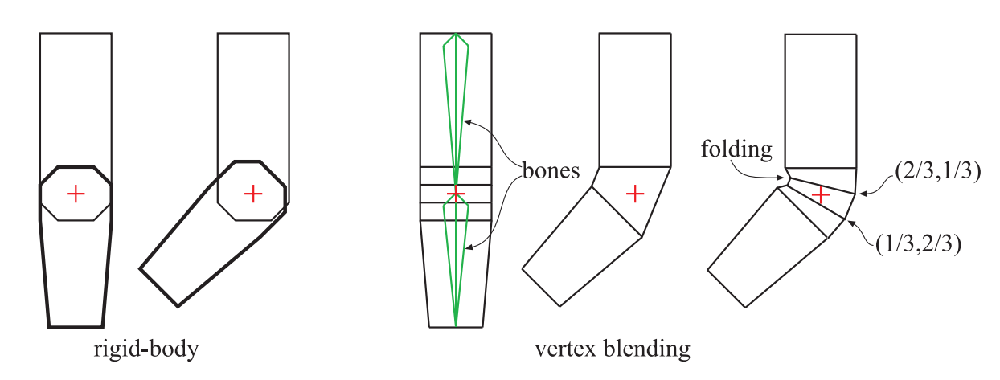
该模型可以使用刚体变换实现动画，但关节处会失真。顶点混合（*veryex blending*）可以解决这一问题。顶点混合有多种名字，如*linear-blend skinning*，*enveloping*，*skeleton-subspace deformation*。在最简单的形式中，前臂和上臂仍像以前一样分开运动，单在关节处，由“塑料皮肤”连接起来。该塑料部分的一部分顶点受前臂矩阵的影响，另一部分顶点受上臂矩阵的影响。这样一来，三角形的顶点可能进行不同的矩阵变换。将该思想进一步拓展的话，一个顶点可以被多个矩阵变换，结果位置通过加权和混合得到。我们需要一个骨架，每根骨头根据设定好的权重影响顶点。所有顶点都有可能受到一个或多个矩阵的影响，因此整个网格被称为皮肤（*skin*）。皮肤包裹在骨架之上。如下图所示：
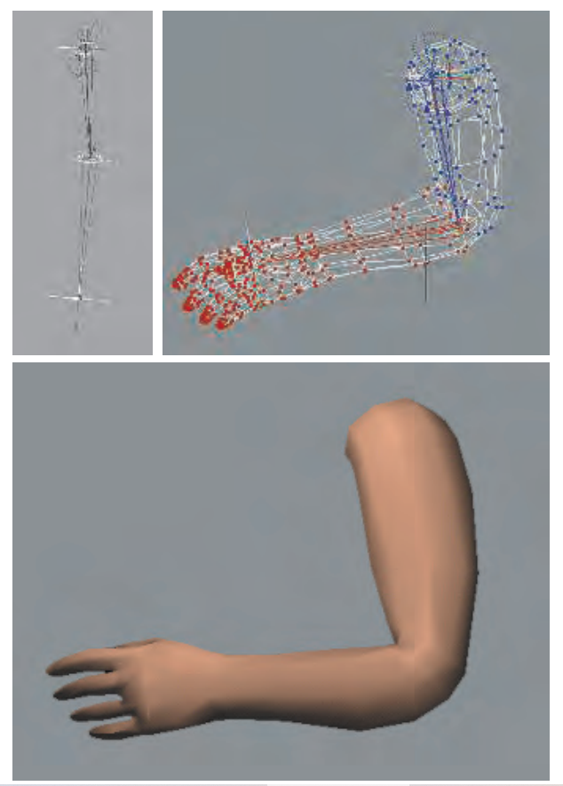
骨架也并非要求一定是刚体，例如【1230，813】。

顶点混合的数学表示是：
$$
\mathbf{u}(t)=\sum_{i=0}^{n-1} w_{i} \mathbf{B}_{i}(t) \mathbf{M}_{i}^{-1} \mathbf{p}, \quad \text { where } \quad \sum_{i=0}^{n-1} w_{i}=1, \quad w_{i} \geq 0
$$
其中$\mathbf{p}$是原始顶点，$\mathbf{u}(t)$是变换后的顶点，其位置依赖于时间$t$。点$\mathbf{p}$使用世界坐标表示，受$n$个骨骼的影响。$w_{i}$是第$i$个骨骼对顶点$\mathbf{p}$的权重。$\mathbf{M}_{i}$表示从骨骼自身的坐标系统转换到世界空间的变换矩阵。通常一个骨骼的控制关节位于自身坐标系的原点。$\mathbf{B}_{i}(t)$是第$i$个骨骼的时世界变换矩阵，并且随着时间改变已实现动画。该矩阵通常是一系列矩阵的连结，例如层级结构中之前的骨骼的矩阵和局部动画矩阵。矩阵$\mathbf{M}_{i}$在一些讨论中并不显示出现，而被认为是$\mathbf{B}_{i}(t)$的一部分。我们把它放在这以强调矩阵的连结过程。

在实际中，$\mathbf{B}_{i}(t)$和$\mathbf{M}_{i}^{-1}$在每个骨骼的每帧动画中被连结。骨骼的权重非负，并且相加为1。法向量通常也可以使用同样的方法变换（可能需要逆转置矩阵）。

顶点混合适合放在GPU端操作。顶点集可以放在静态缓冲中，被一次性传递给GPU，然后重用。在每一帧，只有骨骼矩阵发生改变。顶点着色器计算这些骨骼矩阵对存储在GPU的原始网格的影响。在这种方式下，处理的数据量和来自CPU的传输的数据量被最小化。骨骼变换矩阵也可以存储在纹理中，这样可以避免受到寄存器存储大小的限制。使用四元数来表示旋转的话，仅用2张纹理即可【r1639】。UAV也可以用来存储蒙皮的结果以实现重用【r146】。

权重也可以超过$[0,1]$的范围，或者加起来不为1。但是，只有使用了其他的混合算法（如*morph targets*），这种做法才有意义。

基本顶点混合算法的缺点是可能出现的折叠，扭曲和自相交【r1037】。一个更好的方法是双重四元数（*dual quaternions*）【r872，873】。但是，该方法会导致隆起现象。【r1001】提出了一种改进方法。

## 4.5 形变

形变在实现动画时很有用。一个模型在$t_{0}$时显示一个形态，在$t_{1}$时变为另一个模型。我们可以使用插值得到这两个时间节点内的连续的混合模型。

形变有两个主要问题：顶点关联（*vertex correspondence*）和插值（*interpolation*）。给定两个任意模型，这两个模型拥有不同的拓扑，不同数量的顶点，以及不同的连接性。我们通常需要确定顶点之间如何关联。这是个很困难的问题，也有许多研究【r28】。但是，如果这两个模型的顶点之间存在一一对应的关系，那么插值就可以在每个顶点的基础上进行，这很容易。

一个形变的变体叫做形变目标（*morph targets*），或者叫混合形状（*blend shapes*）。它允许用户进行更符合直觉的控制。基本思想如下图所示：
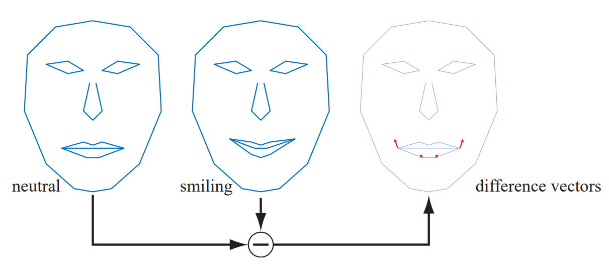
我们从一个中立模型开始，在这个例子中是一张脸，用$\mathcal{N}$表示。除此之外，我们还有一些其他不同的面部表情。在示例中只有一个微笑的表情。通常情况下，我们允许$k \geq 1$个不同的表情，表示为$\mathcal{P}_{i}, i \in[1, \ldots, k]$。在预处理阶段先计算“差别表情”：$\mathcal{D}_{i}=\mathcal{P}_{i}-\mathcal{N}$，即从每个面部表情中减去中立表情。则，一个形变模型可以用如下方法获得：
$$
\mathcal{M}=\mathcal{N}+\sum_{i=1}^{k} w_{i} \mathcal{D}_{i}
$$
这一过程实际上就是在中立模型上根据权重加上不同表情的特征。如上图所示，令$w_{1}=1$得到中间的微笑表情。令$w_{1}=0.5$得到一个半微笑表情。也可以使用负权重或者大于1的权重。我们还可以增加一个有悲伤眉毛的模型。对改模型使用负权重会得到快乐的眉毛。由于位移是可加的，因此眉毛模型可以与微笑模型混合使用。

形变是控制动画的强有力的工具，因为它允许独立控制不同模型的特征。【r1037】介绍了*pose-space deformation*，将顶点混合和形变结合起来。【r1608】使用预结算的顶点纹理去存储了检索不同目标模型之间的位移。由于硬件支持流输出和顶点ID，一个模型可以使用更多的目标模型，整个效果的计算也可以全部放在GPU端【r841，1047】。使用一个低分辨率模型，然后通过曲面细分和位移映射来产生高分辨率模型，可以避免对高精度模型的每个顶点进行蒙皮的消耗【r1971】。

## 4.6 集合缓冲回放

在一些剪辑场景中，需要一些极高质量的动画，使用上述的方法无法实现。一种原始的方法是将所有帧的所有顶点的数据存下来，然后从磁盘中读取并更新网格。但是，对于一个30000顶点的模型，这会造成$50 \mathrm{MB} / \mathrm{s}$的带宽。【r545】提供了几种将内存消耗减小至$10 \%$的方法。

首先要进行量化。例如，位置和纹理坐标使用16位整数存储每一个坐标。这会丧失一定的信息。为了进一步减少数据，需要进行时间和空间上的预测，并将插值编码。对于空间压缩，可以使用平行四边形预测【r800】。时间上的预测则类似于MPEG压缩。这些技术使得实时流数据成为可能。

## 4.7 投影

在剪裁和渲染之前需要进行投影。在本节，我们假定摄像机指向负$z$轴，$y$轴向上，$x$轴向右，也即，右手坐标系。DirectX使用左手坐标系，摄像机指向$z$轴正方向。这两者是等价的。

### 4.7.1 正交投影

正交投影保持线的平行。物体的大小不会受距离摄像机的距离影响。如下的矩阵$\mathbf{P}_{o}$是一个简单的正交投影矩阵，它保持$x$，$y$坐标不变，并将$z$坐标清0。也即，正交投影到平面$z=0$上。
$$
\mathbf{P}_{o}=\left(\begin{array}{cccc}
{1} & {0} & {0} & {0} \\
{0} & {1} & {0} & {0} \\
{0} & {0} & {0} & {0} \\
{0} & {0} & {0} & {1}
\end{array}\right)
$$
投影的效果如下图所示：
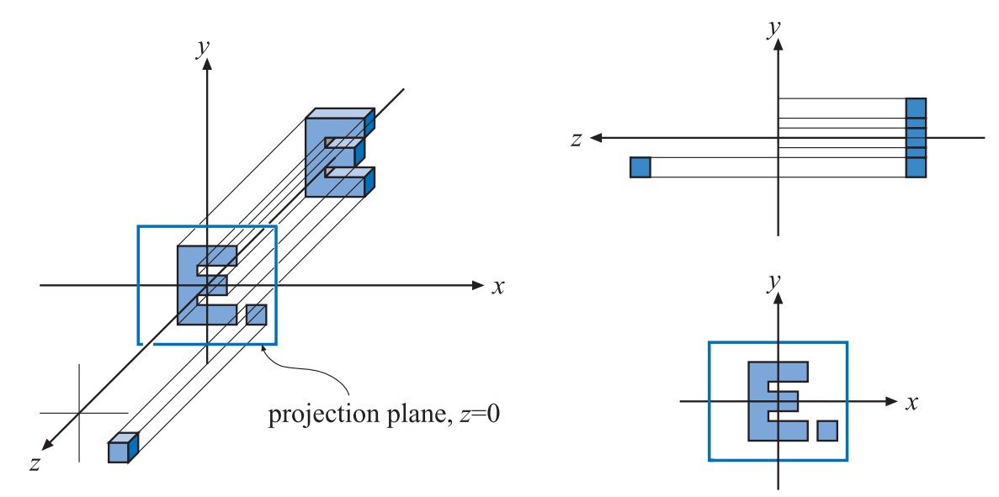
显然，$\mathbf{P}_{o}$是不可逆的。该投影有一个问题：它将$z$值为正的点和$z$值为负的点投影到了同一个平面。我们通常需要把$z$值（也包括$x$和$y$坐标）限制在一个特定的区间中，比如$n$（近平面）到$f$（远平面）。

一个更加通用的正交投影矩阵使用一个6元组表达：$(l, r, b, t, n, f)$，分别指代左右下上近远6个平面。该矩阵将由这6个平面组成的轴对称包围盒（AABB）平移并放缩到一个中心位于原点的轴对称立方体。AABB的最小顶点是$(l, b, n)$，最大顶点是$(r, t, f)$。主要注意的是$n>f$，因为我们的视角指向负$z$轴。我们通常认为近平面小于远平面，如果用户提供了这样的数值，我们需要在内部取负。

在OpenGL中该轴对称立方体的最小顶点是$(-1,-1,-1)$，最大顶点是$(1,1,1)$。在DirectX中，范围是$(-1,-1,0)$到$(1,1,1)$。该立方体叫做规范视域体（*canonical view volume*），其中的坐标叫做标准设备坐标（*normalized device coordinates*）。变换到规范视域体的原因是方便剪裁。变换过程如下：
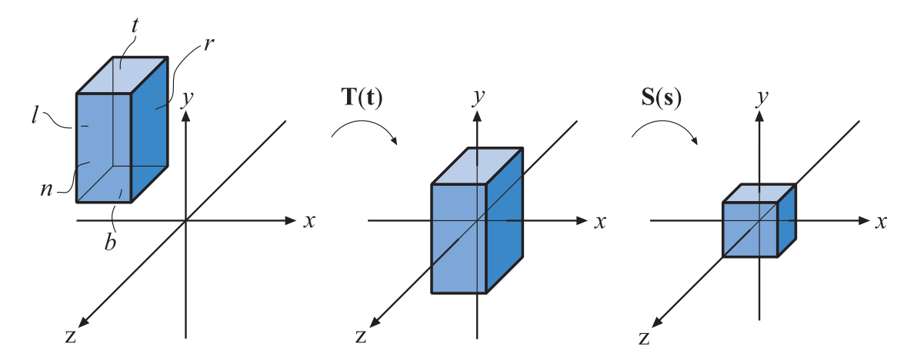

正交变换矩阵如下：
$$
\mathbf{P}_{o}=\mathbf{S}(\mathbf{s}) \mathbf{T}(\mathbf{t})=\left(\begin{array}{cccc}
{\frac{2}{r-l}} & {0} & {0} & {0} \\
{0} & {\frac{2}{t-b}} & {0} & {0} \\
{0} & {0} & {\frac{2}{f-n}} & {0} \\
{0} & {0} & {0} & {1}
\end{array}\right)
\left(\begin{array}{cccc}
{1} & {0} & {0} & {-\frac{l+r}{2}} \\
{0} & {1} & {0} & {-\frac{t+b}{2}} \\
{0} & {0} & {1} & {-\frac{f+n}{2}} \\
{0} & {0} & {0} & {1}
\end{array}\right)
\\
=\left(\begin{array}{cccc}
{\frac{2}{r-l}} & {0} & {0} & {-\frac{r+l}{r-l}} \\
{0} & {\frac{2}{t-b}} & {0} & {-\frac{t+b}{t-b}} \\
{0} & {0} & {\frac{2}{f-n}} & {-\frac{f+n}{f-n}} \\
{0} & {0} & {0} & {1}
\end{array}\right)
$$
$\mathbf{P}_{o}$可以写成平移矩阵和放缩矩阵的连结。当且仅当$n \neq f, l \neq r, t \neq b$时，$\mathbf{P}_{o}$是可逆的。

在计算机图形学中，通常在投影变换后使用左手坐标系，即，对于视口，$x$轴朝右，$y$轴朝上，$z$轴超前。由于在我们定义的AABB中，远平面的值小于近平面的值，因此这样得到的正交变换总是自动包含一个镜像变换。该镜像变换负责变换到左手坐标系。

DirectX将$z$值映射到$[0,1]$，而不是OpenGl的$[-1,1]$。这需要在投影矩阵后再连结一个放缩和平移矩阵：
$$
\mathbf{M}_{s t}=\left(\begin{array}{cccc}
{1} & {0} & {0} & {0} \\
{0} & {1} & {0} & {0} \\
{0} & {0} & {0.5} & {0.5} \\
{0} & {0} & {0} & {1}
\end{array}\right)
$$
因此，DirectX使用的正交投影矩阵是：
$$
\mathbf{P}_{o[0,1]}=\left(\begin{array}{cccc}
{\frac{2}{r-l}} & {0} & {0} & {-\frac{r+l}{r-l}} \\
{0} & {\frac{2}{t-b}} & {0} & {-\frac{t+b}{t-b}} \\
{0} & {0} & {\frac{1}{f-n}} & {-\frac{n}{f-n}} \\
{0} & {0} & {0} & {1}
\end{array}\right)
$$
该矩阵通常以转置的形式出现，因为DirectX使用行优先的形式。

### 4.7.2 透视投影

在透视投影中，线会丧失平行性。我们首先推导一个简单的透视投影矩阵。该矩阵投影到平面$z=-d, d>0$。我们直接从世界空间推导。

假设摄像机位于原点，我们想把一个点$\mathbf{p}$投影到平面$z=-d, d>0$，得到一个新的点$\mathbf{q}=\left(q_{x}, q_{y},-d\right)$。如下图所示：
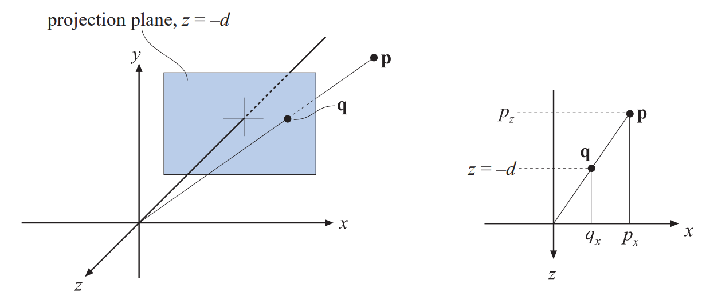
根据相似三角形原理，有：
$$
\frac{q_{x}}{p_{x}}=\frac{-d}{p_{z}} \quad \Longleftrightarrow \quad q_{x}=-d \frac{p_{x}}{p_{z}}
$$
类似的有$q_{y}=-d p_{y} / p_{z}$。从而可以得到透视投影矩阵如下：
$$
\mathbf{P}_{p}=\left(\begin{array}{rrrr}
{1} & {0} & {0} & {0} \\
{0} & {1} & {0} & {0} \\
{0} & {0} & {1} & {0} \\
{0} & {0} & {-1 / d} & {0}
\end{array}\right)
$$
验证如下：
$$
\mathbf{q}=\mathbf{P}_{p} \mathbf{p}=\left(\begin{array}{rrrr}
{1} & {0} & {0} & {0} \\
{0} & {1} & {0} & {0} \\
{0} & {0} & {1} & {0} \\
{0} & {0} & {-1 / d} & {0}
\end{array}\right)\left(\begin{array}{c}
{p_{x}} \\
{p_{y}} \\
{p_{z}} \\
{1}
\end{array}\right)=\left(\begin{array}{c}
{p_{x}} \\
{p_{y}} \\
{p_{z}} \\
{-p_{z} / d}
\end{array}\right) \Rightarrow\left(\begin{array}{c}
{-d p_{x} / p_{z}} \\
{-d p_{y} / p_{z}} \\
{-d} \\
{1}
\end{array}\right)
$$
最后一步进行的操作是除以$w$分量，以保证$w$分量为1。直觉上很容易理解为什么齐次坐标允许投影。齐次化过程的几何理解就是讲点$\left(p_{x}, p_{y}, p_{z}\right)$投影到平面$w=1$。

与正交变换类似，也存在一个投影变换，改变换并非投影到一个平面（这是不可逆的），而是将视椎体投影到之前描述的规范视域体。其中视椎体开始于$z=n$，结束于$z=f$，并且$0>n>f$。在$z=n$的矩形的最小点是$(l, b, n)$，最大点是$(r, t, n)$，如下图所示：
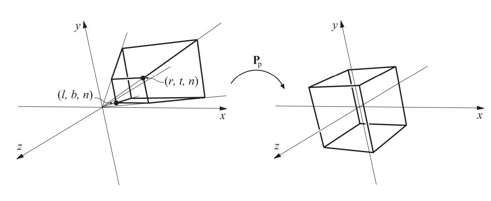

参数$(l, r, b, t, n, f)$决定了摄像机的视锥体。水平视域由左右两个平面（$l$和$r$定义）之间的角度决定，垂直视域由上下两个平面（$t$和$b$定义）之间的角度决定。视域越大，摄像机看到的越多。非对称平截头也是可以的。非对称平截头可以用于立体视觉和虚拟现实。

视域在感知场景时是一个重要的因素。相对于摄像机屏幕，眼睛有一个物理视域。其关系是（这里应该是指水平视域）：
$$\phi=2 \arctan (w /(2 d))$$
其中$\phi$是视域，$w$是对象垂直于视线的宽度，$d$是对象到眼睛的距离。例如，25英寸的屏幕宽度大约是22英寸。在12英寸处，视域是85度；在20英寸处，视域是58度；在30英寸处，视域是40度。摄像机透镜大小与视域的关系也类似。例如，35mm的摄像机（宽度36mm）和50mm透镜形成的视域是$\phi=2 \arctan (36 /(2 \cdot 50))=39.6$度。使用偏窄的视域会减弱透视效果，因为观察者在场景中被放大。使用偏宽的视域会造成物体的扭曲，尤其是在屏幕的边缘。但是，更宽的视域使得场景中的对象更大，给人印象更深刻，并且可以提供更多的场景信息。

将平截头变换到单位立方体的透视投影矩阵如下：
$$
\mathbf{P}_{p}=\left(\begin{array}{cccc}
{\frac{2 n}{r-l}} & {0} & {-\frac{r+l}{r-l}} & {0} \\
{0} & {\frac{2 n}{t-b}} & {-\frac{t+b}{t-b}} & {0} \\
{0} & {0} & {\frac{f+n}{f-n}} & {-\frac{2 f n}{f-n}} \\
{0} & {0} & {1} & {0}
\end{array}\right)
$$
在点上应用该变换后得到另一个点$\mathbf{q}=\left(q_{x}, q_{y}, q_{z}, q_{w}\right)^{T}$。$w$分量通常非0并且不等于1。为了得到透视点$\mathbf{p}$，需要除以$w$分量：
$$
\mathbf{p}=\left(q_{x} / q_{w}, q_{y} / q_{w}, q_{z} / q_{w}, 1\right)
$$
矩阵$\mathbf{P}_{p}$总是将$z=f$映射到$+1$，将$z=n$映射到$-1$。透视投影也可以处理远平面在无穷远的情况：
$$
\mathbf{P}_{p}=\left(\begin{array}{cccc}
{\frac{2 n}{r-l}} & {0} & {-\frac{r+l}{r-l}} & {0} \\
{0} & {\frac{2 n}{t-b}} & {-\frac{t+b}{t-b}} & {0} \\
{0} & {0} & {1} & {-2 n} \\
{0} & {0} & {1} & {0}
\end{array}\right)
$$
总结：应用透视投影$\mathbf{P}_{p}$后，紧跟剪裁和齐次化，最终得到NDC坐标。

为了得到OpenGL中使用的透视投影矩阵，需要乘以镜像矩阵$\mathbf{S}(1,1,-1,1)$，因为需要变换到左手坐标系。这会将$\mathbf{P}_{p}$的第3列取负。经过镜像变换后，远近平面被记为正值，即$0<n^{\prime}<f^{\prime}$。作为参考，下面是OpenGL使用的矩阵：
$$
\mathbf{P}_{\mathrm{OpenGL}}=\left(\begin{array}{cccc}
{\frac{2 n^{\prime}}{r-l}} & {0} & {\frac{r+l}{r-l}} & {0} \\
{0} & {\frac{2 n^{\prime}}{t-b}} & {\frac{t+b}{t-b}} & {0} \\
{0} & {0} & {-\frac{f^{\prime}+n^{\prime}}{f^{\prime}+n^{\prime}}} & {-\frac{2 f^{\prime} n^{\prime}}{f^{\prime}-n^{\prime}}} \\
{0} & {0} & {-1} & {0}
\end{array}\right)
$$
一种简化的设置投影矩阵的方法是提供垂直视域$\phi$，纵横比$a=w / h$（$w \times h$是屏幕分辨率），$n^{\prime}$和$f^{\prime}$，有：
$$
\mathbf{P}_{\mathrm{OpenGL}}=\left(\begin{array}{cccc}
{c / a} & {0} & {0} & {0} \\
{0} & {c} & {0} & {0} \\
{0} & {0} & {-\frac{f^{\prime}+n^{\prime}}{f^{\prime}-n^{\prime}}} & {-\frac{2 f^{\prime} n^{\prime}}{f^{\prime}-n^{\prime}}} \\
{0} & {0} & {-1} & {0}
\end{array}\right)
$$
其中$c=1.0 / \tan (\phi / 2)$。该矩阵被实现在旧函数gluPerspective()中，该函数位于OpenGL Utility Library（GLU）。

一些API（如DirectX）将近平面映射到$z=0$，远平面映射到$z=1$。此外，DirectX使用左手坐标系来定义投影矩阵。因此在DirectX中，投影矩阵是：
$$
\mathbf{P}_{p[0,1]}=\left(\begin{array}{cccc}
{\frac{2 n^{\prime}}{r-l}} & {0} & {-\frac{r+l}{r-l}} & {0} \\
{0} & {\frac{2 n^{\prime}}{t-b}} & {-\frac{t+b}{t-b}} & {0} \\
{0} & {0} & {\frac{f^{\prime}}{f^{\prime}-n^{\prime}}} & {f^{\prime}-n^{\prime}} \\
{0} & {0} & {1} & {0}
\end{array}\right)
$$
DirectX使用行优先形式，因此该矩阵通常以转置形式出现。

使用透视投影的一个问题是计算得到的深度值并不随输入的$p_{z}$线性变化。将投影变换矩阵作用于点$\mathbf{p}$，得到：
$$
\mathbf{v}=\mathbf{P}_{\mathbf{p}}=\left(\begin{array}{c}
{\cdots} \\
{\cdots} \\
{d p_{z}+e} \\
{\pm p_{z}}
\end{array}\right)
$$
这里省略了$v_{x}$和$v_{y}$，$d$和$f$的内容依赖于所选择的矩阵。如果使用$\mathbf{P}_{\mathrm{OpenGL}}$，则有$d=-\left(f^{\prime}+n^{\prime}\right) /\left(f^{\prime}-n^{\prime}\right)$，$e=-2 f^{\prime} n^{\prime} /\left(f^{\prime}-n^{\prime}\right)$和$v_{x}=-p_{z}$。为了获得NDC深度，还需要透视除，即：
$$
z_{\mathrm{NDC}}=\frac{d p_{z}+e}{-p_{z}}=d-\frac{e}{p_{z}}
$$
其中$z_{\mathrm{NDC}} \in[-1,+1]$（OpenGL）。可以看到，输出的深度值$z_{\mathrm{NDC}}$反比于输入的深度值$p_{z}$。例如，如果$n^{\prime}=10$，$f^{\prime}=110$，这里使用OpenGL的术语。当$p_{z}$在负$z$轴$60$单位时（也就是中点），计算的NDC深度是0.833，而不是0。下图显示了近平面到原点距离变化对深度值的影响。距离$f^{\prime}-n^{\prime}$恒定为100。近平面距离原点越近，远处的点的NDC深度值的范围越小。这会导致$z$缓冲失真。
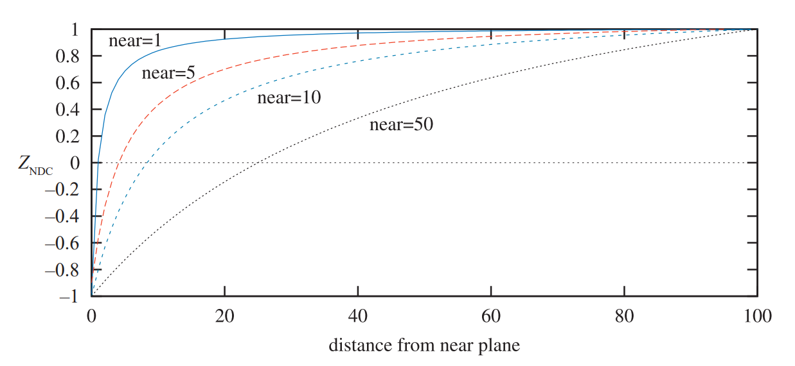

有一些方法可以用来提高深度值精度。*reversed z*是一种通用的方法【r978】，它就是使用浮点深度或者整数来存储$1.0-z_{\mathrm{NDC}}$。下图是结果的比较。图示使用了DirectX的变换矩阵。即$z_{\mathrm{NDC}} \in[0,+1]$。左上角使用了标准的整数深度缓冲，有4位精度（因此在$y$轴上有16个标记）。右上将远平面设置成无穷远，可以看到这样做并不会损失多少精度。左下使用了浮点数深度，有3位指数和3位尾数。可以看到$y$轴上的分布十分不均匀，$x$上更加糟糕。右下使用了反转浮点深度，即$1-z_{\mathrm{NDC}}$。可以看到分布情况大大改善。
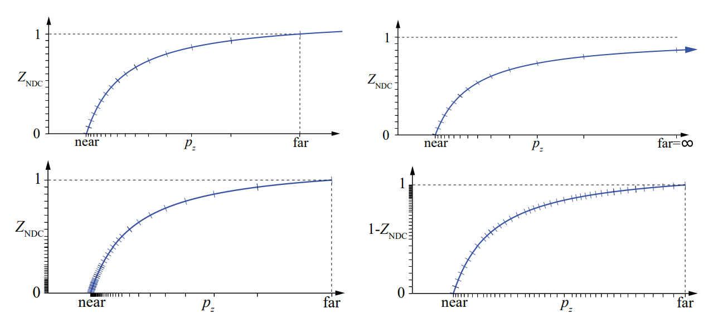

【r1472】通过模拟显示使用*reversed z*的浮点深度缓冲可以提供最佳的精度，对于整数深度缓冲（通常有24位）也建议使用*reversed z*。对于不使用*reversed z*的标准映射方法，【r1803】发现将投影矩阵分开可以减少错误率。例如，使用$\mathbf{P}\left(\mathbf{M}{\mathbf{p}}\right)$要优于$\mathbf{T}{\mathbf{p}}$，其中$\mathbf{T}=\mathbf{P} \mathbf{M}$。在范围$[0.5,1.0]$中，fp32和int24的精度基本一样，因为fp32的尾数是23位。让NDC深度正比于$1 / p_{z}$是为了简化硬件，并提高深度压缩的效果。

【r1063】提出使用对数深度值来提高阴影贴图的精度。【r991】使用前一帧的深度缓存来决定最大近平面和最小远平面。针对屏幕空间深度，【r881】提出用如下方法重新映射每个顶点：
$$
\begin{aligned}
&z=w\left(\log _{2}\left(\max \left(10^{-6}, 1+w\right)\right) f_{c}-1\right)，OpenGL\\
&z=w \log _{2}\left(\max \left(10^{-6}, 1+w\right)\right) f_{c} / 2，DirectX
\end{aligned}
$$
算法详情参考原文。【r1605】提出了使用多个子平截头的算法，可以将精度提高到任意想要的程度。

## 拓展阅读

略