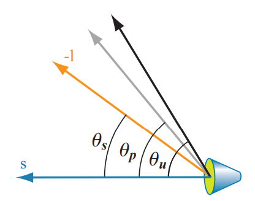

# Chapter 5 着色基础

渲染分写实化和风格化。本节介绍的着色概念同时适用于这两种渲染方法。

## 5.1 着色模型

决定物体外观的第一步就是选择一个着色模型（*shading model*）来描述物体的颜色如何根据表面方向，视方向，光方向之类的因素而变化。

下面以*Gooch shading model*的一个变种为例进行介绍。这是一种非写实化渲染，被设计用来在技术示例中提升细节的可识别性。其基本思想是比较表面法向量与光的位置。如果法向量指向光，使用暖色调着色；如果法向量指离光，使用冷色调着色。中间角度的颜色插值获得。我们还会增加一个高光效果。结果如下图：


着色模型通常有属性来控制外观的变化。我们的示例模型只有一个属性，表面颜色。如下图所示：


与绝大多数着色模型一样，我们的模型受表面相对于视方向和光方向的方位的影响。这些方向通常表示被单位向量，如下图所示：


模型的数学定义如下：
$$
\mathbf{c}_{\text {shaded }}=s \mathbf{c}_{\text {highlight }}+(1-s)\left(t \mathbf{c}_{\text {warm }}+(1-t) \mathbf{c}_{\text {cool }}\right)
$$
方程中，我们使用了如下的中间计算：
$$
\begin{aligned}
\mathbf{c}_{\text {cool }} &=(0,0,0.55)+0.25 \mathbf{c}_{\text {surface }} \\
\mathbf{c}_{\text {warm }} &=(0.3,0.3,0)+0.25 \mathbf{c}_{\text {surface }} \\
\mathbf{c}_{\text {highlight }} &=(1,1,1) \\
t &=\frac{(\mathbf{n} \cdot 1)+1}{2} \\
\mathbf{r} &=2(\mathbf{n} \cdot \mathbf{l}) \mathbf{n}-1 \\
s &=(100(\mathbf{r} \cdot \mathbf{v})-97)^{\mp}
\end{aligned}
$$
截断操作很常见。我们使用$x^{\mp}$将结果截取到0和1之间。另一个常见的操作是线性插值。我们在模型中先在$\mathbf{c}_{\text {warm }}$和$\mathbf{C}_{\text {cool }}$之间插值，然后在得到的插值结果和$\mathbf{C}_{\text {highlight }}$之间插值。$\mathbf{r}=2(\mathbf{n} \cdot \mathbf{l}) \mathbf{n}-1$计算反射向量，将$\mathbf{l}$关于$\mathbf{n}$反射。

## 5.2 光源

我们的模型很简单，但现实中的光很复杂。光源可以有大小，形状，颜色，强度。间接光也会影响着色。基于物理的写实化着色模型需要把这些因素都考虑进去。相反的，风格化着色模型会根据需要以不同方式使用光照。一些模型甚至没有光的概念。增加光照复杂度的另一个因素是着色模型如何对待有光和无光这两种不同的情况。这样的着色模型在有光照的时候是一种外观，在无光照的时候是另一种外观。区分有光照和无光照有多种准则：距离光源的距离，阴影，法向量与光向量之间的角度是否大于90度，或者是这些因素的组合。可以将这种有光和无光的二分性拓展到光强度的连续性变化。这可以通过在无光和有光之间插值来实现。这意味着将光强度限制在一个范围内，可能是0到1。也可以用一个无范围限制的量来以另一种方式影响着色。后者的一种常规做法是将着色模型分解为有光和无光两部分，并使用光强度$k_{\text {light }}$来线性放缩有光部分：
$$
\mathbf{c}_{\text {shaded }}=f_{\text {unlit }}(\mathbf{n}, \mathbf{v})+k_{\text {light }} f_{\text {lit }}(\mathbf{l}, \mathbf{n}, \mathbf{v})
$$
这可以拓展到RGB光颜色：
$$
\mathbf{c}_{\text {shaded }}=f_{\text {unlit }}(\mathbf{n}, \mathbf{v})+\mathbf{c}_{\text {light }} f_{\text {lit }}(\mathbf{l}, \mathbf{n}, \mathbf{v})
$$
再拓展到多光源：
$$
\mathbf{c}_{\text {shaded }}=f_{\text {unlit }}(\mathbf{n}, \mathbf{v})+\sum_{i=1}^{n} \mathbf{c}_{\text {light }_{i}} f_{\text {lit }}\left(\mathbf{l}_{i}, \mathbf{n}, \mathbf{v}\right)
$$
无光的部分$f_{\text {unlit }}(\mathbf{n}, \mathbf{v})$对应于不受光影响的外观。它依据需要的效果可以有多种形式。例如，可以使用纯黑来表达无光，也可以使用风格化的外观。此外，无光部分通常用来表达一些其他类型的光，这些光并非来自于场景中显示摆放的光源。例如，天空的光和周围物体反射的光，都使用无光部分来表达。

光的照射效果可以使用射线可视化。击中表面的射线的密度对应于光的强度。下图是光照射的横截面示意图：

击中表面的光线之间的空间大小反比于$\mathbf{l}$和$\mathbf{n}$之间夹角的余弦值。因此，击中表面的射线密度正比于$\mathbf{l}$和$\mathbf{n}$之间夹角的余弦值。将光方向定义为光照射方向取反是为了计算方便。还要注意背面照射的光不应该贡献亮度，因此需要一步截断操作。有：
$$
\mathbf{c}_{\text {shaded }}=f_{\text {unlit }}(\mathbf{n}, \mathbf{v})+\sum_{i=1}^{n}\left(\mathbf{l}_{i} \cdot \mathbf{n}\right)^{+} \mathbf{c}_{\text {light }_{i}} f_{\text {lit }}\left(\mathbf{l}_{i}, \mathbf{n}, \mathbf{v}\right)
$$
该公式是对上一个公式的特殊化。它可用于PBS，也可用于风格化渲染以保证光照的整体一致性。

$f_{\mathrm{lit}}()$的最简单的形式就是一个恒定的颜色：
$$
f_{\mathrm{lit}}()=\mathbf{c}_{\mathrm{surface}}
$$
这将得到如下的着色模型：
$$
\mathbf{c}_{\text {shaded }}=f_{\text {unlit }}(\mathbf{n}, \mathbf{v})+\sum_{i=1}^{n}\left(\mathbf{l}_{i} \cdot \mathbf{n}\right)^{+} \mathbf{c}_{\text {light }_{i}} \mathbf{c}_{\text {surface }}
$$
改模型的光照部分对应于*Lambertian*光照模型。改模型适用于完美漫反射表面，即完美粗糙的表面。本节的介绍只是兰伯特模型的一个简化的阐释。兰伯特模型本身就可以用于简单的着色，并且也是许多着色模型的关键组件。

光源于着色模型的交互主要受2个参数控制：指向光源的向量$\mathbf{l}$和光的颜色$\mathbf{c}_{light}$。不同光源的主要区别就在于这2个参数如何变化。光源被近似视为无穷小的点。

### 5.2.1 方向光

方向光是最简单的光源模型，其$\mathbf{l}$和$\mathbf{c}_{light}$恒定不变，例如太阳。也可以将方向光的概念进行拓展，允许$\mathbf{c}_{light}$变化而保持$\mathbf{l}$不变。

### 5.2.2 精确光

*punctual lights*不是指光源很“守时”，而是指光源有一个确定的位置。这样的光源也没有维度，形状和大小。*punctual*一词来自于拉丁文*punctus*，意思是“点”。术语“点光”指代一种特殊的光源，该光源向所有方向均匀发射光线。因此，点光和聚光是两种不同的精确光。光方向$\mathbf{l}$依赖于当前着色点$\mathbf{p}_0$相对于精确光$\mathbf{p}_{light}$的位置：
$$
\mathrm{I}=\frac{\mathbf{p}_{\text {light }}-\mathbf{p}_{0}}{\left\|\mathbf{p}_{\text {light }}-\mathbf{p}_{0}\right\|}
$$
该方程是一个向量标准化操作。但有时候我们需要该操作的中间结果：
$$
\begin{aligned}
&\mathbf{d}=\mathbf{p}_{\text {light }}-\mathbf{p}_{0}\\
&r=\sqrt{\mathbf{d} \cdot \mathbf{d}}\\
&1=\frac{\mathrm{d}}{r}
\end{aligned}
$$
$r$被用来计算光的衰减。

#### 点光/泛光

朝所有方向均匀发射光线的精确光被称为点光（*point lights*）或者泛光（*omni lights*）。对于点光，$\mathbf{c}_{light}$随距离$r$变化，也就是衰减。下图显示了衰减的几何解释：

如图所示，在一个给定的表面，光线之间的距离正比于平面到点光的距离。由于光线之间的距离增长发生在平面的两个维度，因此光线的密度（也即$\mathbf{c}_{light}$）正比于平面到点光的距离的反平方$1 / r^{2}$。令$\mathbf{c}_{light_0}$表示$\mathbf{c}_{light}$在参考距离$r_0$的值，有：
$$
\mathbf{c}_{\mathrm{light}}(r)=\mathbf{c}_{\mathrm{light}_{0}}\left(\frac{r_{0}}{r}\right)^{2}
$$
上式通常被称为光的平方反比衰减（*inverse-square light attenuation*）。尽管该公式技术上讲是正确的，但它还有一些问题。因此不能直接用在实际应用中。

第一个问题发生在距离相对较小时。当$r$趋近于0，$\mathbf{c}_{light}$会无限制增长。当$r$等于0，会发生除0错误。一种解决办法【r861】是在分布上加一个很小的值$\epsilon$：
$$
\mathbf{c}_{\mathrm{light}}(r)=\mathbf{c}_{\mathrm{light}_{0}} \frac{r_{0}^{2}}{r^{2}+\epsilon}
$$
$\epsilon$的值依赖于具体的应用。例如，Unreal引擎使用$\epsilon=1$cm【r861】。CryEngine【r1591】和Frostbite【r960】使用了另一种方法，将$r$截断到一个最小值$r_{\mathrm{min}}$：
$$
\mathbf{c}_{\mathrm{light}}(r)=\mathbf{c}_{\operatorname{light}_{0}}\left(\frac{r_{0}}{\max \left(r, r_{\min }\right)}\right)^{2}
$$
不像上一个方法中的$\epsilon$可以比较自由地设置，这里的$r_{\mathrm{min}}$有物理解释：它代表物理光源的半径。小于$r_{\mathrm{min}}$的$r$值表示着色表面穿插到了物理光源的内部，这显然是不可能的。

第二个问题发生在非常远的距离。该问题不是视觉上的问题，而是性能上的问题。尽管光强度随着距离衰减，但永远不会到0。为了高效渲染，我们需要光的强度在某个有限距离处减小到0。有许多种修改方法可以实现该效果，但引入的修改要越小越好。为了避免在光影响范围的边界处出现突变，要求修改后的函数的值和导数要在相同的距离处达到0。一种解决办法是用一个窗口函数（*windowing function*）去乘以原来的方程。Unreal Engine【r861】和Frostbite【r960】使用的一个窗口函数是【r860】：
$$
f_{\mathrm{win}}(r)=\left(1-\left(\frac{r}{r_{\mathrm{max}}}\right)^{4}\right)^{+2}
$$
其中$+2$表示先截断再平方。下图分别显示了原始的平方反比曲线，前述的窗口函数，以及这两者的乘积：


应用的实际需要也会影响方法的选择。例如，当距离衰减函数以一个很低的空间频率（光照贴图或者逐顶点）进行采样时，要求导数在$r_{\mathrm{max}}$处等于0就非常重要。CryEngine不适用光照贴图和逐顶点光照，所以采用了一种很简单的做法：在$0.8r_{\mathrm{max}}$到$r_{\mathrm{max}}$范围内切换到线性衰减【r1591】。

对于一些应用来说，符合平方反比曲线并不是要务，它们会使用全新的函数，形式如下：
$$
\mathbf{c}_{\operatorname{light}}(r)=\mathbf{c}_{\operatorname{light}_{0}} f_{\text {dist }}(r)
$$
其中$f_{\text {dist }}(r)$是距离的函数，被称作距离衰减函数（*distance falloff functions*）。一些应用可能出于性能原因不使用平方反比衰减函数，例如正当防卫2【r1379】：
$$
f_{\text {dist }}(r)=\left(1-\left(\frac{r}{r_{\text {max }}}\right)^{2}\right)^{+2}
$$
在其他应用中，衰减函数的选择会有更多考虑。例如，在Unreal Engine中，不管是写实化还是风格化渲染，都有两种光衰减模式：一种是前述的平方反比模式，另一种是指数衰减模式。该模式可以通过微调来获得各种各样的衰减曲线【r1802】。古墓丽影（2013）使用样条编辑工具来设置衰减曲线，这可以对曲线的形状进行更加精细的控制。

#### 聚光

现实世界中的光源往往具有方向性，这种方向性使用方向衰减函数$f_{\operatorname{dir}}(\mathbf{l})$来表达。将其与距离衰减函数结合得到：
$$
\mathbf{c}_{\mathrm{light}}=\mathbf{c}_{\mathrm{light}_{0}} f_{\mathrm{dist}}(r) f_{\mathrm{dir}}(\mathbf{l})
$$
不同的$f_{\operatorname{dir}}(\mathbf{l})$可以产生不同的光照效果。一种重要的类型是聚光，其光的范围是一个圆锥体。聚光的方向衰减函数绕聚光的方向$s$圆形对称，因此可以表达为$s$和$-\mathrm{l}$之间的角度$\theta_{s}$的函数。注意需要对光向量取反。

聚光通常有一个本影角$\theta_{u}$，满足当$\theta_{s} \geq \theta_{u}$时有$f_{\operatorname{dir}}(\mathbf{l})=0$。这个角类似于最大衰减距离$r_{max}$，可以用于剔除。聚光还有一个半影角$\theta_{p}$，这定义了一个内部的圆锥体，其中的光不受方向衰减的影响。如下图所示：


聚光有多种不同的方向衰减函数，但都大同小异。例如，Frostbite【r960】使用的函数$f_{\operatorname{dir}_{\mathrm{F}}}(1)$和three.js浏览器图形库【r218】使用的函数$f_{\operatorname{dir}_{\mathrm{T}}}(1)$分别如下：
$$
\begin{aligned}
t &=\left(\frac{\cos \theta_{s}-\cos \theta_{u}}{\cos \theta_{p}-\cos \theta_{u}}\right)^{\mp} \\
f_{\text {dir }_{F}}(1) &=t^{2} \\
f_{\text {dir }_{T}}(1) &=\text { smoothstep }(t)=t^{2}(3-2 t)
\end{aligned}
$$
smoothstep是一个3次多项式，常用于平滑插值。下图显示了不同光的效果：

图中从左到右分别是方向光，无衰减的点光和平滑变换的聚光。注意到点光虽然没有衰减，但是边缘仍然会变暗，这是因为光向量和法向量之间角度的变化。

#### 其他精确光

方向衰减函数并不局限于前述的聚光衰减函数，它可以表达任意的方向变化，包括复杂的表格模式。IES（illuminating Engineering Society）针对这种模型定义了一个标准的文件格式。IES的相关资料被用于游戏《杀戮地带：暗影堕落》【r379，380】，以及Unreal【r861】和Frostbite【r960】。【r961】总结了如何解析并使用这种格式的文件。游戏《古墓丽影》（2013）【r953】使用的精确光在世界坐标的$x$，$y$，$z$轴方向有独立的距离衰减函数。光强度随时间的变化也是用曲线来表达，以实现闪烁的火把的效果。

### 5.2.3 其他类型的光

方向光和精确光主要通过光方向$\mathbf{l}$来刻画。不同类型的光可以通过使用其他计算光方向的方法来定义。例如，《古墓丽影》有一种胶囊光，它使用线段来代替点。对于每一个着色像素，使用到线段上最近点的方向作为光方向。现实中，光源可以有大小和形状，并从多个方向照射表面。在渲染中，这种光叫做区域光（*area lights*）。它在实时渲染中变得越来越流行。区域光渲染技术主要分为两类：模拟区域光因被部分遮挡而造成的阴影边缘的软化，和区域光在表面上的着色效果。

## 5.3 实现着色模型

本节使用代码实现上述着色方程。

### 5.3.1 评估频率

当设计着色实现时，需要根据评估频率（*frequency of evaluation*）来划分计算。首先，判断一个给定计算的结果在一整个*draw call*中是否不变。在这种情况下，计算可由应用进行，结果通过着色去输入传递给图形API。即使在这一类别中也存在不同的评估频率。最简单的形式即使着色方程中的恒定子表达式，或者是任何基于不变量（例如硬件参数和配置选项）的计算。这种着色计算可能在编译的时候就已经计算完毕，因此不需要使用一致着色器输入。此外，该类计算也可以在离线情况下预先计算，并在运行时载入。

另一种情况是计算结果虽然不断变化，但是速度很慢，以至于没必要每帧更新，例如游戏世界中的太阳光。如果这种计算的消耗很大，我们可以把它分散在多个帧中。

其他情况包括每帧一次的计算，如连结是矩阵和投影矩阵；每个模型计算一次，如根据位置更新光照参数；每个*draw call*计算一次，如更新材质的参数。根据评估频率划分一致着色器输入有利于提升应用的性能【r1165】。

如果一个着色计算的结果在一个*draw call*中会发生变化，那么它就不能通过一致着色器输入传递到着色器中，而是必须在可编程着色器阶段被计算，或者通过可变着色器输入传递到其他阶段。理论上，着色器计算可以发生在任何可编程阶段，不同阶段有不同的评估频率：
* 顶点着色器：曲面细分之前每个顶点评估一次
* 壳着色器：每个面片评估一次
* 域着色器：曲面细分后每个顶点评估一次
* 几何着色器：每个原型评估一次
* 像素着色器：每个像素评估一次

在实际中，绝大多数着色计算每个像素进行一次，主要用像素着色器实现，计算着色器也越来越受到重视。其他阶段主要用于几何操作，如变换和形变。其原因可以通过比较逐顶点着色和逐像素着色的效果来理解。在以前，这两者分别被叫做*Gouraud shading*【r578】和*Phong shading*【r1414】。这里使用的着色模型与前述的模型（$\mathbf{c}_{\text {shaded }}=s \mathbf{c}_{\text {highlight }}+(1-s)\left(t \mathbf{c}_{\text {warm }}+(1-t) \mathbf{c}_{\text {cool }}\right)$）类似，但作了修改以适用于多光源。下图显示了结果：

可以看到，对于龙这个模型，其顶点数很密，因此逐顶点和逐像素着色的差别很小。但是对于茶壶，逐顶点着色会产生一些视觉上的错误，如高光的棱角。而对于有两个三角形组成的面片，逐顶点着色是完全错误的。错误的原因是着色器算中有一部分计算（如高光）在网格表面上非线性变化，而顶点着色器的输出在三角形上会被线性插值。

原则上，可以只在像素种色器中计算高光，而把其他计算放在顶点着色器中。理论上这会产生相同的结果，并且节省计算。但在实际中，这种混合计算往往不是最佳的。线性变化的部分计算量非常小，以这种方式分割着色计算往往会增加开销，例如重复的计算和额外的可变输入。这反而会降低性能。

顶点着色器主要负责变换。其输出的表面属性需要被变换到合适的坐标系。这些属性包括位置，法向量，切向量等。在被通过可变着色器输入传递给像素着色器之前，这些属性会在三角形上被线性插值。尽管顶点着色器通常输出单位法向量，插值会改变法向量的长度，如下图所示：

因此像素着色器需要重新单位化法向量。上图还展示了另一个问题：如果法向量在不同顶点间变化巨大（可能是顶点混合的副作用），那么插值结果会朝更长的法向量倾斜。因此，对于需要被插值的向量，通常的做法是在插值前后分别进行一次单位化。与法向量不同，指向特定位置的向量（如视向量和光向量）通常不需要插值。这些向量在像素着色器中使用插值得到的位置来计算。如果由于特殊原因需要插值这些向量，则在插值前不要进行单位化，否则会产生错误的结果，如下图所示：


之前我们提到过，顶点着色器需要将表面属性变换到合适的坐标系。摄像机和光的位置通常由应用负责变换到相同的坐标系。但是，哪一个坐标系才是合适的坐标系？可能的选择有世界坐标，或者摄像机的局部坐标，甚至是模型的坐标系。具体的选择需要考虑具体的应用特性，如灵活性，性能，简单性。例如，如果场景中包含大量的灯光，那么可以选择世界坐标系以避免变换光的位置。也可以选择摄像机空间，以优化像素着色器中关联视向量的计算并提高精度。

也有一些特殊的着色模型，如平面着色（*flat shading*），如下图所示：

原则上平面着色可以使用几何着色器实现，但最近的实现通常使用顶点着色器。方法是将每个原型的属性与其第一个顶点关联，并关闭顶点属性插值。当关闭顶点属性插值后（每个顶点属性可以分别设置是否关闭插值），第一个顶点的值会被传递到该原型的所有像素。

### 5.3.2 实现样例

下面介绍一个实现着色模型的例子。使用的着色方程如下：
$$
\mathbf{c}_{\text {shaded }}=\frac{1}{2} \mathbf{c}_{\text {cool }}+\sum_{i=1}^{n}\left(\mathbf{l}_{i} \cdot \mathbf{n}\right)^{+} \mathbf{c}_{\text {light }_{i}}\left(s_{i} \mathbf{c}_{\text {highlight }}+\left(1-s_{i}\right) \mathbf{c}_{\text {warm }}\right)
$$
中间计算如下：
$$
\begin{aligned}
\mathbf{c}_{\text {cool }} &=(0,0,0.55)+0.25 \mathbf{c}_{\text {surface }} \\
\mathbf{c}_{\text {warm }} &=(0.3,0.3,0)+0.25 \mathbf{c}_{\text {surface }} \\
\mathbf{c}_{\text {highlight }} &=(2,2,2) \\
\mathbf{r}_{i} &=2\left(\mathbf{n} \cdot \mathbf{l}_{i}\right) \mathbf{n}-1_{i} \\
s_{i} &=\left(100\left(\mathbf{r}_{i} \cdot \mathbf{v}\right)-97\right)^{\mp}
\end{aligned}
$$
该光源遵循之前介绍的多光源着色方程，即：
$$
\mathbf{c}_{\text {shaded }}=f_{\text {unlit }}(\mathbf{n}, \mathbf{v})+\sum_{i=1}^{n}\left(\mathbf{l}_{i} \cdot \mathbf{n}\right)^{+} \mathbf{c}_{\text {light }_{i}} f_{\text {lit }}\left(\mathbf{l}_{i}, \mathbf{n}, \mathbf{v}\right)
$$
其中的有光项和无光项分别是：
$$
\begin{array}{l}
{f_{\text {unlit }}(\mathbf{n}, \mathbf{v})=\frac{1}{2} \mathbf{c}_{\text {cool }}} \\
{f_{\text {lit }}\left(\mathbf{l}_{i}, \mathbf{n}, \mathbf{v}\right)=s_{i} \mathbf{c}_{\text {highlight }}+\left(1-s_{i}\right) \mathbf{c}_{\text {warm }}}
\end{array}
$$
在绝大多数的应用中，材质属性中可变值（如$\mathbf{c}_{surface}$）被存储在顶点数据中，或者更一般的，存储在纹理中。然而，为了保持示例的简单性，我们假定$\mathbf{c}_{surface}$在模型层面是恒定的。

实现使用动态分支迭代所有光源。但是，渲染大量的光源需要其他的方法。另外，为了实现的简单，我们限制光源类型为点光源。

着色器模型不是孤立的，而是实现在一个更大的渲染框架中。我们的样例基于WebGL 2。我们会按照由内向外的顺序实现，即先是像素着色器，然后顶点着色器，最后是应用端的图形API调用。

首先是着色器输入输出的定义。使用GLSL的术语，着色器输入包含两类：一致输入和可变输入。下面是像素着色器可变输入和输出的定义：
```GLSL
in vec3 vPos ;
in vec3 vNormal ;
out vec4 outColor ;
```
像素着色器只有一个输出，就是最终的颜色。像素着色器的输入要与顶点着色器的输出相匹配。像素着色器有2个可变输入：位置和法向量，都位于世界坐标中。一致输入的数量要多得多，这里为了简单，只列出与光源相关的2个定义：
```GLSL
struct Light {
    vec4 position ;
    vec4 color ;
};

uniform LightUBlock {
    Light uLights [ MAXLIGHTS ];
};

uniform uint uLightCount ;
```
由于是点光，因此需要位置和颜色。使用vec4而不是vec3是为了遵循GLSL std140数据分布标准的限制。尽管这会浪费空间，但它保证了CPU和GPU之间数据分布的一致性。Light结构的数组被定义在一个命名的uniform块中，这是GLSL的一个特性，通过将一组一致变量绑定到一个缓冲对象上以加速数据传输。应用端会在编译着色器之前使用正确的值（本示例中是10）来替换MAXLIGHTS字符串。整数uLightCount是光的实际数量。

下面是像素着色器的代码：
```GLSL
vec3 lit( vec3 l, vec3 n, vec3 v) {
    vec3 r_l = reflect (-l, n);
    float s = clamp (100.0 * dot(r_l , v) - 97.0 , 0.0 , 1.0) ;
    vec3 highlightColor = vec3 (2 ,2 ,2);
    return mix( uWarmColor , highlightColor , s);
}

void main () {
    vec3 n = normalize ( vNormal );
    vec3 v = normalize ( uEyePosition .xyz - vPos );
    outColor = vec4 ( uFUnlit , 1.0) ;
    for ( uint i = 0u; i < uLightCount ; i++) {
        vec3 l = normalize ( uLights [i]. position .xyz - vPos );
        float NdL = clamp (dot(n, l), 0.0 , 1.0) ;
        outColor .rgb += NdL * uLights [i]. color .rgb * lit(l,n,v);
    }
}
```
注意$f_{\text {unlit }}()$和$\mathbf{c}_{warm }$的值以一致变量的形式传入。mix()函数执行插值操作。

下面关注顶点着色器。由于已经看过像素着色器的一致变量定义的例子，这里省略一致变量的定义。下面是可变输入和输出的定义：
```GLSL
layout ( location =0) in vec4 position ;
layout ( location =1) in vec4 normal ;
out vec3 vPos ;
out vec3 vNormal ;
```
输入定义包含指定数据在顶点数组中如何分布的指令。下面是顶点着色器代码：
```GLSL
void main () {
    vec4 worldPosition = uModel * position ;
    vPos = worldPosition .xyz;
    vNormal = ( uModel * normal ).xyz;
    gl_Position = viewProj * worldPosition ;
}
```
顶点着色器中有一些通用的操作。位置和法向量会被变换到世界空间并传递给像素着色器。最后，位置被变换到齐次剪裁空间并传递给gl_Position。该变量是光栅化需要使用的一个系统定义变量。任何顶点着色器都需要输出gl_Position变量。

注意法向量并没有做单位化操作。因为在原始的网格数据中它们的长度就是1，并且我们也没有做任何以非均匀方式修改它们长度的操作，如定点混合或者非均匀放缩。模型矩阵可能包含均匀放缩项，但那会成比例地修改所有法向量的长度，因此不会产生之前所提到的法向量偏移问题。

使用WebGL API设定像素着色器的代码如下：
```GLSL
var fSource = document . getElementById (" fragment "). text . trim ();

var maxLights = 10;
fSource = fSource . replace (/ MAXLIGHTS /g, maxLights . toString ());

var fragmentShader = gl. createShader (gl. FRAGMENT_SHADER );
gl. shaderSource ( fragmentShader , fSource );
gl. compileShader ( fragmentShader );
```
这里把MAXLIGHTS替换为了合适的数值。绝大多数渲染框架提供类似的预编译控制。其他应用端代码被省略，如设置一致变量，初始化顶点数组，清空，绘制，等等。

### 5.3.3 材质系统

一个渲染系统通常需要处理大量的材质，着色模型和着色器。材质是一个底层的图形API资源，美术人员很难与其交互。材质（*material*）则是对表面外观的一种面向美术的抽象。材质有时候也会描述一些非可视化的属性，例如碰撞属性。

尽管材质通过着色器实现，但是这两者之间并不是一一对应的。同一个材质可以使用多个不同的着色器。一个着色器也可以被多个材质所共享。最常见的例子是参数化材质。在最简单的形式下，材质参数化需要两种类型的材质实体：材质模板（*material templates*）和材质实例（*material instances*）。每个材质模板描述了一类材质，包含一个参数集合。每个材质实例对应于一个材质模板加上对参数集合中所有参数的具体赋值。一些如Unreal Engine【r1802】之类的引擎还有一个更加复杂的层级结构。其中材质模板可以继承其他的材质模板。

参数可以以传递一致参数的形式在运行时决定，也可以通过在编译着色器之前替换的方式在编译时决定。绝大多数情况下材质参数与着色模型的参数一一对应，但也有例外。一个材质可能固定一个着色模型参数的值，例如表面颜色。一个着色模型参数也可能是多个材质参数的计算结果。在某些情况下，诸如位置，方位，甚至是时间之类的参数都会参与到计算中。基于位置和方位的着色在地形材质中很常见。例如，高海拔的地方施加雪的效果。基于时间的着色通常用于具有动画效果的材质，如闪烁的霓虹灯。

材质系统的一个最重要的任务就是将各种着色方程划分为不同的元素并控住它们如何组合。在许多情况下这种组合十分有用，如：
* 将表面着色与几何处理组合。例如刚体变换，顶点混合，形变，曲面细分，实例化和剪裁。这些功能各自独立：表面着色依赖于材质，几何处理依赖于网格。因此可以分开处理它们，然后材质系统根据需要把它们组合起来。
* 将表面着色与诸如像素丢弃和混合之类的操作组合。这主要跟移动GPU有关，因为在移动设备上混合操作通常发生在像素种色器。
* 将计算着色模型参数的操作与计算着色模型本身组合。这允许只实现一次着色模型，然后重用它，并跟各种不同的计算着色模型参数的方法结合起来。
* 组合可选择的材质参数，选择逻辑，以及其他着色器。这允许独立实现不同的特性。
* 将着色模型和其参数的计算与光源评估相结合：对于每一个光源计算着色点的$\mathrm{c}_{light}$和$\mathrm{l}$。延迟渲染之类的技术会改变这种组合架构。

GPU着色器不允许代码片段的后编译链接。每个着色器阶段的代码会以一个单元编译。着色器阶段的划分的确提供了有限的模块性，这也与上述列表的第一项符合：将表面着色（通常发生在像素着色器）与几何处理（通常由其他着色器阶段执行）相结合。但这种“符合”并不是完美的，因为每个着色器还会进行其他的操作，并且其他类型的组合也需要被处理。基于这些限制，材质系统实现所有组合类型的唯一方法就是源码。这通常包括一些字符串连接和替换操作，主要通过C风格的预处理指令实现，如#include，#if和#define。

早期的渲染系统的着色器变体数量很少，并且每一个都是人工手写。这有一个好处，每个变体可以做精细的优化。但随着变体数量的增加，手写的方式已经不能胜任。这也是为什么模块化和组装型如此重要的原因。设计处理大量变体的渲染系统的第一个问题就是在不同的配置之间的选择是发生在运行时还是编译时。在旧的硬件上，动态分支难以实现，因此编译时是唯一选择。现代GPU可以很好地处理动态分支。现今许多功能性变体在运行时被处理，如光的数量。然而，增加大量的功能性变体会引入另一个消耗：寄存器数量的上升。这继而导致填充率的下降，最终降低性能。因此，编译时变体仍有很大价值。

举一个例子。假设一个应用支持3种光源：2种比较简单的光源（方向光和点光）和一种比较复杂的聚光（支持列表照明模式以及一些其他的特性，需要大量的代码来实现）。然而，只有不到$5 \%$的光源是聚光。一种比较好的方法是编译2个着色器变体，一种适用于没有聚光的情况，一种适用于有聚光的情况。由于代码简单，第一种变体会有更高的效率。

现代材质系统同时使用运行时着色器变体和编译时着色器变体。需要编译的变体数量十分庞大。《命运：被夺走的国王》在一帧中使用了超过9000个编译时着色器变体。而可能的变体数量更加巨大。Unity的着色器有将近1000亿个可能的变体。只有使用到的变体才会被编译。着色器编译系统需要重新设计来处理数量如此众多的可能的变体。

材质系统的设计者采用了各种不同的策略：
* 代码重用：在共享文件中实现函数，在其他着色器中使用#include预处理指令来使用这些函数
* 减法：一种被称为*iibershader*或者*supershader*的着色器将各种功能聚合成一个大的集合。该着色器综合使用预编译和动态分支来剔除不需要的部分。
* 加法：各种功能定义为节点的形式，使用输入输出连接器组合起来。节点的连接可以通过文本或者图形编辑器。通常着色器只有部分内容允许通过可视化编辑。例如在Unreal引擎中，图形化编辑器只能影响着色模型的输入的计算。
* 基于模板：定义一个接口，然后不同的实现以符合改接口的插件的形式定义。这比加法策略更加正式，并且适用于大量的功能。这种接口的一个例子就是将着色模型参数的计算和着色模型本身的计算分割开来。Unreal Engine【r1802】有不同的“材质域”。“表面域”用于计算着色模型参数，“光函数域”用于计算给定光源下用于调整$\mathrm{c}_{light}$的一个标量值。类似的“表面着色器”也存在于Unity【r1437】中。延迟渲染技术也强调类似的结构，其G-buffer充当接口。

除了组合，现代材质系统还有其他重要的设计考虑。例如针对不同平台，着色器语言和API的支持和优化。《命运》中的着色器系统使用一种定制的着色器语言，并使用一个专用的预处理层来处理使用这种语言的着色器。这允许编写平台独立的材质。将其转换到不同的着色器语言的过程是自动的。Unreal Engine【r1802】和Unity【r1436】有类似的系统。

材质系统还需要保证性能。《命运》中的着色器系统和Unreal Engine自动检测在一个*draw call*中结果不变的计算并将其移到着色器的外面。另一个例子是《命运》中使用的范围划分系统。它会根据不同的更新频率（如每帧一次，每个光源一次，每个物体一次）来划分常量，并在合适的时间更新它们。

## 5.4 锯齿和抗锯齿

当一个像素格子的中心被三角形覆盖时，像素的颜色会发生突变。这会产生失真（*aliasing*，也叫锯齿）。用于解决改问题的方法被称为抗失真（*antialiasing*，也叫抗锯齿）。如下图所示：

采样理论和数字过滤是渲染的核心内容，下面介绍其基本的理论基础。

### 5.4.1 采样和过滤理论

渲染本质上就是采样。图像的产生过程就是对三维空间的采样来获得每个像素额颜色。使用纹理需要对图素进行重采样，使得在各种情况下都可以得到很好的结果。为了获得一段动画的一个图像序列，需要每隔一段时间采样一次。本节介绍采样，重构和过滤。为了简单性，我们将局限在一维。这些概念可以很自然地拓展到二维。

下图显示了以恒定空间间隔采样一个连续信号的情况：

采样（*sampling*）的目的是数字化地表示信息。采样得到的信号需要被重构（*reconstructed*）以恢复原始的信号。这通过对采样后的信号进行过滤（*filtering*）来实现。

采样总会伴随失真。计算机图形中的失真的常见例子有锯齿，闪烁的高光和被缩小的纹理。当信号采样频率过低时就会发生失真，采样后的信号的频率会低于原始的信号，如下图所示：

想要重构原始的信号，采样的频率必须大于原始信号的最大频率的两倍。这叫做采样理论（*sampling theorem*），该采样频率叫做奈奎斯特频率（*Nyquist rate*），或者奈奎斯特限制（*Nyquist limit*）。“最大频率”意味着原始信号是带宽受限（*band-limited*）的，即频率不会超过一个阈值。

三维场景永远不是带宽受限的。三角形的边，阴影的边等等现象产生的信号不连续变化，因此其频率是无穷的【r252】。并且，无论采样点如何密集，物体总有可能小到不被采样到。因此，使用点采样不可能完全解决失真问题，而我们几乎总是使用点采样。然而，有些情况下我们知道一个信号何时是带宽受限的。比如，当纹理被应用于表面时。我们可以计算纹理采样相对于像素采样的频率。如果该频率小于奈奎斯特限制，那么直接采样就是合适的。如果该频率过高，就需要一些算法来限制纹理的频率。

#### 重构

给定一个带宽受限的采样后的信号，我们需要使用过滤器来重构原始信号。三种常用的过滤器如下图所示。注意过滤器的面积必须总是1，否则重构得到的信号会放大或者缩小。


下图中盒子过滤器（最近邻）用于重构原始信号。这是效果最差的过滤器，但在计算及图形中经常被使用，因为简单。


下图中帐篷过滤器（也叫三角过滤器）用于重构原始信号。这相当于在临近采样点之间线性插值。效果比盒子过滤器好，因为重构的信号是连续的。


然而，使用帐篷过滤器重构得到的信号平滑性很差，因为采样点处的坡度会发生突变。为了完美重构，需要使用低通过滤器（*low-pass filter*）。信号的一个频率成分是一个正弦波：$\sin (2 \pi f)$，其中$f$是该成分的频率。低通过滤器剔除所有频率高于特定频率的成分。直观上，低通过滤器移除信号中的锐利部分，即做模糊操作。理想的低通过滤器是一个正弦过滤器：
$$
\operatorname{sinc}(x)=\frac{\sin (\pi x)}{\pi x}
$$
傅里叶分析【r1447】的理论解释了为什么正弦过滤器是最理想的低通过滤器。一个简要的解释请参考原文。

使用正弦过滤器重构可以得到更加平滑的结果，如下图所示：

采样过程会引入高频成分，而低通过滤器会剔除它们。事实上，正弦过滤器会剔除所有频率高于$1 / 2$采样频率的成分。当采样频率是1时（即被采样信号的最大频率必须小于$1 / 2$），上式中的正弦函数是最佳的重构过滤器。更一般的，假定采样频率是$f_{\boldsymbol{s}}$，即相邻采样点之间的间隔是$1 / f_{s}$。则最佳的重构过滤器是$\operatorname{sinc}\left(f_{s} x\right)$。它会剔除所有频率高于$f_{s} / 2$的成分。这在对信号进行重采样时十分有用。然而，该过滤器的过滤宽度是无穷的，并且在一些地方是负的，因此实际中很少用它。

也有一些中庸的过滤器位于低质量的盒子、帐篷过滤器和正弦过滤器之间【r1214，1289，1413，1793】。这些过滤函数都是对正弦函数的近似，限制了影响的像素的数量。高斯过滤器也经常被使用【r1402】。

使用过滤器后得到一个连续的信号。然而，在计算及图形中我们不能直接显示连续信号。但我们可以重采样连续信号来获得不同的尺寸，即放大信号或者缩小信号。

#### 重采样

重采样用于放大或者缩小采样过的信号。假定原始的采样点位于坐标$(0,1,2, \dots)$。进一步假定重采样后我们希望新的采样点之间的间隔是$a$。当$a>1$时发生缩小（降采样），当$a<1$时发生放大（升采样）。

放大比较简单。由于重构得到的信号是连续的，因此只需要根据需要的间隔重采样重构的信号即可。如下图所示：


然而同样的方法对缩小行不通。原始频率过高，采样无法避免失真。【1447，1661】显示应该先使用$\operatorname{sinc}(x / a)$过滤器来得到一个连续的信号，然后再根据需要的间隔重采样。如下图所示。换个说法，通过使用$\operatorname{sinc}(x / a)$，增加了低通过滤器的宽度，因此信号中更多的高频成分被剔除。拓展到数字图像，这类似于先模糊（剔除高频成分），再重采样到一个更低的分辨率。


### 5.4.2 基于屏幕的抗锯齿

本节介绍基于屏幕的抗锯齿算法。它们都只操作在管线的输出采样上。不同的算法有不同的特性。原始采样方法的一个主要问题是较低的采样率。一个采样发生在像素的中心。通过对每个屏幕网格采样多次并通过一定方式混合，可以得到更好的像素颜色，如下图：


基于屏幕的抗锯齿的通用策略是先根据一定的模式采样，然后加权相加采样结果来得到最终的像素颜色：
$$
\mathbf{p}(x, y)=\sum_{i=1}^{n} w_{i} \mathbf{c}(i, x, y)
$$
在实时渲染系统（和其他大多数渲染系统）中采样通常是点采样，权重通常均匀分布，即$w_{i}=\frac{1}{n}$

每像素计算多个采样的抗锯齿算法被称为超采样（*supersampling*），或者过采样（*oversampling)*）。最简单的方法是全场景抗锯齿FSAA（*full-scene antialiasing*），也叫作超采样抗锯齿SSAA（*supersampling antialiasing"*）。它使用更大的分辨率渲染场景，然后过滤临近的采样来获得图像。例如，假设需要$1280 \times 1024$的图像。如果渲染到$2560 \times 2048$的离屏缓冲，然后对每个$2 \times 2$的像素区域做平均，这就相当于每个像素采样4次，并使用盒子过滤器。这对应于下图中的$2 \times 2$网格采样：

这种方法消耗很大，因为每个像素都必须完全着色。NVIDIA的*dynamic super resolution*特性是一种更加精细的超采样方法。它使用了13个采样和高斯过滤器【r1848】。

一种与超采样有关的采样方法使用了累积缓冲（*accumulation buffer*）的思想。它不需要更大的分辨率，但需要颜色通道的位数更多。为了得到$2 \times 2$采样，需要产生4个图像，这通过在屏幕的$x$轴和$y$轴方向分别移动半个像素来实现。由于消耗较大，这种方法不适用于实时渲染。累积缓冲曾是一个独立的硬件。它曾被OpenGL API支持，后来在3.0中被废除。在现代GPU上，累积缓冲使用像素着色器实现。

超采样和累积缓冲使用的采样需要被独立着色，性价比不高。多重采样抗锯齿MSAA（*Multisampling antialiasing*）减小了计算消耗。它计算每个像素的颜色一次，并将结果共享给其中的采样。假设每个片段有4个采样点，每个点都有自己的颜色和深度值。但是，对于每个应用在改像素的对象片段，像素着色器只计算一次。如果所有采样点被片段覆盖，那么着色只发生在像素的中心。如果片段只覆盖了部分的采样，那么着色位置可以适当偏移来更好得表示被覆盖的位置。例如，这样做可以防止采样到纹理边界之外的颜色。该位置调整被称作重心采样（*centroid sampling*），或者重心插值（*centroid interpolation*），并且由GPU自动进行（如果开启的话）。重心采样可以避免背离三角形（off-triangle）问题，但会导致导数计算错误。相关示例如下图。该图中，一个像素被两个对象覆盖。红色对象覆盖3个采样，蓝色对象覆盖1个采样。这需要执行像素着色器2次，分别位于用绿色标注的两个位置。红色三角形覆盖了像素的中心，因此该中心位置被用于计算颜色，结果共享给这3个采样。而蓝色对象的像素着色器使用其覆盖的采样位置计算。因此使用MSAA时，屏幕上的一个像素，其执行像素着色器的次数不一定只有1次。


MSAA快于超采样。通过将采样和覆盖分割开来可以进一步节约内存，从而提升速度。因为需要存取的内存越少，渲染速度越快。NVIDIA在2006年引入了覆盖采样抗锯齿CSAA（*coverage sampling antialiasing*），AMD也紧跟其后推出了强化质量抗锯齿EQAA（*enhanced quality antialiasing*）。例如，EQAA的“2f4x”模式存储2个颜色和深度值，并在4个采样点之间共享。颜色和深度值存储在一张表中，每个采样点使用一个比特位来指定与表中的哪一项相关联。如上图所示。左边是MSAA，右边是EQAA。如果颜色的数量超过限制，那么有一个颜色会被剔除，其采样被标识为未知，也不会影响最终的颜色【r382，383】。绝大多数情况下，一个像素不太可能包含3个甚至更多的可见不透明片段，因此该策略在实际中表现良好【r1405】。然而，为了更高的质量，有些游戏还是会使用4倍MSAA。

当所有的几何体被绘制到多重采样缓冲后，需要执行解析（*resolve*）操作。该步骤将采样颜色平均来决定最终的像素颜色。当使用HDR时会有问题，通常需要在解析前进行色调映射【r1375】。这消耗很大，可以使用一些近似函数或者其他的方法【r862，1405】。

默认情况下MSAA使用盒子过滤器。2007年ATI引入了定制过滤器抗锯齿CFAA（*custom filter antialiasing*）【r1625】。它可以使用更窄或者更宽的帐篷过滤器。该模式后被EQAA取代。在现代GPU上，像素着色器和计算着色器可以拿到MSAA的采样值并使用任何想要额重构过滤器，甚至可以拿到周围像素的采样值。更宽的过滤器可以减少失真，但会损失细节。【r1402，1405】发现3次平滑和B样条过滤器，加上一个宽2或3像素的过滤器可以得到最好的效果。使用着色器来模拟解析操作会有性能消耗。

NVIDIA内置的TXAA类似地使用了改进的重构过滤器。其作用于更广的区域而非单个像素，从而产生更好的结果。它和更新的多帧抗锯齿MFAA（*multi-frame antialiasing)*）都使用了时间抗锯齿TAA（*temporal antialiasing*）技术。该技术使用前一帧的结果来改进图像。允许程序员在每帧设置MSAA采样模式的功能使得该技术成为可能【r1406】。

一些时间抗锯齿算法使用多个偏移的图像来产生更好的结果。先产生一个图像，可能使用MSAA或者其他方法，然后跟前一个图像混合。通常使用2到4帧图像【r382，836，1405】。旧的图像可以被赋予指数级降低的权重【r862】，但在视角和场景不动的情况下会有闪帧的现象，因此通常只用2帧，并且权重相同。使用最新2帧的平均可以得到更好的结果。使用这种时间采样算法可以把低分辨率的图像升采样到显示分辨率【r1110】。除此之外，一些使用多个采样点来产生好结果的技术可以转而使用更少的采样点，因为多帧的结果会被混合【r1938】。

与抗锯齿相关的问题包括闪烁和重影。另外，延迟渲染与MSAA和其他的抗锯齿技术不兼容。关于抗锯齿的一些其他的技术请参考原文。

#### 采样模式

高效的采样模式是降低失真的关键。人类对水平和垂直的边的失真最敏感，其次是斜45度。旋转网格超采样RGSS（*Rotated grid supersampling*）使用了旋转的正方形模式，之前的图示有一个例子。

RGSS模式是*Latin hypercube*，或者叫*N-rooks sampling*的一种形式。RGSS要优于规则的$2 \times 2$采样模式。为了有更好的结果，通常采样点之间不能离得太近。我们需要一个均匀的分布。诸如*Latin hypercube*之类的层级采样（*stratied sampling*）技术通常与*jittering*，*Halton sequences*和*Poisson disk sampling*相结合【r1413，1758】。

实际中GPU生产生通常使用硬件实现采样模式。下图是实际使用的MSAA模式。


另一种模式是随机采样（*stochastic sampling*）。交织采样（*interleaved sampling*）也被偶尔实现。ATI的SMOOTHVISION就是一个例子。一些其他的GPU支持的算法也值得注意，如NVIDIA的Quincunx。FLIPQUAD模式将RGSS和Quincunx进行了结合，如下图：

其他方法见原文。

#### 形态学方法

失真主要来源于边。利用失真的几何结构信息可以改进抗锯齿效果。2009年【r1483】提出了形态学抗锯齿MLAA（*morphological antialiasing*）。“形态学”意味着与几何结构有关，强调查找并重构边。这种类型的抗锯齿是一个后处理的过程，即发生在通常渲染之后。该类技术有SRAA（*subpixel reconstruction antialiasing*），GBAA（*geometry buffer antialiasing*），DEAA（*distance-to-edge antialiasing*），DLAA（*directionally localized antialiasing*）。两种最常用的算法是FXAA（*fast approximate antialiasing*）和SMAA（*subpixel morphological antialiasing*）。消耗大概是每帧1到2毫秒。算法的技术细节请参考原文。

## 5.5 透明，Alpha，合成

半透明物体对光的影响可以分为两大类效果：基于光的效果，其中物体导致光的衰减和转向，和基于视角的效果，即半透明物体本身被渲染。本节讨论基于视角效果中最简单的情况：半透明物体衰减后面物体的颜色。

一种方法是*screen-door transparency*。其基本思想是每隔一个像素渲染三角形，这样后面的物体部分可见，产生透明效果。但该方法有缺点，但实现简单。另一种方法是*stochastic transparency*，它使用随机采样拓展了前面的方法。

许多透明算法将透明物体的颜色与后面物体的颜色进行混合。这需要*alpha blending*的概念。*alpha*描述一个对象片段在给定像素的不透明度和覆盖情况。*alpha*为1.0表示物体完全不透明，并且完全覆盖像素区域。在不同的情形下，*alpha*可以代表不透明度，或者覆盖情况，或者两者都是。例如，肥皂泡的一条边对某一像素的覆盖是0.75，不透明度是0.1，那么*alpha*值是$0.75 \times 0.1=0.075$。但是，如果使用MSAA或者其他类似的抗锯齿算法，采样会考虑覆盖情况。那么我们就会使用0.1来作为*alpha*值。

### 5.5.1 混合顺序

半透明物体使用$\mathbf{over}$操作：
$$
\mathbf{c}_{o}=\alpha_{s} \mathbf{c}_{s}+\left(1-\alpha_{s}\right) \mathbf{c}_{d}
$$
其中$\mathbf{c}_{s}$是半透明物体的颜色（叫做*source*），$\mathbf{c}_{d}$是缓冲中原先的颜色（叫做*destination*）。$\mathbf{over}$操作并不总是产生令人信服的结果。例如，现实世界中，红色的透明物体放在蓝色的物体上，则蓝色物体会显示黑色，这并不能通过$\mathbf{over}$操作实现。另一种常见的操作是加法混合（*additive blending*）：
$$
\mathbf{c}_{o}=\alpha_{s} \mathbf{c}_{s}+\mathbf{c}_{d}
$$
该混合模式多用于比较明亮的效果，本身并不能产生正确的透明效果。

为了正确绘制半透明物体，需要先绘制所有不透明物体，然后再绘制半透明物体。而且，半透明物体也必须按照从后往前的顺序绘制，通常还要关闭深度写入（深度测试仍然正常工作）。

可以通过修改$\mathbf{over}$操作，使得从前向后绘制可以得到相同的结果。这通过$\mathbf{under}$操作实现：
$$
\begin{aligned}
&\mathbf{c}_{o}=\alpha_{d} \mathbf{c}_{d}+\left(1-\alpha_{d}\right) \alpha_{s} \mathbf{c}_{s} \quad[\text { under operator }]\\
&\mathbf{a}_{o}=\alpha_{s}\left(1-\alpha_{d}\right)+\alpha_{d}=\alpha_{s}-\alpha_{s} \alpha_{d}+\alpha_{d}
\end{aligned}
$$
注意$\mathbf{under}$操作需要维护alpha值，而$\mathbf{over}$操作不需要。

### 5.5.2 顺序独立的半透明

本节介绍了一些不需要排序的算法。详见原文。
* *depth peeling*
* *dual depth peeling*
* *A-buffer*
* *multi-layer alpha blending*
* DirectX 11.3引入*rasterizer order views*，在移动设备上叫做*tile local storage*
* *k-buffer*

### 5.5.3 预乘alpha和合成

$\mathbf{over}$操作也应用于照片合成和其他合成渲染。这个过程叫做合成（*compositing*）。每个像素的alpha随RGB一同被存储。这种$\mathrm{RGB} \alpha$图像可进行混合操作。一种使用合成$\mathrm{RGB} \alpha$数据的方式是预乘（*premultiplied alphas*），也叫关联alpha（*associated alphas*）。即在使用前，先用alpha乘以RGB的值。这可以使$\mathbf{over}$操作更加高效。另一种图像存储的方式是非预乘（*unmultiplied alphas*或者*unassociated alphas*或者*nonpremultiplied alphas*）。进行过滤和混合操作时最好使用预乘数据，因为使用非预乘时线性插值之类的操作会出错。支持alpha的图像格式有PNG（只有非预乘），OpenEXR（只有预乘），TIFF（两种都有）。

一个与alpha相关联的概念叫做*chroma-keying*。演员在蓝色或者绿色的背景前被拍摄。也叫作*green-screening*或者*blue-screening*。其思想就是用一个精确的颜色来表示透明。这样可以不需要alpha通道，但是无法实现半透明效果。例如，GIF格式支持该操作。

## 5.6 显示编码

在进行着色计算时，我们假定数值是线性（*linear*）的。然而，显示缓冲和纹理会使用非线性编码。简单来说，着色器输出颜色在范围$[0,1]$，我们需要用指数$1 / 2.2$来作用于它，这叫伽马校正（*gamma correction*）。对于输入的纹理和颜色需要做相反的操作。大多数情况下可以让GPU自动完成这些操作。

在早期，阴极射线管CRT（*cathode-ray tube*）是规范。在该设备中输入电压和显示亮度有一个指数关系。作用在一个像素上的能量提升，显示的亮度并不会线性提升，而是存在指数关系。例如，假设指数是2，则输入为0.5的像素射出的光是$0.5^{2}=0.25$。其他诸如LCDs等显示技术虽然响应曲线不同于CRT，但会通过转换电路来模拟CRT的特性。

显示转换函数（*display transfer function*）描述了显示缓冲中的数字值与显示器发射的亮度之间的关系。它也叫做EOTF（*electrical optical transfer function*）。显示转换函数由硬件实现，并且不同领域有不同的标准。该转换的逆叫做OETF（*optical electric transfer function*）。

当对线性颜色值进行编码时，我们的目的是消除显示转换函数的影响。这需要应用显示转换函数的逆。这个过程就是伽马校正。当解码纹理数据时，我们需要应用显示转换函数来得到线性值。下图显示了这个过程：


个人电脑显示器的标准转换函数使用一个叫做*sRGB*的颜色空间规范定义。绝大多数API可以指定GPU自动进行转换。产生mipmap时也会考虑*sRGB*编码。同样的，纹理之间的线性插值和alpha混合都会考虑编码以正常工作。如果后处理应用在显示编码之后，效果会出错。可以把显示编码理解为一种数据压缩。

如果需要手动应用*sRGB*编码，这里有一个标准转换方程和几个简化版本。我们忽略数字的位数，线性值和编码值都在$[0.0,1.0]$的范围内。我们用$x$表示线性值，用$y$表示编码后的非线性值。应用如下的*sRGB*显示转换函数的逆：
$$
y=f_{\mathrm{sRGB}}^{-1}(x)=\left\{\begin{array}{ll}
{1.055 x^{1 / 2.4}-0.055,} & {\text { where } x>0.0031308} \\
{12.92 x,} & {\text { where } x \leq 0.0031308}
\end{array}\right.
$$
第二个式子的作用是保证转换完全可逆。该方程可做如下简化：
$$
y=f_{\text {display }}^{-1}(x)=x^{1 / \gamma}
$$
其中$\gamma=2.2$。

PNG，JPEG和GIF之类的文件格式中存储的都是经过显示编码后的，因此可以直接传递给帧缓冲，供显示器显示。进行着色计算之前需要把图像数据转换成线性值。从显示编码到线性值的*sRGB*转换是：
$$
x=f_{\mathrm{sRGB}}(y)=\left\{\begin{array}{ll}
{\left(\frac{y+0.055}{1.055}\right)^{2.4},} & {\text { where } y>0.04045} \\
{\frac{y}{12.92},} & {\text { where } y \leq 0.04045}
\end{array}\right.
$$
该函数就是显示转换函数。简化版本是：
$$
x=f_{\text {display }}(y)=y^{\gamma}
$$
在移动应用和网页应用中还有一个更加简化的版本：
$$
\begin{aligned}
&y=f_{\operatorname{simpl}}^{-1}(x)=\sqrt{x}\\
&x=f_{\operatorname{simpl}}(y)=y^{2}
\end{aligned}
$$

如果忽视伽马校正，线性值在显示器上会变暗。一些基于物理的光照计算也需要线性值，否则结果会出错。如下图所示，两个重叠的聚光照亮一个平面，亮度分别是$0.6$和$0.4$。在左图中没有使用伽马校正。可以看到左边的光明显比右边的亮，中间重叠的部分更加亮的不真实。右图使用了伽马校正。光的亮度成比例地增加，中间重叠的部分也很正常。


忽视伽马校正还会影响抗锯齿边的质量。如下图所示：

这叫做*roping*，因为边看起来像一条扭曲的绳索。例子如下。左边使用了伽马校正，中间部分矫正，右边没有矫正。


显示技术不断发展，现在的显示器可以支持更亮，更大范围的颜色。

## 拓展阅读

略