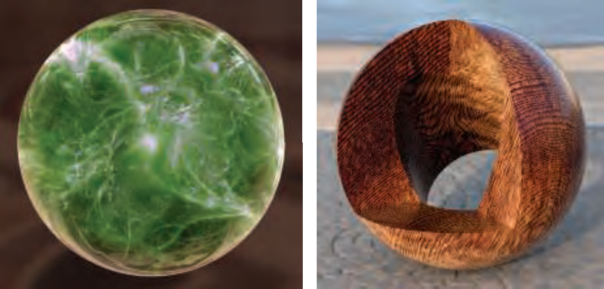

# Chapter 6 纹理

在计算机图形学中，使用纹理就是在表面的每个位置上使用一些图像，函数，或者其他的数据源，来修改其外观的过程。例如，可以用一张砖墙的颜色图像来表示砖墙的几何信息。但这样做的效果不是很好。砖块和泥浆的粗糙度不同，但只是用颜色纹理的话，这两者看起来是一样粗糙的。解决方法是再应用一张纹理，该纹理用来修改墙壁的粗糙度。然而此时每个砖块都是完全平坦的，这也不符合实际。可以使用凹凸映射（*bump mapping*）来修改器法向量，从而改变表面的方向。从阴影的角度看，这种凹凸效果会失效。砖块应该突出，并遮挡泥浆。砖块还应该向泥浆投射阴影。视差映射（*parallax mapping*）使用一张纹理，在渲染的时候对表面进行形变操作。视差遮挡映射（*parallax occlusion mapping*）根据高度纹理发射射线来提升真实感。位移映射（*displacement mapping*）则直接修改三角形的高度。

## 6.1 纹理管线

纹理主要影响着色方程。纹理中的像素被称为图素（*texel*），以区别屏幕中的像素。应用纹理的过程可以用一个纹理管线来描述。

应用纹理开始于空间中的一个位置。该位置可以在世界空间，但更多的是在模型的局部空间，因为这样一来，当模型移动时，纹理也会跟着移动。使用投影方程（*projector*）作用于该位置得到纹理坐标（*texture coordinates*），以用于访问纹理。该过程叫映射（*mapping*），也就是纹理映射（*texture mapping*）的由来。有时候纹理本身被叫做纹理地图（*texture map*）。

在使用纹理坐标访问纹理之前，可以使用一个或多个响应函数（*corresponder*）将纹理坐标变换到纹理空间。这些纹理空间位置被用于获取纹理中的值。获取的值还会经过数值变换函数（*value transform*）的变换，最后才用于修改表面的属性，例如材质或者法向量。下图显示了整过过程。注意，并不是所有的步骤都必须同时激活。

下图是使用砖块纹理的示意图。$(x, y, z)$坐标位于模型的局部空间，假设是$(-2.3, 7.1, 88.2)$.投影函数将$(x, y, z)$变换为纹理坐标$(u, v)$。假设是$(0.32, 0.29)$。砖块纹理的分辨率是$256 \times 256$，因此响应函数使用$256$乘以$(u, v)$，得到$(81.92, 74.24)$。抛弃小数，$(81, 74)$处的颜色是$(0.9, 0.8, 0.7)$。纹理颜色位于$sRGB$颜色空间，因此在进行着色计算前，需要被转换到线性空间，即$(0.787, 0.604, 0.448)$。

### 6.1.1 投影函数

建模软件通常允许美术定义每个顶点的uv坐标。这些坐标可以用投影函数或者网格展开算法来初始化。美术可以像编辑定点位置一样编辑定点的uv坐标。建模程序通常使用的投影函数有球面，圆柱和平面投影。如下图：

其他输入也可用于投影函数。例如，表面法向量可用于选择6个平面投影方向中的哪一个。在面的接缝处会出现纹理不匹配的问题。【r521，522】讨论了混合技术。【r1740】描述了*polycube maps*算法。

其他的投影函数压根就不是投影，而是创建表面过程的一部分。例如，参数化曲面的定义自然就有一个uv坐标集，上图中第一行第四个就是这样的一个例子。纹理坐标也可以由视方向，甚至是表面的温度来产生。纹理函数的目标是产生纹理坐标，使用位置的函数仅仅是完成该目标的一种途径。

美术可以使用工具细分模型，并应用不同的投影函数，如下图：

在实际工作中，投影函数往往应用在建模阶段，投影的结果被存储在定点上。但也有例外。有时候需要在顶点着色器或者像素着色器中使用投影函数。这样做可以提升精度，并且能够实现各种效果，如动画。一些渲染方法，如环境映射（*environment mapping*），使用特殊的映射函数，必须要在像素着色器中计算。

球面映射将点投影到一个虚拟的球体，与环境映射使用的方法类似。该映射存在顶点插值问题。圆柱映射计算$u$坐标与球面映射一样，$v$坐标则是沿着圆柱轴的距离。这种映射适用于天然有轴的对象，例如旋转曲面。当表面与圆柱轴近似垂直时会发生扭曲。平面映射沿某一方向作正交投影。它适合于贴画效果。

投影方向侧面的表面会有严重扭曲，因此美术通常手动将模型分解为多个近似平面。一些工具通过展开网格，或者计算一个近似最优的平面映射集合，或者其他方法，来最小化扭曲。目标是使得每个多边形映射得到的纹理的面积尽可能与自身的面积成正比，并保留尽可能多的网格连接性。连接性很重要，因为同一条边如果映射到不同的纹理区域，会出现穿帮。一个展开良好的网格也会减轻美术的工作。下图是一个例子。网格展开是网格参数化（*mesh parameterization*）研究领域中的一个方面。

纹理坐标空间不一定是二维的，也可能是三维的。此时纹理坐标表示为$(u, v, w)$，其中$w$表示投影方向的深度。还有系统使用4个坐标，表示为$(s,t,r,q)$。其中$q$用作齐次坐标的第4个值。它的行为像投影仪，投影纹理的大小随着距离的增加而增加。一个例子是投影装饰性的聚光模式，叫做*gobo*。

另一种重要的纹理坐标空间是方向性的，其中每个点通过一个输入方向来访问。一个例子是立方体贴图（*cube map*）。一维纹理也是有用的，例如地形根据海拔着色。线也可以应用纹理。一个例子就是讲半透明纹理应用于长线来模拟雨的效果。这种纹理也用于将一个值转换到另一个值，例如查找表。

在被插值前，纹理坐标需要用响应函数进行变换。

### 6.1.2 响应函数

响应函数将纹理坐标变换到纹理空间位置。这提供了一定的灵活性。一个响应函数的例子是可以使用API来选择只映射纹理的部分内容。

另一类响应函数是矩阵变换。改变换可以由顶点着色器或者像素着色器进行。这允许对纹理施加平移，旋转，放缩，切变，投影等变换。变换的连结顺序会影响结果。注意图像本身并不是被变换的对象，变换的是定义图像位置的空间。因此变换的连结顺序可能与你期望的相反。

纹理坐标在$[0,1]$范围之内。有一类响应函数决定纹理坐标超出该范围时的行为。在OpenGL中，这类响应函数叫做重复模式（*wrapping mode*），在DirectX中则叫做纹理寻址模式（*texture addressing mode*）。常用的类型有：
* $\mathbf{wrap}$（DirectX），$\mathbf{repeat}$（OpenGL），或者$\mathbf{tile}$：图像在表面上重复。算法上，纹理坐标的整数部分被抛弃。
* $\mathbf{mirror}$：图像在表面上重复，但每隔一个重复会翻转一次。
* $\mathbf{clamp}$（DirectX）或$\mathbf{clamp \ to \ border}$（OpenGL）：范围之外的纹理坐标使用一个独立定义的颜色渲染。

下图是例子：

在不同的轴上可以应用不同的重复模式。在DirectX中还有一个$\mathbf{mirror \ once}$模式，只翻转一次，然后变为$\mathbf{clamp}$模式。

当重复次数过多时会穿帮，叫做周期问题（*periodicity*）。解决方法是将其与另一个纹理结合。一些商业地形渲染系统中拓展了这一思想。在该系统中，根据地形的高度，坡度等因素，多个纹理被组合使用。另一种避免周期问题的方法是在着色器程序中使用专用响应函数来随机组合纹理模式。一个例子是*wang tiles*。

最后还有一个隐式的响应函数。纹理坐标通常被限制在$[0,1]$范围内。如之前的砖墙例子所示，使用图像的分辨率乘以纹理坐标可以得到目标像素位置。这种方法的好处是纹理坐标可以独立于具体图像的尺寸。

### 6.1.3 纹理值

在实时渲染中图像纹理应用最多，程序纹理也有不少应用。在应用程序纹理时，从纹理坐标获得纹理值得过程不是内存查找，而是计算一个函数。纹理值可以是$\mathbf{RGB}$，灰度值，$\mathbf{RGB} \alpha$。其他类型的值也可以，如表面粗糙度。从纹理返回的值在使用前可能还需要进行变换操作。这种变换可以由着色器程序实施。一个例子是将纹理中存储的法向量值从$[0.0,1.0]$映射到$[-1.0,1.0]$。

## 图像纹理

我们将探讨根据给定纹理坐标，从图像纹理中获得纹理值的方法。在本节的剩下部分，当提到像素单元（*cell*）时，我们指代包围该像素的屏幕网格单元。如【s5.4.1】所讨论的，一个像素就是一个显示的颜色值，会受到其网格单元之外的采样的影响。

这部分专注于快速采样和过滤图像纹理的方法。【s5.4.2】讨论了失真问题，但主要是关于边。纹理也有采样问题，主要发生在三角形的内部。

像素着色器通过诸如$\mathbf{texture2D}$之类的调用获取纹理值。GPU负责将纹理坐标转换成图素坐标。不同的API之间纹理坐标系统也不一样。在DirectX中，左上角是$(0,0)$，右下角是$(1,1)$。这与许多图像文件存储数据的方式是匹配的。第一行存储在文件的前面。在OpenGL中，$(0,0)$位于左下角。图素的坐标是整数，但我们经常需要访问浮点数位置并做混合操作。这又带来一个问题：像素中心的浮点坐标是什么。答案分两类：截断和取整。DirectX 9定义中心为$(0.0,0.0)$，即取整。这会让人产生困惑，因为左上角像素的左上角坐标是$(-0.5,-0.5)$。DirectX 10采用了OpenGL的设计，中心的坐标是$(0.5,0.5)$，即截断。或者更准确地说，向下取整，因为分数部分被抛弃（我也没搞懂为什么这样命名）。

有一个术语需要特别解释：依赖性纹理读取（*dependent texture read*）。它有两种定义。第一种主要针对移动设备。当使用类似$\mathbf{texture2D}$的函数访问纹理时，如果像素着色器自己计算纹理坐标，而不是不加修改地直接使用顶点着色器传过来的纹理坐标，那么就发生了依赖性纹理读取。老的移动设备GPU通常不支持OpenGL ES 3.0。当没有依赖性纹理读取时，这种GPU可以运行得更快，因为纹理数据可以预获取。另一种旧的定义主要针对早期的桌面GPU。当一个纹理坐标依赖于之前获得的纹理值时发生依赖性纹理读取。例如，一个纹理可能修改着色法向量，而之后的立方体映射需要使用法向量来计算纹理坐标。现今，这种类型的读取会对性能产生影响。

GPU使用的纹理通常是$2^{m} \times 2^{n}$，其中$m$和$n$都是非负整数。这种纹理被称为POT（*power-of-two*）纹理。现代GPU可以处理NPOT（*non-power-of-two*）纹理。但是，一些旧的移动设备GPU可能不支持NPOT纹理的mipmap操作。纹理大小也有限制。DirectX 12最大支持$16384^{2}$。

假设把一个$256 \times 256$的纹理应用在一个正方形上。如果该正方形的尺寸大于原始图像，会发生放大（*magnification*）。反过来正方形的尺寸小于原始图像，会发生缩小（*minification*）。这两种情况需要使用不同的采样和过滤方法。

本节介绍的采样和过滤方法应用于从纹理中获取的值。但是，期望的做法是对最终的渲染图像进行抗失真操作。理论上，这需要对最终的像素颜色进行采样和过滤。这两者的区别简单来说就是对着色方程的输入进行过滤还是对其输出进行过滤。只要输入输出是线性关联的（例如颜色输入），那么这两者等价。但是，其他的着色器输入，例如法向量和粗糙度，并不具有线性关系。标准的纹理过滤方法在这种类型的纹理上工作的不是很好。改进的方法见【s9.13】。

### 6.2.1 放大

当视角过近时需要放大纹理。3种常见的过滤技术如下图所示，从左到右分别是最近邻（*nearest neighbor*），双线性插值（*bilinear interpolation*）和三次卷积（*cubic convolution*，也叫*bicubic interpolation*）。最近邻是最简单的过滤技术（实际使用的过滤器是盒子过滤器，见【s5.4.1】），它跟双线性插值都是最常用的。三次卷积使用$4 \times 4$或者$5 \times 5$的图素数组的加权平均。它的放大质量要好得多。尽管对三次卷积的硬件原生支持不是很普遍，但是它可以使用着色器程序实现。

最近邻方法会导致像素化（*pixelation*），因为它把距离像素中心最近的图素的颜色值作为结果。尽管效果差，但是性能好。

双线性插值（有时候也叫*linear interpolation*）查找最近的4个图素，并在二维空间上线性插值来得到一个混合的颜色。它的结果更加模糊，最近邻中出现的锯齿现象消失。回到之前砖墙的例子：不丢弃分数部分，我们得到$\left(p_{u}, p_{v}\right)=(81.92,74.24)$。我们使用OpenGL的坐标系，即原点在左下角。下图显示了整个过程。为了找到最近的4个图素，我们首先从采样位置减去$(0.5,0.5)$，得到$(81.42,73.74)$。丢弃分数部分，则4个最近的图素从$(x, y)=(81,73)$到$(x+1, y+1)=(82,74)$。分数部分$(0.42,0.74)$，则是采样位置相对于这4个图素中心形成的坐标系统的坐标，用$\left(u^{\prime}, v^{\prime}\right)$表示。

定义纹理访问函数$\mathbf{t}(x, y)$，其中$x$和$y$是整数，函数返回图素的颜色。$\left(u^{\prime}, v^{\prime}\right)$位置的双线性插值颜色的计算分为两步。首先，底下的两个图素$\mathbf{t}(x, y)$和$\mathbf{t}(x+1, y)$被水平线性插值（使用$u^{\prime}$），上面两个图素$\mathbf{t}(x, y+1)$和$\mathbf{t}(x+1, y+1)$的插值过程过程类似。两次插值分别得到$\left(1-u^{\prime}\right) \mathbf{t}(x, y)+u^{\prime} \mathbf{t}(x+1, y)$和$\left(1-u^{\prime}\right) \mathbf{t}(x, y+1)+u^{\prime} \mathbf{t}(x+1, y+1)$，在上图中用绿色点表示。这两个值再使用$v^{\prime}$垂直插值，即：
$$
\begin{aligned}
\mathbf{b}\left(p_{u}, p_{v}\right)=&\left(1-v^{\prime}\right)\left(\left(1-u^{\prime}\right) \mathbf{t}(x, y)+u^{\prime} \mathbf{t}(x+1, y)\right) \\
&+v^{\prime}\left(\left(1-u^{\prime}\right) \mathbf{t}(x, y+1)+u^{\prime} \mathbf{t}(x+1, y+1)\right) \\
=&\left(1-u^{\prime}\right)\left(1-v^{\prime}\right) \mathbf{t}(x, y)+u^{\prime}\left(1-v^{\prime}\right) \mathbf{t}(x+1, y) \\
&+\left(1-u^{\prime}\right) v^{\prime} \mathbf{t}(x, y+1)+u^{\prime} v^{\prime} \mathbf{t}(x+1, y+1)
\end{aligned}
$$
直觉上，图素距离采样点越近，对其影响越大，方程也证实了这一点。注意对称性：右上角图素的影响等于左下角图素与采样点形成的矩形的面积。

针对放大造成的模糊的一种常用的解决办法是使用细节纹理（*detail texture*）。细节略。原文还介绍了一个黑白棋盘的例子来说明双线性插值的一个问题，没太看懂，故省略。

由于三次过滤器的消耗较大，一些不太耗的方法被提了出来。【r1451】提出了使用平滑曲线来在$2 \times 2$图素中插值的方法。细节见原文。

### 6.2.2 缩小

当发生缩小时，多个图素会覆盖一个像素：

为了获得像素的正确颜色，需要将影响该像素的所有图素的颜色整合起来。然而，想要精确计算所有图素对像素的影响程度是很困难的，其性能在实时应用中也不可接受。

因此，许多方法被提了出来，见下图（从上到下分别是最近邻，mipmap，summed-area table）：

一种方法是最近邻，如上图中的第一个图像。该过滤器会产生严重的失真现象，尤其是在水平线远处。当视角移动式失真更加明显，这是时间失真（**temporal aliasing）的一种表现。另一种方法是双线性插值。这种方法只比最近邻好一点。当影响一个像素的图素超过4个时，失真会突然严重。

如【s5.4.1】所述，失真问题可以通过采样和过滤解决。纹理的信号频率依赖于图素在屏幕上的间距。根据奈奎斯特定理，我们必须确保纹理的信号频率不大于采样频率的一半。例如，假设一个纹理由黑白相间的线条组成，相隔一个图素。则波长是2个图素宽，因此频率是$\frac{1}{2}$。那么采样的频率至少是$2 \times \frac{1}{2}$。即，一个像素对一个图素。因此，对于通常的纹理，想要避免失真，一个像素至多对应一个图素。

为了达到这一目标，要么提升像素采样频率，要么降低纹理频率。之前讨论的方法都是提升像素采样频率。但是，提升的程度很有限，需要新的方法。这些新方法背后的基本思想是一样的：对纹理进行预处理，创建特定的数据结构，以帮助计算一个像素上有大量图素时的近似效果。在实时应用中，这些算法有固定的时间和资源消耗。每个像素的采样数量是固定的。

#### Mipmapping

最流行的方法是*mipmapping*，几乎所有的图形加速器都支持。“mip”代表*multum in parvo*，在拉丁语中表示“一个小地方放许多东西”。这与算法很匹配：原始纹理被重复地向下采样来得到更小的图像。

当使用mipmapping时，会预先制作原始纹理的小尺寸版本。原始纹理（第0层）被降采样到四分之一大小，每个新的图素是原始纹理中4个相邻图素的平均值。新的第1层的纹理有时候被叫做原始纹理的子纹理（*subtexture*）。该过程迭代进行，知道纹理的一个维度变为1个图素。如下图所示。其中垂直轴是第3个坐标$d$。在该图中，$d$不是线性的。这些图像的整体被称为*mipmap chain*。

构建高质量mipmap的两个重要因素是好的过滤和伽马矫正。通常mipmap的做法是将原始纹理中4个相邻图素做平均来得到下一级纹理的图素值。这相当于使用盒子过滤器，效果不是很好。一些更好的选择有Gaussian filter，Lanczos filter，Kaiser filter等。一些API也支持更好的过滤。在处理纹理的边时，需要注意是重复纹理还是简单复制。

纹理通常被编码在非线性空间。忽视伽马矫正会修改mapmap的感知亮度。当视角远离使用不正确mipmap的物体时，该物体看起来更暗，对比度和细节也会受到影响。因此，在计算mipmap之前，必须将纹理从sRGB空间转换到线性空间。计算完毕后再转换回sRGB空间以存储。绝大多数API支持sRGB纹理，并且会正确进行伽马矫正。

如前所述，一些纹理与最终着色颜色没有线性关系。尽管这是关于过滤的常见问题，mipmap对该问题尤其敏感，因为有大量的像素被过滤。专用的mipmap算法见【s9.13】。

使用mipmap纹理的过程如下。一个屏幕像素覆盖了纹理中的一片区域。当像素区域被投影到纹理上时，它会覆盖多个图素，见下图：

尽管使用像素的单元格边界不是严格正确，但这里作简化处理。根据【s5.4.1】，单元格之外的图素也可以影响像素的颜色。我们的目的是计算纹理大约有多少部分影响了该像素。通常有两种方法来计算$d$（在OpenGL中叫做$\lambda$，也叫做*texture level of detail*）。一种方法是使用像素的单元格形成的四边形的长边来近似像素的覆盖情况。另一种方法是计算如下4个微分的最大绝对值：$\partial u / \partial x$，$\partial v / \partial x$，$\partial u / \partial y$和$\partial v / \partial y$。每一个微分衡量了纹理坐标在某一个屏幕轴上的变化量。

在Shader Model 3.0和更新的标准下，像素着色器可以获得这些梯度值。由于它们基于临近像素中值得差异，因此不能再动态控制流中获取梯度。注意顶点着色器不能够获取梯度值。当使用顶点纹理时，顶点着色器必须手动计算这些值。

计算$d$的目的是决定在mipmap金字塔轴的何处进行采样。像素和图素的比率应该至少是$1: 1$，以满足奈奎斯特定理。像素覆盖的图素越多，$d$越大，使用的纹理更小更模糊。$d$相当于纹理层级，但是有小数部分。在$d$上一层的纹理和下一层的纹理被采样。每个纹理使用双线性插值，结果根据$d$的小数部分再进行线性插值。整个过程被称为三线性插值（*trilinear interpolation*）。

用户可以通过LOD偏移（*level of detail bias*）来控制$d$值。该值被佳到$d$上，因此会影响纹理的相对感知细节度。增大$d$，纹理会变得模糊。一个好的LOD偏移依赖于图像的类型和使用方式。例如，有些模糊的图像可以使用负的偏移，另外一些有失真的人工图像可以使用正的偏移。偏移可以基于整个纹理指定，也可以在像素着色器中对每个像素指定。为了更好的控制，用户还可以自己提供$d$值，或者用于计算$d$值得导数。

Mipmap有一些缺点，其中一个主要问题就是过模糊（*overblurring*）。当观察者以近似水平侧面的角度看向一个应用纹理的表面时，一个像素在$u$方向覆盖了大量的图素，但是在$v$只覆盖了很少的图素。由于我们使用长边来计算$d$值，因此会发生过度模糊。在之前的示例图中可以看到，远处的线条在右边会过模糊。

#### Summed-Area Table

一种避免过迷糊的方法是SAT（*summed-area table*）。首先创建一个数组，大小等于纹理，但是每个颜色通道的精度更高。在该数组的每个位置，计算并存储对应纹理中该位置与原点形成的矩形中的所有图素的和。应用纹理时，像素单元格投影到纹理后被一个矩形包围。SAT计算该矩形的平均颜色，作为该像素的颜色。如下图：

使用的公式如下：
$$
\mathbf{c}=\frac{\mathbf{s}\left[x_{u r}, y_{u r}\right]-\mathbf{s}\left[x_{u r}, y_{l l}\right]-\mathbf{s}\left[x_{l l}, y_{u r}\right]+\mathbf{s}\left[x_{l l}, y_{l l}\right]}{\left(x_{u r}-x_{l l}\right)\left(y_{u r}-y_{l l}\right)}
$$
其中$x$和$y$是矩形的图素坐标，$\mathbf{s}[x, y]$是该图素对应的面积和数组值。注意$\left(x_{l l}, y_{l l}\right)$是区域$\mathbf{C}$的右上角，$\left(x_{l l}+1, y_{l l}+1\right)$是包围盒的左下角。

之前的图示显示了SAT的结果。虽然远处右边的模糊改善了不少，但是中间对角线方向的相交线仍然过模糊。因为从对角线方向看向纹理时，像素的映射与其包围盒的大小相差很大。这样一来，计算包围盒中的图素平均值时会引入过多无关的图素。

SAT是各向异性过滤（*anisotropic ltering*）算法的一个例子。这种算法计算非正方形区域的图素颜色值。SAT可以用现代GPU实现。在实现光滑反射，深度域，阴影贴图，模糊反射等效果时，使用SAT可以提升渲染质量。

#### 无约束各向异性过滤

具体算法略。一个简单的原理图：

该方法克服了SAT的缺点。并且由于它使用mipmap算法来采样，该方法不需要比mipmap更多的纹理内存。

### 6.2.3 体积纹理

图像纹理的一个直接拓展是三维图像纹理，使用$(u, v, w)$（或者$(s, t, r)$）访问。例如，医学图像数据可以用一个三维网格表示。绝大多数GPU支持体积纹理的mipmap。由于在一个mipmap层过滤体积纹理需要三线性插值，加上层之间的线性插值，整体构成了四线性插值。由于涉及到了16个图素的平均计算，会产生精度问题，可以用高精度体积纹理解决。体积纹理存储空间大，过滤消耗高，但有自己独特的优点。计算三维网格的二维参数化表示的复杂过程可以省略，因为三维位置坐标可以被直接用作纹理坐标。这避免了一些扭曲和接缝问题。体积纹理还可以用来表示材质的体积结构。由于使用体积纹理十分低效，一些优化方法被提了出来，例如使用八叉树来存储体积纹理。

### 6.2.4 立方体贴图

另一种纹理叫立方体纹理（*cube texture*），或者叫立方体贴图（*cube map*）。它有6个正方形纹理，每个纹理与立方体的一个面向关联。该纹理使用三维纹理坐标访问纹理值。该坐标指定从原点指向立方体外面的一个射线。射线与立方体相交处就是结果。绝对值最大的坐标选择面，例如向量$(-3.2,5.1,-8.4)$选择负$z$轴。剩下的两个坐标除以该绝对值，即$8.4$。最后再从$[-1,1]$映射到$[0,1]$。即$((-3.2 / 8.4+1) / 2,(5.1 / 8.4+1) / 2) \approx(0.31,0.80)$。立方体贴图主要用于环境映射【s10.4.3】。

### 6.2.5 纹理表示

有多种方法可以改善处理大量纹理时的性能：纹理地图集，纹理数组和无绑定纹理。这些方法的目的都是避免渲染时切换纹理所造成的消耗。【s19.10.1】和【s19.10.2】讨论了纹理流和纹理转码。

处于性能考虑，需要尽可能地减少状态的改变。纹理地图集（*texture atlas*）将多个纹理放在一张更大的纹理中。如下图中左图：

子纹理的大小是任意的。子纹理的位置摆放也可以优化。使用mipmap时也会有一些需要注意的问题。当使用重复模式和镜像模式时，地图集会出错，因为这些寻址模式的操作对象是一整个地图集。计算mipmap时一个子纹理也可能混入另一个子纹理。

一种解决办法是纹理数组（*texture araays*）。见上图右图。纹理数组中的子纹理必须居于相同的维度，格式，mimap层级，MSAA设定。使用纹理数组也比单独绑定每个子纹理要快。

一些API支持无绑定纹理（*bindless texture*），也可以避免状态切换消耗。不使用无绑定纹理的话，需要使用API将纹理绑定到一个特定的纹理单元。纹理单元的数量是有限的，这给程序员带来了麻烦。驱动确保纹理一直驻留在GPU侧。使用无绑定纹理，纹理的数量不再受限。因为每一个纹理使用一个64位指针关联（也叫句柄*handle*）。访问这些句柄的方式有多种：一致输入，可变输入，从其他纹理，从SSBO。应用需要确保纹理一直驻留在GPU。无绑定纹理避免了任何形式的绑定消耗，因此加速了渲染。

### 6.2.6 纹理压缩

纹理压缩可以解决内存消耗和带宽的问题。GPU在需要时才会解码压缩纹理。诸如JPEG和PNG之类的图像文件格式使用了各种各样的压缩算法，但这些算法很难用硬件实现解码。S3公司开发了S3TC（*S3 Texture Compression*）算法。该算法被选为DirectX的标准算法，并改名为*DXTC*。在DirectX 10及以后的版本，它又被叫做BC（*Block Compression*）。它也是OpenGL的事实标准，几乎所有的GPU都支持该算法。它的优点是压缩后的图像大小固定，每个块可以独立压缩和解码，解码简单迅速，固定速度，不需要共享查找表或者其他的依赖性。

DXTC/BC有7个变体，但是基本策略是一样的。编码作用在$4 \times 4$的图素块上，也叫做瓦片（*tiles*）。每块独立编码。具体算法参考原文。各个变体总结如下：

DXT是DirectX 9使用的名字，在DirectX 10中被改为BC。这些算法的最大缺点是有损性，无法完美复原原始图像。

OpenGL ES有另一种压缩算法，叫做ETC（*Ericsson texture compression*）。它具有跟S3TC一样的特性：快速解码，随机存取，无间接查找，固定速度。OpenGL ES 3.0引入了ETC2。EAC（*Ericsson alpha compression*）用于压缩只有一个颜色通道的图像。ETC1，ETC2和EAC被包含于OpenGL 4.0，OpenGL ES 3.0，Vulkan和Metal。法向量的压缩需要特别考虑，见原文。PVRTC是PowerVR上使用的一种纹理压缩格式，主要用于iPhone和iPad。OpenGL ES 3.2引入了ASTC（*Adaptive scalable texture compression*）。上述所有压缩算法都是有损的。压缩和解压缩的速度不一定一样，使用固定函数硬件的解压缩速度极快，而压缩就会慢一点。这种差异叫做数据压缩不对称性（*data compression asymmetry*）。

一些改进压缩纹理质量的方法被提了出来，详见原文。

## 6.3 程序纹理

程序纹理（*procedural texture*）使用函数计算来得到纹理值，而非查找图像。由于现代GPU对图像纹理的支持很好，在实时渲染中图像纹理的应用更加广泛。但是，GPU的发展方向是计算消耗越来越小，而内存访问消耗越来越大。因此程序纹理的应用正变得越来越广泛。

体积纹理是程序纹理的一种应用。例如使用多个噪音函数来产生值。下图是一个例子：

*cellular texture*也是一种程序纹理。此外，物理模拟和其他一些交互的结果也是一种类型的程序纹理，如水的涟漪。这种纹理提供了无限的可变性。

当使用二维程序纹理时，拉伸和接缝会产生比图像纹理更加严重的问题。有一些解决办法被提了出来。程序纹理的抗锯齿问题也值得探讨。一方面，mipmap之类的方法不能使用，这给程序员带来了压力。另一方面，程序纹理的作者拥有纹理的“内部信息”，这位抗锯齿提供了新的可能。

## 6.4 纹理动画

作为纹理的图像不需要是静止的。例如，一个视频可以作为纹理，并且每帧都会变化。纹理坐标也不需要是静止的。可以对纹理坐标使用矩阵，甚至是更加复杂的函数，来获得各种各样的效果。使用纹理混合技术还可以获得另外一种效果。例如，从大理石纹理过渡到肉质纹理，可以表现雕像复活的效果。

## 6.5 材质映射

纹理可以修改材质属性。修改表面颜色的纹理叫做*albedo color map*或者*diffuse color map*。任何参数都可以通过纹理修改，如下图：

进一步的，纹理还可以修改像素着色器的控制流和函数。例如，一个生锈的金属表面可以使用一张纹理来指定哪个地方生锈，并执行着色器中的生锈着色代码，其他地方执行光泽着色代码。

## 6.6 Alpha映射

