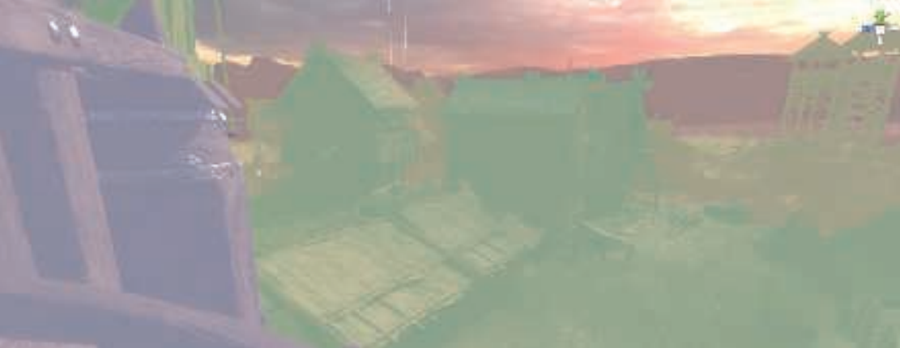
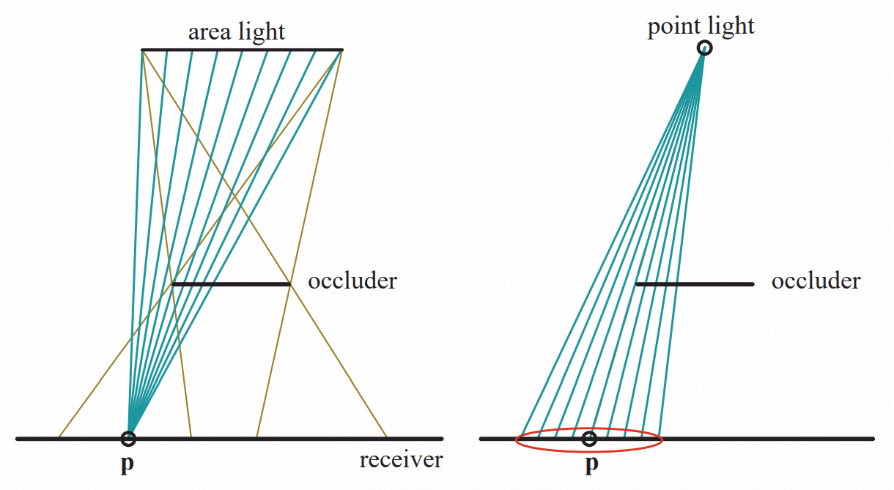

# Chapter 7 阴影

本章讨论实时阴影算法。使用的术语示意如下：

遮挡者（*occluders*）将阴影投射至接受者（*receivers*）。精确光源只产生完全阴影区域，也叫硬阴影（*hard shadows*）。如果使用面积光或者体积光，则会产生软阴影。每个阴影有一个完全阴影区域，叫做本影（*umbra*），和一个部分阴影区域，叫做半影（*penumbra*）。软阴影通过模糊的边来标识。注意，使用低通过滤器来模糊硬阴影的边通常并不能正确渲染软阴影。遮挡者距离接受者的距离越近，软阴影越锐利。如下图：

软阴影的本影区域并不等于精确光源产生的硬阴影。软阴影的渲染效果通常更好。

## 7.1 平面阴影

本节讨论将阴影投射至平面的算法。

### 7.1.1 投影阴影

在这类方法中，三维物体被渲染两次，第二次用来渲染阴影。一个矩阵被用来将物体的顶点投影至一个平面。如下图：

其中光源位于$\mathbf{l}$，被投影的顶点在$\mathbf{v}$，投影后的顶点在$\mathbf{p}$。我们首先讨论阴影平面为$y=0$的简单情况。首先计算$x$坐标，根据相似三角形，有：
$$
\frac{p_{x}-l_{x}}{v_{x}-l_{x}}=\frac{l_{y}}{l_{y}-v_{y}} \Longleftrightarrow p_{x}=\frac{l_{y} v_{x}-l_{x} v_{y}}{l_{y}-v_{y}}
$$
$z$坐标获得的方式相同：$p_{z}=\left(l_{y} v_{z}-l_{z} v_{y}\right) /\left(l_{y}-v_{y}\right)$。$y$坐标为$0$。这些方程可以转化为投影矩阵：
$$
\mathbf{M}=\left(\begin{array}{cccc}
{l_{y}} & {-l_{x}} & {0} & {0} \\
{0} & {0} & {0} & {0} \\
{0} & {-l_{z}} & {l_{y}} & {0} \\
{0} & {-1} & {0} & {l_{y}}
\end{array}\right)
$$
考虑任意阴影平面：$\pi: \mathbf{n} \cdot \mathbf{x}+d=0$，如上图右图所示。可以计算投影点$\mathbf{p}$如下：
$$
\mathbf{p}=1-\frac{d+\mathbf{n} \cdot \mathbf{l}}{\mathbf{n} \cdot(\mathbf{v}-\mathbf{l})}(\mathbf{v}-\mathbf{l})
$$
转换成投影矩阵得：
$$
\mathbf{M}=\left(\begin{array}{cccc}
{\mathbf{n} \cdot 1+d-l_{x} n_{x}} & {-l_{x} n_{y}} & {-l_{x} n_{z}} & {-l_{x} d} \\
{-l_{y} n_{x}} & {\mathbf{n} \cdot 1+d-l_{y} n_{y}} & {-l_{y} n_{z}} & {-l_{y} d} \\
{-l_{z} n_{x}} & {-l_{z} n_{y}} & {\mathbf{n} \cdot 1+d-l_{z} n_{z}} & {-l_{z} d} \\
{-n_{x}} & {-n_{y}} & {-n_{z}} & {\mathbf{n} \cdot 1}
\end{array}\right)
$$
为了渲染阴影，将物体投影至阴影平面后使用黑色渲染。为了防止投影物体被渲染在阴影平面的下面，通常需要对阴影平面增加一个偏移。另一种更加安全的方法是先渲染地面，然后在关闭深度缓冲的情况下渲染阴影，然后渲染其他物体。如果阴影平面不是无限的，那么投影的阴影有可能落在阴影平面的外面，造成穿帮。这可以使用模板缓冲来解决。

另一种算法是先将三角形渲染至一个纹理中，然后将该纹理应用至平面。这种纹理其实是一种光照贴图（*light map*），用于调整表面的亮度。这种方法可以实现半影和曲面阴影，但缺点是纹理可能会被放大，造成穿帮。如果阴影在每帧之间变化不是很大的话，这种纹理可以重用。绝大多数阴影技术都利用了这一思想。

遮挡着必须在光源和接受者之间。如果光源在遮挡着之下，会发生反影（*antishadow*）。如下图：

如果遮挡者在接收者之下，也会产生错误。

### 7.1.2 软阴影

投影阴影也可以软化。当光源有面积时会产生软阴影。一种近似方法是使用多个放置在面积光上的精确光源。每个精确光源会渲染一张图像。对所有图像平均就会得到软阴影。由于消耗太大，这种方法并没有被实际使用。其效果如下图左图所示：

这种方法的一个问题是各个精确光源产生的阴影棱角分明，可以被很容易地看出来。

一种更高效的方法是使用卷积，即过滤。对精确光源产生的阴影进行过滤操作在某些情况下可以产生比较好的效果。如下图：

然而，在物体与地面接触的地方效果比较差。

## 7.2 向曲面投射阴影

一种将平面阴影拓展至曲面阴影的简单方法是将产生的阴影图像用作一个投影纹理。从光的视角考虑阴影。光能看到的地方被照亮，看不到的就是阴影。从光的视角使用黑色将遮挡者渲染到一个白色纹理中，然后将该纹理投影到接收者的表面。

这种投影纹理的方法有一些严重的缺点。首先，应用必须要标识哪些是遮挡者，哪些是接收者。其次，接收者距离光源的距离必须大于遮挡者，否则出错。最后，遮挡者没有自阴影。

一些图案光可以使用预建的投影纹理来实现。一个聚光就是一个正方形投影纹理加一个圆形。使用包含水平线的投影纹理可以实现百叶窗效果。这种类型的纹理叫做光衰减遮罩（*light attenuation mask*），饼干纹理（*cookie texture*），遮光贴图（*gobo map*）。

## 7.3 阴影锥

阴影锥（*shadow volumes*）使用模板缓冲可以实现向任意物体投射阴影。它不是基于图像的（如阴影贴图算法），因此避免了采样问题，因此可以在任何地方产生正确锐利的阴影。这有时候是一个缺点，如布料的褶皱会投射非常细的硬阴影，效果很差。由于消耗不确定，阴影锥很少被使用。

想象一个点和一个三角形。将点到三角形的顶点的连线无限延伸可以得到一个无限的三面金字塔。如下图：

点代表光源。那么任何位于三角形之下的被截断的金字塔之中的物体都处于阴影之中。这个被截断的金字塔叫做阴影锥。

我们渲染场景时，从眼睛发出射线。射线穿过一个像素，最终抵达某一个显示在屏幕上的物体的表面。在射线经过的路径上，当我们穿过一个阴影锥的正面（朝向观察值）时，计数器加1。同样的，当射线穿过阴影锥的背面时，计数器减1。当射线到达要显示在屏幕上某个像素的表面上一点时，如果计数器大于0，则该像素处在阴影之中。如下图：

像这样使用射线计算相交十分耗时，使用模板缓冲更好。一个例子如下图：

为每个三角形绘制四边形会产生严重的重绘问题。针对此问题有一些解决方法。然而，阴影锥仍然有一个非常严重的问题：极端的可变性。想象场景中有一个很小的三角形。如果摄像机与光源的位置重合，那么阴影锥的消耗极小，因为构造的四边形不会覆盖任何像素。当摄像机远离光源，四边形会覆盖越来越多的像素，造成计算量的上升。由于在交互式应用中固定帧率十分重要，这种可变性使得阴影锥不可用。

## 7.4 阴影贴图

基本思想是从光的视角将场景渲染至$z$缓冲。光看到的地方被照亮，看不到的地方就是阴影。$z$缓冲中每个像素包含到光源最近的点的深度值。我们将整个$z$缓冲的内容叫做阴影贴图（*shadow map*），也叫阴影深度贴图（*shadow depth map*）或者阴影缓冲（*shadow buffer*）。为了使用阴影贴图，需要从摄像机的视角渲染第二次。每个像素的位置与阴影贴图相比较。如果要渲染的点到光源的距离远与阴影贴图中的对应值，则该点处于阴影之中。如下图所示：

阴影贴图很流行，因为其更好预测。构建阴影贴图的消耗近似正比于渲染的原型的数量，并且访问阴影贴图的时间是恒定的。阴影贴图也可以产生一次并在帧之间重用。

对于一个方向光，光的视角必须要包含所有将阴影投射至摄像机视域体的物体。光使用正交投影。局部光源也需要调整视角。如果局部光源距离阴影投射物足够远，那么一个平截头就足以包含这些物体。如果局部光是一个聚光，那么直接使用其关联的平截头即可。

如果光源被阴影投射物包围，那么需要使用一个6面立方体，类似于立方体环境影射。这叫做全向阴影贴图（*omnidirectional shadow maps*）。两个分开的贴图接缝处会产生穿帮问题，需要特别注意。

并不是场景中的所有物体都需要被渲染到阴影贴图中。只有能够投射阴影的物体才需要。例如，地面只接受阴影而不投射阴影，因此不需要被渲染到阴影贴图中。

阴影投射物需要位于光的平截头中。该平截头可以被调节，来丢弃一些阴影投射物。如下图：

只渲染需要的阴影不仅可以减少时间，还可以减少平截头的尺寸，从而增加阴影贴图的分辨率，最终提升质量。此外，如果平截头的远近平面距离尽可能的近，也可以提升$z$缓冲的精度。

阴影贴图的缺点是，阴影的质量依赖于阴影贴图的分辨率和$z$缓冲的数字精度。阴影贴图在比较深度时被采样，因此该算法对=失真问题比较敏感，尤其是物体之间的接触点。一个常见的问题是自阴影失真（*self-shadow aliasing*），也叫表面粉刺（*surface acne*）或者阴影粉刺（*shadow acne*）。此时一个三角形会不正确地向自身投射阴影。该问题有两个原因。一个单纯是处理器的数字精度限制。另一个原因是几何上的。采样点的值被用来表示一块区域的深度。如下图：

一种方法是引入一个偏移因子。当比较距离时，从接收者的距离中减去一个小的偏移。如下图：

该偏移值可以是一个常量。不过更好的选择是使用一个跟接收者相对于光源的角度成比例的偏移。这种偏移叫做坡度比例偏移（*slope scale bias*）。为了实现这两种偏移，可以使用指令（如OpenGL中的glPolygonOffset）来将每个物体推离光源一定距离。下面解释一下上图。光在头顶，垂直线表示阴影贴图的像素中心。遮挡者被记录的深度用$\times$表示。点号表示我们想要判断阴影的位置。它们最近的阴影贴图深度值用相同颜色的$\times$表示。左图中没有使用偏移，蓝色和橘色的位置会被不正确地判断为处于阴影中。中间的图使用了一个常量偏移。蓝色位置依然判断错误。右图使用坡度比例偏移，结果全部正确。通常，常量偏移和坡度比例偏移会结合使用。坡度比例偏移需要截断操作，因为正切值可以无穷大。

另一种方法叫做法向量偏移（*normal offset bias*）。其他偏移算法见【s7.5】。

过大的偏移会造成光泄露（*light leaks*），或者彼得潘（*Peter Panning*）。物体会漂浮在表面上。

一种避免自阴影的方法叫做二次深度阴影映射（*second-depth shadow mapping*），另一种技术叫做双重阴影贴图（*dual shadow map*）。详见原文。

当观察者移动时，光的视域体会发生变化，从而造成阴影在帧与帧之间发生抖动，详见原文。

### 7.4.1 分辨率强化

阴影贴图的图素与屏幕的像素通常不是一一对应的，这会导致穿帮，如下图：

图中阴影具有很明显的块状，因为大量的像素被对应到了一个图素。这种不匹配叫做透视失真（*perspective aliasing*）。如果物体表面斜对着光，正对着观察者，也会出现一个图素对应多个像素的情况。这种叫做投影失真（*projective aliasing*）。如下图：

尽管直接增加阴影贴图的分辨率可以缓解该问题，但会导致内存和计算消耗的增加。一种解决办法是让光的采样模式尽可能接近摄像机的采样模式。这通过改变场景投影到光的方式来实现。如下图：

利用这种思想的算法包括PSM（*perspective shadow maps*），TSM（*trapezoidal shadow maps*）和LiSPSM（*light space perspective shadow maps*）。这一类算法统称为透视扭曲算法（*perspective warping*）。这类算法的一个优点是除了修改光的矩阵外不需要做额外的工作。每种方法有自己的优缺点。然而，当光源位于摄像机的前面并且指向摄像机时，这些方法会失效。这种情况叫做双重平截头（*dueling frusta*）。在距离眼睛更近的地方需要更多的阴影贴图采样，而上述方法不能解决该问题。这一类方法还有其他缺点，如摄像机移动导致的阴影质量不稳定。因此，这类方法应用很少。

在靠近观察者的方法增加采样的思想导致了一类新的算法：产生多个阴影贴图。其中最流行的就是层级阴影贴图CSM（*cascaded shadow maps*），也叫平行分割阴影贴图（*parallel-split shadow maps*）。其基本思想是切割摄像机的平截头，如下图：

对于切割得到的每个视域体，光源产生一个紧紧包围它的平截头，并产生一个阴影贴图。通过使用纹理地图集或者纹理数组可以最小化缓存访问延迟。效果的比较如下：

这种算法实现直观，效果不错并且稳定，因此是现在通用的做法。

CSM通常的做法是每个层级使用一张独立的阴影贴图。下图显示了每张贴图覆盖的范围。

确定如何划分深度范围的任务叫做$z$划分（*z-partitioning*）。该任务可简单可复杂。一种对数划分算法要求每个层级的远近平面的距离的比值相同：
$$
r=\sqrt[c]{\frac{f}{n}}
$$
其中$n$和$f$是整个场景的远近平面，$c$是贴图的数量，$r$是结果比率。例如，场景中最近的物体距离是1米，最远的物体的距离是1000米，有3级层级阴影，则$r=10$。深度划分为1到10到100到1000。最近的深度值对划分的影响很大。实际中通常使用对数分布和等距分布的加权混合。

设置近平面比较困难。如果设的过远，物体有可能被该平面裁剪，造成严重的穿帮。一种方法叫做采样分布阴影贴图SDSM（*sample distribution shadow maps*）。它使用前一帧的深度值来划分深度。效果如下：

使用单一阴影贴图的情况下，当光采样在帧之间移动时，阴影会有闪烁现象。而当物体在层级阴影之间移动时，问题更加严重。一种解决办法是让这些视域体稍稍重叠，对重叠区域的采样进行混合操作。

有许多优化效率和质量的方法。例如，重用计算结果，或者预先计算阴影投射物。由于区分阴影的正确与否很困难，可以使用一个低模的代理来进行实际的阴影计算。或者直接将非常小的物体剔除掉。远距离的阴影贴图可以减少更新频率。但如果有大型移动物体的话还需要做额外处理。远距离的层级阴影贴图可以直接忽略动态物体。这种情况下可以使用静态阴影贴图。CSM还可与光照贴图或者其他阴影技术结合使用。等等。

几何体在计算每个层级阴影贴图时都会被使用。一些提升效率的方法致力于在一个pass中将遮挡者渲染到多个阴影贴图中。几何着色器可以用于复制物体数据并传递到多个视图。实例化几何着色器允许一个物体输出到至多32个深度纹理。多重视口拓展可以将一个物体渲染到一个指定的纹理数组切片。

遮挡剔除（*occlusion culling*）在改进效率方面也有很多应用，见原文。

## 7.5 Percentage-Closer Filtering

对阴影贴图技术进行拓展可以提供伪软阴影，还可以缓解阴影贴图精度的问题。这种技术类似于纹理放大。基本思想是检索最近的4个采样点。将这些深度值与表面的深度进行比较，并在比较结果上进行插值。这种过滤结果会产生人工软阴影。这些半影会随着阴影贴图的分辨率，摄像机位置和其他因素的变化而变化。

这种从阴影贴图中检索多个采样并混合比较结果的思想叫做PCF（*percentage-closer ltering*）。面积光产生软阴影。到达某一点的光的数量正比于面积光相对于改位置的可见面积。PCF则是颠倒这一过程，来产生精确光源的近似软阴影。它并不是从表面位置计算光的可见面积，而是从一个靠近表面原始位置的位置集合来计算精确光的可见性。如下图：

*percentage-closer ltering*指代计算光可见的采样的百分比。

采样与过滤这些阴影贴图的位置有许多种变体。采样区域有多宽，采样数量，采样模式，如何加权。一种类似于双线性插值的特殊纹理采样模式可以实现PCF。DirectX 10引入了一种单指令双线性过滤以支持PCF。规则采样会导致穿帮，一种方法是使用泊松分布，如下：

使用PCF时，自阴影与阴影粉刺的问题会变得更加严重。一些额外的偏移因子被提了出来。如*bias cone*，*receiver plane depth bias*。

PCF的一个问题是，由于采样区域固定大小，半影的宽度是恒定的。在遮挡者和接受者接触的地方会产生无法接受的结果，如下：

## 7.6 Percentage-Closer Soft Shadows

PCSS（*percentage-closer soft shadows*）在阴影贴图上搜索某一位置的附近区域来找到所有可能的遮挡者，并用这些遮挡者到该位置的距离的平均来决定采样区域的宽度：
$$
w_{\text {sample }}=w_{\text {light }} \frac{d_{r}-d_{o}}{d_{r}}
$$
$d_{r}$是接收者到光的距离，$d_{r}$是平均遮挡距离。上图右图是一个例子。技术细节见原文。

使用CHS（*contact hardening shadows*）可以提升PCSS的速度。其他技术有SSSM（*separable soft shadow mapping*），*min/max shadow map*，*backprojection*。

## 7.7 过滤阴影贴图

一些对阴影贴图做过滤操作的算法有：VSM（*variance shadow map*），*convolution shadow map*，ESM（*exponential shadow map*），也叫EVSM（*exponential variance shadow map*），*moment shadow mapping*。

## 7.8 体阴影技术

本节介绍了*deep shadow maps*，*opacity shadow maps*，*adaptive volumetric shadow maps*。

## 7.9 不规则$z$缓冲阴影

细节见原文，一个图示如下：

## 7.10 其他应用

一种用于渲染地形阴影的技术效果如下：

另一种技术是渲染屏幕空间阴影（*screen-space shadows*）。在现代渲染引擎中，可以通过一个prepass来得到摄像机视角的深度缓冲。该深度缓冲中的值可以被看作是高度场。通过不断采样该深度缓冲，可以执行一个光线步进的过程来判断某一个位置朝光源的方向是否被遮挡。尽管消耗较大，但是该方法产生的阴影质量很高，通常用于特写镜头。

## 拓展阅读

略