# Chapter 8 光和颜色

前几章讨论的RGB颜色代表光的强度和颜色。本章将从物理的角度探讨有关光的各种量。我们还会进一步学习表示场景线性光量的颜色到最终显示颜色的转换。

## 8.1 光量

物理渲染的基础是精确地量化光。首先是辐射度学（Radiometry），这是与光的物理传播有关的核心领域。然后是光度学（photometry），它与人眼对光量的敏感度相关。我们对光的理解是一个精神物理（*psychophysical*）现象：对物理刺激的精神感知。色度学（colorimetry）讨论颜色感知。最后，我们讨论使用RGB颜色值来进行渲染的合理性。

### 8.1.1 辐射度学

辐射度学研究对电磁辐射的衡量。辐射以波的形式传播。不同波长（*wavelengths*）的电磁波拥有不同的性质。电磁波波长的范围很大。伽马波的波长小于半分之一纳米，极端低频（ELF，extreme low frequency）的无线电波的波长有数万千米长。人类能看到的波的波长范围很小，从400纳米（紫）到700纳米（红），如下图：
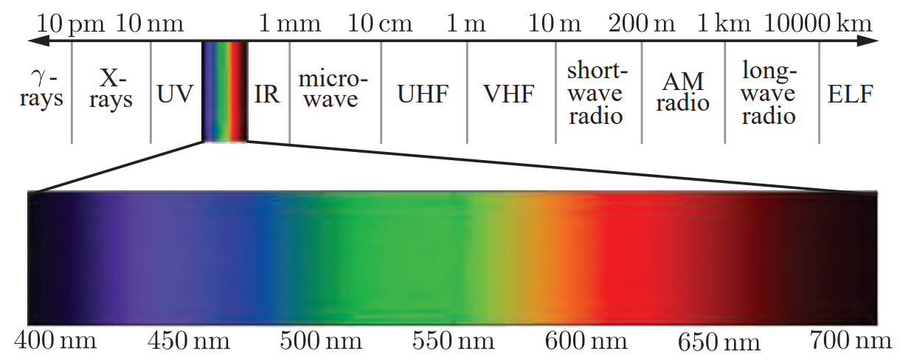

衡量电磁辐射不同方面的量有：总能量，功率，相对于面积或方向或两者的功率密度，如下表：
|名称|符号|单位|
|:-|:-|:-|
|辐射通量（*radiant flux*）|${\Phi}$|$watt(W)$|
|辐照度（*irradiance*）|$E$|$\mathrm{W} / \mathrm{m}^{2}$|
|辐射强度（*radiant intensity*）|$I$|$\mathrm{W} / \mathrm{sr}$|
|辐射率（*radiance*）|$L$|$\mathrm{W} /(\mathrm{m}^{2} \mathrm{sr})$|

在辐射度学中，基本单位是辐射通量${\Phi}$。辐射通量是辐射能量相对于时间的流，也就是功率，用瓦特$watt(W)$作单位。辐照度是辐射通量相对于面积的密度，即$d \Phi / d A$。辐照度的定义是相对于一块面积的。这可以是空间中一个想象的区域，但通常是物体的表面。单位是瓦特每平方米。立体角（*solid angle*）是对角度的三维拓展。一个角度可以认为是平面上角度的连续集合的大小的一种衡量。其以弧度为单位的值等于该方向集合与半径为1的圆相交得到的弧的长度。类似的，立体角是三维空间中角度的连续集合的大小的一种衡量，单位是球面度（*steradians*），缩写为$sr$。它定义为相交面片的面积。立体角用$\omega$表示。在二维中，弧度为$2 \pi$的角覆盖整个单位圆。拓展到三维，球面度为$4 \pi$的立体角覆盖整个单位球。1球面度的立体角如下图：
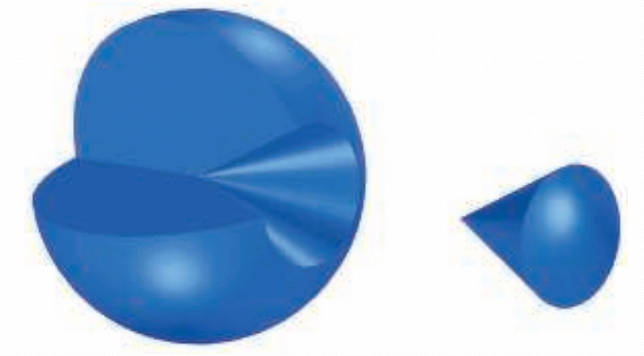

辐射强度定义为辐射通量相对于立体角的密度，即$d \Phi / d \omega$。辐射率衡量一个射线上的电磁辐射。更精确的，它定义为辐射通量相对于面积和立体角的密度，即$d^{2} \Phi / d A d \omega$。该面积所在的平面垂直于射线。如果辐射率引用于表面上的其他方位，那么需要一个余弦矫正因子。其他辐射率定义中提及的投影面积就是指代该余弦矫正因子。

辐射率是眼睛或者摄像机这些传感器所衡量的量，因此对渲染至关重要。计算着色方程的目的就是计算沿着从着色点到摄像机的射线的方向的辐射率。其值就是第5章中$C_{shaded}$的物理等价量。辐射率的单位是瓦特每平方米每球面度。

辐射率可以认为是5个变量的函数（如果包含波长的话是6个），叫做辐射率分布（*radiance distribution*）。三个变量指定一个位置，另外两个指定方向。该方程描述了任何光在空间中任何位置的传播。一种理解渲染过程的方式是眼睛和屏幕定义了一个点和一个方向集合（穿过每个像素的射线），针对该点和每个方向计算该方程。【s13.4】讨论的基于屏幕的渲染使用了类似的概念，叫做光场（*light field*）。

在着色方程中，辐射率通常以$L_{o}(\mathbf{x}, \mathbf{d})$和$L_{i}(\mathbf{x}, \mathbf{d})$的形式出现，分别表示从点$\mathbf{x}$射出和射入$\mathbf{x}$的辐射率。方向向量$\mathbf{d}$表示射线的方向，并根据约定总是指离$\mathbf{x}$。在$L_{i}(\mathbf{x}, \mathbf{d})$的例子中这种约定可能有点怪，因为$\mathbf{d}$的方向与光的传播方向相反。但是在类似点积的计算中这种约定很方便。

辐射率一个很重要的性质是在不考虑雾等大气效果的前提下，它不会受到距离的影响。

绝大多数光波是多种不同波长的混合，这通常使用光谱功率分布SPD（*spectral power distribution*）来可视化表示。SPD显示光的能量如何相对于波长分布。下图显示了三个例子：
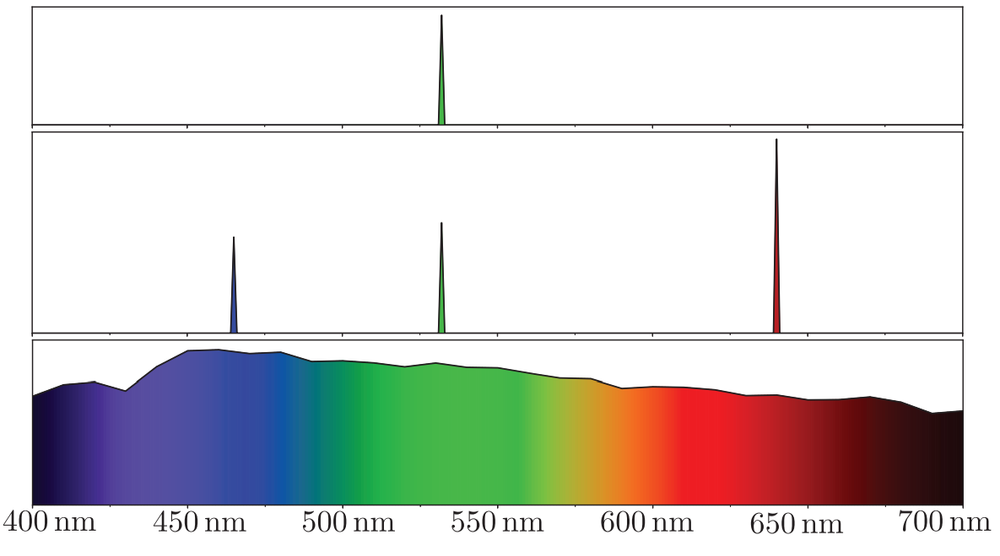
注意，尽管中间的图和下面的图相差很大，但人眼将它们感知为同一个颜色。显然，人眼是一个很糟糕的分光计。

所有辐射度学相关的量都有光谱分布。例如，辐照度的光谱分布的单位是瓦特每平方米每纳米。

使用整个SPD来渲染是不实际的。因此，通常的做法是使用RGB三元组来表示辐射度学相关的量。

### 8.1.2 光度学

辐射度学只关注物理量，而不考虑人眼的感知。光度学与辐射度学类似，但它会根据人眼的敏感度对所有量进行重新衡量。辐射相关的计算结果乘以CIE光照度曲线后被转换到光照度单位。该曲线以555纳米为中心，呈铃铛状。如下图：
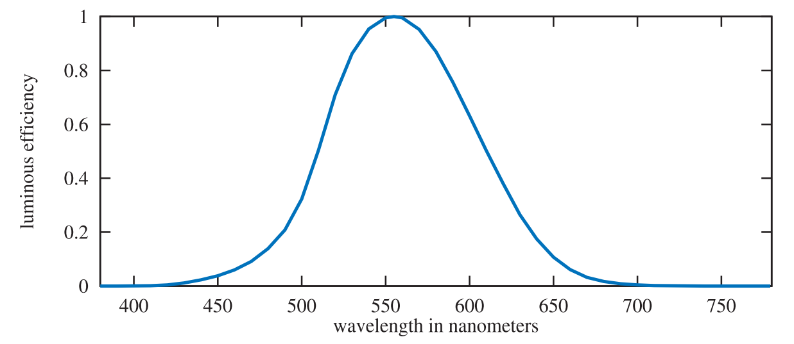

转换曲线和度量单位是光度学和辐射度学之间唯二的区别。每个辐射度学相关的量都有一个对应的光度学相关的量。下表显示了这种关系：
|辐射度学相关的量：单位|光度学相关的量：单位|
|:-|:-|
|辐射通量（*radiant flux*）：$watt(W)$|光通量（*luminous flux*）：$lumen(lm)$|
|辐照度（*irradiance*）：$\mathrm{W} / \mathrm{m}^{2}$|光照度（*illuminance*）：$lux(lx)$|
|辐射强度（*radiant intensity*）：$\mathrm{W} / \mathrm{sr}$|光强度（*luminous intensity*）：$candela(cd)$|
|辐射率（*radiance*）：$\mathrm{W} /(\mathrm{m}^{2} \mathrm{sr})$|亮度（*luminance*）：$\mathrm{cd} / \mathrm{m}^{2}=\mathrm{nit}$|
单位都有期望的关系，例如勒克司的单位是流明每平方米。尽管逻辑上流明应该是基本单位，但由于历史原因，坎德拉被定义为基本单位，其他单位从他导出。在北美，灯光设计师使用一种被废弃的英制单位来衡量光照度，即英尺烛光（foot-candle，fc），而不是用lux。

亮度（*luminance*）用来描绘物体表面的亮度。例如，高动态范围（HDR）电视屏幕的峰值亮度通常是500nit到1000nit。清澈的天空的亮度是8000nit，60瓦灯泡的亮度是120,000nit，水平线上的太阳的亮度是600,000nit。

### 8.1.3 色度学

我们对光的颜色的感知与光的SPD有很大的关系。这也不是一一对应的关系。色度学研究光谱功率分布与颜色感知之间的关系。人眼可以识别一千万种不同的颜色。人眼的视网膜上有三种不同类型的锥细胞。每种类型的锥细胞对不同的波长做出反应。其他动物的颜色感受器的数量不定，有的多达15种。因此，给定一个SPD，我们的大脑只接收三种不同的信号。这就是为什么只用三个数值就可以精确表示任何颜色刺激。

这三个数字怎么来？CIE（*Commission Internationale d'Eclairage*）提出了一些用于衡量颜色的标准条件，这些条件用于进行颜色匹配实验。在颜色匹配实验中，三种颜色的光被投射到白色的屏幕上。它们的颜色重叠，形成一块面片。需要匹配的测试颜色被投射到这块面片的旁边。测试颜色只有单一波长。观察者使用旋钮调整这三个颜色灯光，直到与测试颜色匹配。调整的权重范围是$[-1,1]$。匹配某些颜色需要负权重。负权重意味着对应的颜色被加到测试颜色面片上。三种被称为$r$，$g$，$b$的光的一个测试结果如下图。这些光几乎是单色的，其能量分布分别集中在645nm，526nm和444nm。将每个匹配权重集关联到测试光的波长的函数叫做颜色匹配函数（*color-matching functions*）。
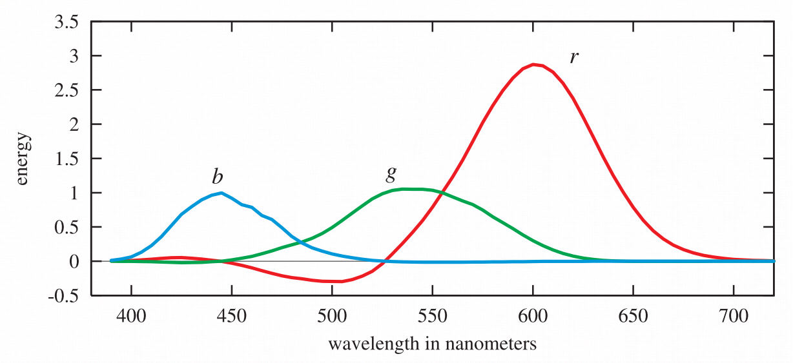

这些函数提供了一种将光谱功率分布转换到三个数值的方法。给定一个单一波长的光，可以从图上得出三种颜色光的权重。对于任意的光谱分布，用颜色匹配函数乘以该分布，则每个结果曲线下面的面积（也就是积分）就是相应的权重。相差很大的光谱分布可能得到相同的权重。给出相同权重的光谱分布叫做条件等色（*metamer*）。

这三个颜色光$r$，$g$，$b$的加权不能表示所有的可见颜色，因为它们的颜色匹配函数对于某些波长有负权重。CIE提出了三个不同的假设光源。它们的颜色匹配函数对所有可见波长都有正权重。这些曲线是原先$r$，$g$，$b$颜色匹配函数的线性组合。这会使得它们的光谱功率分布在某些波长为负，因此这些光是无法实现的数学抽象。它们的颜色匹配函数用$x(\lambda)$，$y(\lambda)$，$z(\lambda)$表示，如下图。其中颜色匹配函数$y(\lambda)$与光度学曲线相同。
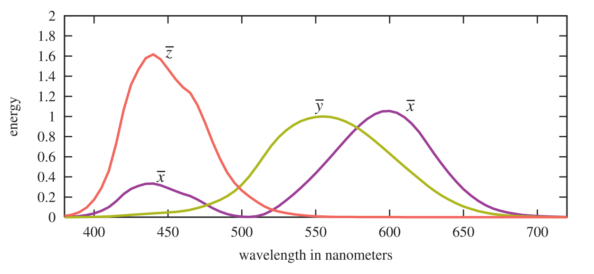

$x(\lambda)$，$y(\lambda)$，$z(\lambda)$用于将任何光谱功率分布$s(\lambda)$转换到三个数值，通过乘法和积分：
$$
X=\int_{380}^{780} s(\lambda) x(\lambda) d \lambda, \quad Y=\int_{380}^{780} s(\lambda) y(\lambda) d \lambda, \quad Z=\int_{380}^{780} s(\lambda) z(\lambda) d \lambda
$$
$X$，$Y$，$Z$叫做三色刺激值（*tristimulus values*）。这些权重定义了CIE XYZ空间中的一个颜色。为了方便，通常将颜色分为亮度（*luminance*）和色度（*chromaticity*）。色度是颜色独立于亮度的属性。例如，同样的蓝色，一个暗一个亮，它们色度一样，但是亮度不同。基于此，CIE通过将颜色投影到$X+Y+Z=1$平面来定义一个二维的色度空间。如下图：
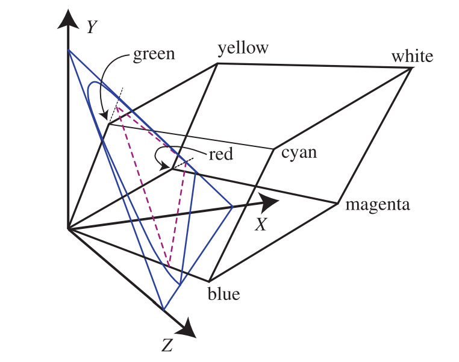
该空间的坐标叫做$x$和$y$，计算如下：
$$
\begin{array}{l}
{x=\frac{X}{X+Y+Z}} \\
{y=\frac{Y}{X+Y+Z}} \\
{z=\frac{Z}{X+Y+Z}=1-x-y}
\end{array}
$$
$z$值通常省略。色度坐标（*chromaticity coordinates*）$x$和$y$的值的图像被称为CIE 1931 色度图像（*chromaticity diagram*）。如下图：
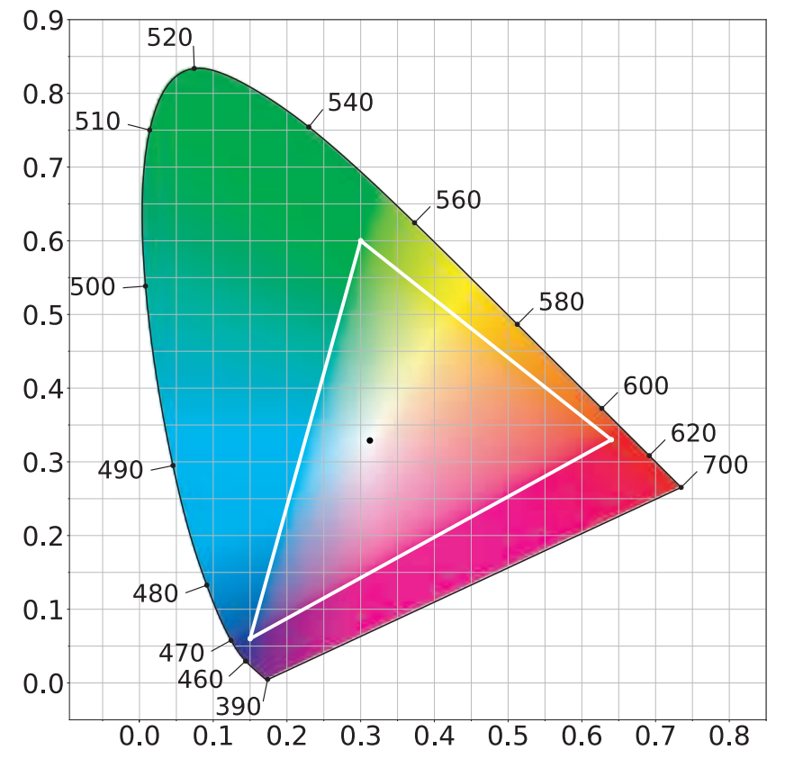
图中的曲线轮廓显示了可见光谱的颜色，直线轮廓叫做紫线（*purple line*）。黑点是illuminant D65的色度，被用作白点（*white point*），也就是用于定义白色或者无色刺激的色度。

总结一下。我们开始于一个实验。该实验使用三个单波长的光，并衡量每种光需要多少，才能匹配另外一个波长的光的外观。有时候这些纯色光需要被加到匹配目标光来完成匹配。这得到会产生负权重的颜色匹配函数集，通过对这些函数的组合可以得到一个不产生负权重的颜色匹配函数集。使用这些函数，我们可以将任意的光谱分布转换到一个$XYZ$坐标。该坐标定义了颜色的色度和亮度。通过使亮度恒定，可以进一步将该坐标化简至$xy$来单独描述色度。

给定一个颜色点$(x, y)$，从白点画一条直线，该直线穿过该颜色点，并与边界相交于边界点。颜色点与白点的距离除以边界点到白点的距离叫做刺激纯度（*excitation purity*）。边界点定义了主波长（*dominant wavelength*）。这些术语在图形学中很少被使用。取而代之，我们使用饱和度（*saturation*）和色调（*hue*）。它们分别与刺激纯度和主波长有着不精确的对应关系。

色度图描述了一个平面。要完全描述一个颜色还需要第三个维度$Y$值，也就是亮度。这些值定义了$xyY$坐标系统。色度图对理解如何渲染颜色十分重要，也有助于理解渲染系统的局限性。电视机或者电脑的显示器使用RGB颜色值来显示颜色。每个颜色通道控制一个显示基色（*display primary*）。每个显示基色会发射具有特定光谱功率分布的光。使用各自的颜色值来对显示基色进行放缩，结果相加后得到一个光谱功率分布，然后被观察者感知。

色度图中的三角形表示一个典型的电视或者电脑显示器的全范围（*gamut*）。三角形的三个角是显示基元，是屏幕能够显示的最饱和的红绿蓝颜色。色度图像的一个重要性质是这些受限颜色使用直线连起来后可以显示显示系统的整体局限性。当RGB颜色值相等时，显示系统产出的就是白点的色度。要注意的是一个显示系统的全范围是一个三维的体积。色度图显示的只是该体积在一个二维平面上的投影。

渲染领域中使用了多种RGB空间。每个空间都使用RGB基元和白点定义。为了便于比较，我们使用另一种色度图，叫做CIE 1976 UCS（*uniform chromaticity scale*）。改图是CIELUV颜色空间的一部分。CIE采用该颜色空间（以及另一个颜色空间CIELAB）的目的是提供比XYZ空间更加均匀的感知。感知上相差同样数值的颜色对在CIE XYZ空间中的距离相差可能会有20倍的差距。CIELUV改进了这一点，使得最大比率下降至4倍。在比较RGB空间的全范围时，这一提升的感知均匀性使得1976图像要大大优于1931图像。其他在这方面进行改进的颜色空间有$\mathrm{IC}_{\mathrm{T}} \mathrm{C}_{\mathrm{P}}$和$\mathrm{J}_{\mathrm{z}} \mathrm{a}_{\mathrm{z}} \mathrm{b}_{\mathrm{z}}$。本章使用CIE 1976 UCS图像，如下：
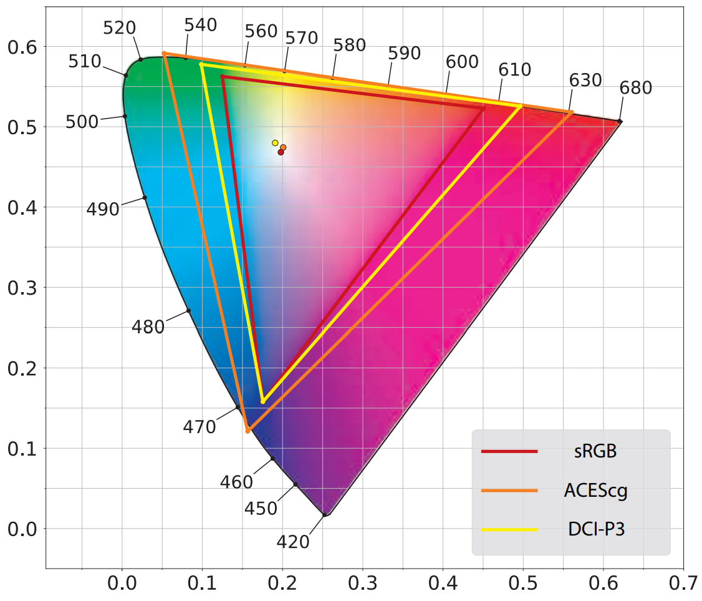

上图显示了3个颜色空间。sRGB是目前实时渲染中应用最广泛的。注意，这里所说的“sRGB颜色空间”指代一个有sRGB基元和白点的线性颜色空间，并不是【s5.6】中讨论的非线性sRGB颜色编码。绝大多数电脑显示器针对sRGB颜色空间设计，相同的显示基元和白点也同样适用于Rec. 709颜色空间。该颜色空间用于HDTV显示器，因此对游戏机非常重要。但是，更多的显示器针对更大的全范围。一些用于照片编辑的电脑显示器使用Adobe 1998颜色空间。DCI-P3颜色空间最初用于电影工业，现在应用越来越广泛。苹果公司在iPhone和Mac上采用了该颜色空间，其他制造商也紧跟其后。尽管超高清UHD（*ultra-high denition*）指定使用极大范围的Rec. 2020颜色空间，但许多情况下UHD实际使用的颜色空间是DCI-P3。Rec. 2020颜色空间的全范围与ACEScg颜色空间很接近。ACEScg颜色空间由AMPAS（*Academy of Motion Picture Arts and Sciences*）开发，用于电影的计算机图形渲染。它并不用做显示颜色空间，而是在渲染时用作工作颜色空间（*working color space*）。渲染完成后颜色会被转换到合适的显示颜色空间。

通常的渲染计算（例如乘法）在不同的颜色空间下面会有不同的结果。有研究表明在DCI-P3或者ACEScg颜色空间中进行这些计算，结果比在线性sRGB颜色空间中要更精确。

从一个RGB空间到XYZ空间的转换是线性的，可以通过一个矩阵完成。该矩阵可以从该RGB空间的基元和白点得到。通过矩阵的逆和连结，可以实现任意RGB颜色空间之间的转换。注意转换后RGB值可能为负或者超过1。一些方法可以将这些颜色映射会目标RGB颜色空间的全范围。

一种常用的转换是将RGB颜色转换到一个灰度亮度值。由于亮度就是$Y$的系数，该操作就是RGB到XYZ转换的“Y部分”。换句话说，就是RGB系数与RGB到XYZ转换矩阵的中间一行的点积。以sRGB和Rec. 709为例，方程是：
$$
Y=0.2126 R+0.7152 G+0.0722 B
$$
这又一次回到了光度学曲线。该曲线表示一个标准的人眼对不同波长的光的反应。将其与三个基元的光谱功率分布相乘后再积分，得到的三个结果权重就构成了上面的亮度方程。红绿蓝的系数不一样是因为人眼对不同的波长的敏感度不一样。

色度学可以告诉我们两个颜色是否一样，但无法预测其外貌。一个给定XYZ颜色刺激的外貌很大程度上依赖于光照，周围的颜色和之前的情况。诸如CIECAM02这样的色貌模型CAM（*color appearance models*）专注于预测颜色的最终外貌。色貌模型是一个更大的研究领域的一部分：可视化感知。

### 8.1.4 使用RGB颜色渲染

严格来说RGB值表示感知量而非物理量。使用RGB来进行渲染本质上是错误的。一个极端的例子如下：
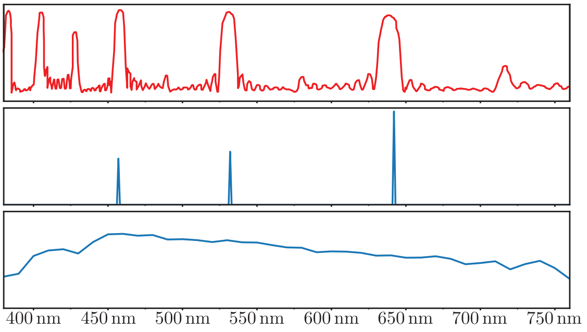
上面一张图显示了用于投影屏幕的材质的光谱反射率。下面两张图是RGB颜色相同的两个光源的光谱功率分布。中间的是激光投影仪，下面的是标准D65光源。投影屏幕材质的高反射率集中在激光投影仪的波长部分。这导致该材质会反射来自计算光投影仪的绝大部分光，而吸收来自其他光源的绝大部分光。在这种情况下使用RGB渲染会产生错误的结果。

然而，这个例子很罕见。实际中的光谱反射曲线要平滑的多，如香蕉的曲线：
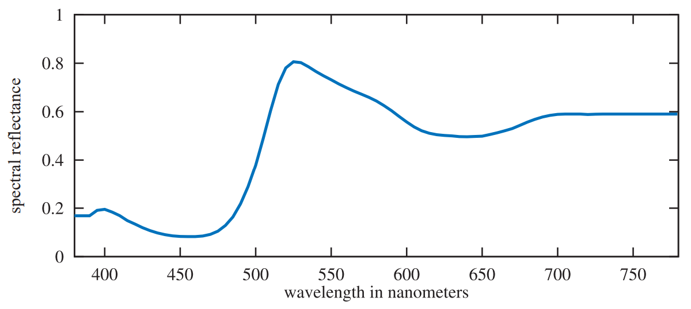
通常光源的SPD与D65光源的SPD相近，激光投影仪的SPD很少见。当光源的SPD与表面光谱反射曲线都很平滑时，使用RGB渲染所引入的错误比较小。

在预测渲染（*predictive rendering*）应用中，这种微小的错误会变得很重要。例如，两个光谱反射曲线在一个光源下有相同的颜色外貌，但在另一个光源下则有不同的颜色外貌。该问题叫做同色异谱失效（*metameric failure*，或者*illuminant metamerism*）。RGB渲染不适用于该场景。

然而，在绝大多数渲染系统中，尤其是交互式应用，RGB渲染工作的很好。即使是电影离线渲染也仅仅是开始采用光谱渲染，离流行还有很远。

## 8.2 场景到屏幕

PBS计算场景的辐射率。但是最终显示缓冲中存储的是像素值。这有一个转换的过程。

### 8.2.1 高动态范围显示编码

【s5.6】讨论了显示编码。它适用于标准动态范围（SDR）显示器（使用sRGB显示标准）和SDR电视（使用Rec. 709和Rec. 1886标准）。这些标准拥有相同的RGB全范围和白点（D65），以及近似相同的非线性显示编码曲线。它们也有近似相同的参考白色亮度等级（sRGB是$80 \mathrm{cd} / \mathrm{m}^{2}$，Rec. 709/1886是$100 \mathrm{cd} / \mathrm{m}^{2}$）。显示器和电视制造商通常不会严格遵守这些亮度规格，而是将其提高一些。

HDR使用Rec. 2020和Rec. 2100标准。Rec. 2020定义的颜色空间的全范围要大得多。它的白点（D65）与Rec. 709和sRGB一样。Rec. 2100定义了两个非线性显示编码：PQ（*perceptual quantizer*）和HLG（*hybrid log-gamma*）。HLG在渲染中很少使用，因此我们专注于PQ。该标准的峰值亮度是$10000 \mathrm{cd} / \mathrm{m}^{2}$

尽管峰值亮度和全范围对于编码很重要，但现实中的显示器难以完全符合这些标准。在本书写作时，很少有消费者级HDR显示器的峰值亮度超过$1500 \mathrm{cd} / \mathrm{m}^{2}$。全范围相较于Rec. 2020更接近于DCI-P3（如下图）。因此，HDR显示器会在内部进行从标准规格到实际显示能力的色调和全范围映射。应用通过传输元数据可以影响该映射。
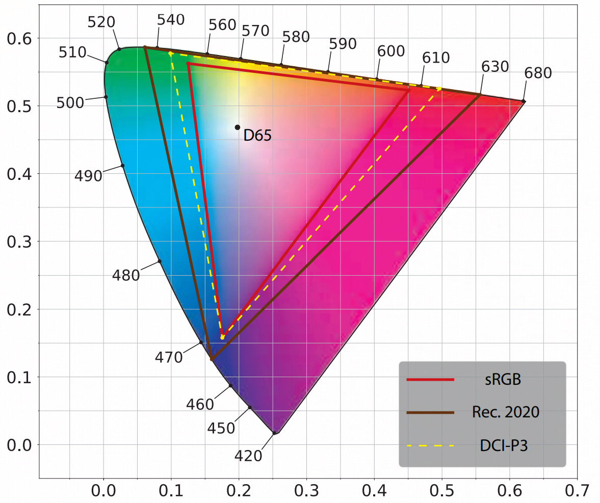

从应用角度，有3种方法可以将图像转换至HDR显示器：
* HDR10：被HDR显示器和PC，主机操作系统广泛支持。缓冲格式是每像素32位。其中每个RGB通道10位无符号整数，alpha通道2位。使用PQ非线性编码和Rec. 2020颜色空间。每个HDR10显示模型进行自己的色调映射，没有标准化和文档化。
* scRGB（线性变体）：只有Windows操作系统支持。其主要优点是方便，并且向后兼容sRGB。
* Dolby Vision：还未被广泛使用。

当使用除scRGB以外的方法时，应用需要将像素的RGB值从渲染工作空间转换至Rec. 2020颜色空间。这需要一个$3\times3$的矩阵。然后应用PQ编码。改编码比Rec. 709和sRGB的编码函数消耗更大。

### 8.2.2 色调映射

之前讨论的显示编码将线性辐射率值转换到非线性编码值以供显示硬件使用。显示编码使用的函数是EOTF的逆。我们忽略了发生在渲染和显示编码之间的一个重要步骤。色调映射（*Tone mapping*），也叫色调重现（*tone reproduction*），用于将场景辐射率值转换到显示辐射率值。这一过程使用的变换叫做端到端变换函数（*end-to-end transfer function*），或者叫场景到场景变换（*scene-to-screen transform*）。图像状态（*image state*）的概念对于理解色调映射很重要。有两种基本的图像状态。场景参考（*Scene-referred*）图像的定义参考场景的辐射率值，显示参考（*display-referred*）图像的定义参考显示辐射率值。图像状态于编码无关。任一状态的图像都可以进行线性编码或者非线性编码。上述概念构成图像管线（*imaging pipeline*），如下：
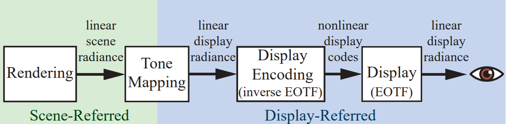

有关色调映射有许多错误的理解。它并不是要保证场景到场景变换是一个恒等变化，在显示器端重现场景的辐射率值。也不是要将场景的高动态范围“挤压”至显示器的低动态范围。为了理解色调映射的目的，最好将其看成是图像重建的一个实例。图像重建的目的是创建一个显示参考图像，该图像在给定的显示属性和观察条件下所产生的感知印象，与观察值看到原始图像时产生的感知印象要尽可能的接近。如下所示：
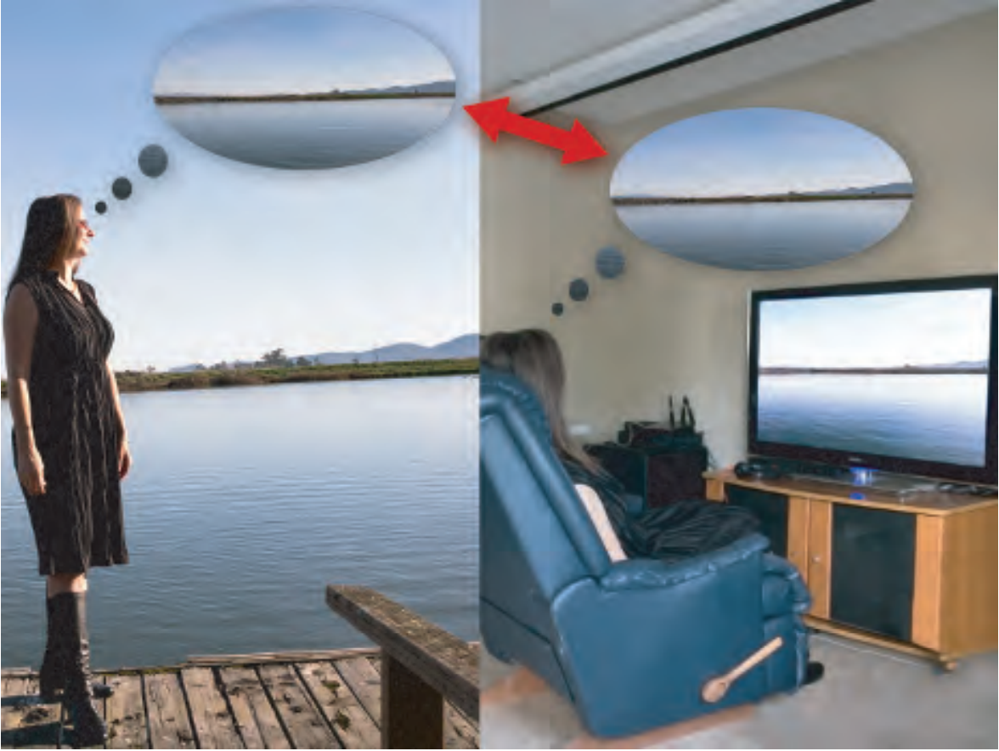

有一种类型的图像重建有着稍稍不同的目的。首选图像重建（*preferred image reproduction*）要求创建的显示参考图像看起来比原始图像更好。

重建与原始图像接近的感知印象很有挑战。因为一个典型场景的亮度范围要比显示器的能力范围大上好几个量级。场景中一些颜色的饱和度也会大大超过显示器的能力。然而，摄影术，电视机，电影院，甚至是文艺复兴时期的画家，都可以创造出原始图像的令人信服的感知印象。他们利用了人的视觉系统的特定属性。

视觉系统会补偿绝对亮度之间的差异。这种能力叫做适应（*adaptation*）。正是由于这种能力，在昏暗房间里的屏幕上显示户外场景的重建可以产生对原始场景的近似感知，尽管重建的亮度只有原始亮度的$1\%$不到。然而，适应所提供的补偿是不完美的。当亮度比较低时，感知的对比度会下降（*Stevens effect*），就如感知上的“无色”（*Hunt effect*）

其他因素也会影响重建图像的实际和感知对比度。显示器的周围（*surround*），例如房间里灯光的亮度，可能会提升或降低感知对比度（*Bartleson-Breneman effect*）。显示器的缺陷或者屏幕反射所产生的显示耀斑（*display flare*）会减少图像的实际对比度。这些效应意味着如果我们想要尽可能地保留原始图像的感知印象，我们必须增大显示参考图像的对比度和饱和度。然而，这又会加剧另一个问题。由于场景的动态范围通常比显示器的动态范围大得多，我们需要选择一个比较小的亮度范围来重建。范围外的值会被剪裁到白色和黑色。增大对比度会进一步减小该范围。

所有这些导致了一个S型的色调重建曲线，类似于光化学胶片所使用的曲线。这不是巧合。光化学胶片乳剂的属性被研究人员和公司仔细调整过，可以产生很好的图像重建效果。因此，形容词“filmic”经常出现在色调映射的讨论中。

曝光（*exposure*）的概念对于色调映射至关重要。在摄像学种，曝光控制射到胶片或者感应器的光的数量。但是，在渲染种，曝光是一个作用在场景参考图像上的线性放缩操作，发生在应用色调重建变换之前。曝光比较麻烦的点在于决定放缩的系数。色调重建变换与曝光紧密结合。在设计色调变换时我们希望应用改变换的场景参考图像使用特定方式进行曝光。

使用曝光进行放缩，然后应用色调重建变换的过程是一种全局色调映射（*global tone mapping*），其中同样的映射被应用在所有像素上。相应的，局部色调映射（*local tone mapping*）在每个像素上使用的映射不尽相同，受周围像素和其他因素的影响。实时应用几乎总是使用全局色调映射，因此我们专注于该类型。先讨论色调重建变换，然后是曝光。

场景参考图像和显示参考图像本质上是不同的。物理计算只有在场景参考数据上进行才是合理的。由于显示器的限制和之前讨论的各种感知效应，这两种图像状态之间的变换通常是非线性的。

#### 色调重建变换

色调重建变化通常使用一维曲线来表达，将场景参考输入值映射到显示参考输出值。这些曲线可以分别独立地应用于R，G，B值，或者直接应用在亮度上。当应用于RGB值时，结果自动位于显示全范围内，因为每个显示参考RGB通道值都在0和1之间。然而，对RGB通道使用非线性操作时（尤其是裁剪），除了以期望的方式改变亮度外，还会引起饱和度和色调的变化。饱和度的变化感知上可能是有益的。绝大多数重建变换为了抵消*Stevens effect*（以及周围环境和耀斑效应），会增加对比度，而这又会引起饱和度的增加，从而抵消*Hunt effect*。然而，色调的变换通常不是我们想要的。现代色调变换通过在色调曲线后附加额外的RGB调整来缓解这一问题。

如果将色调曲线用于亮度，色调和饱和度的变化可以被避免（或者说至少减弱）。然而，结果显示参考颜色可能会落在显示RGB全范围的外面。这种情况下还需要重新映射回全范围内。

色调映射的一个潜在问题是对场景参考像素颜色应用非线性函数时会使得抗锯齿技术产生问题。【5.4.2】探讨了这一问题。

Reinhard色掉重建操作是早期实时渲染中使用的色调变换。在改变换中，绝大多数比较暗的颜色不会被改变，而比较亮的颜色会向白色靠拢。其他色调变换见原文，如*Hable filmic curve*。美国电影艺术与科学学院（*Science and Technology Council of the Academy of Motion Picture Arts and Sciences*）创建了ACES（*Academy Color Encoding System*），一种在电影和电视工业管理颜色的标准。ACES将场景到场景的变换分为两个部分。第一个部分是参考渲染变换RRT（*reference rendering transform*），用于将场景参考值变换到显示参考值。该显示参考值位于一个标准的设备中立的输出空间，叫做输出颜色编码规范OCES（*output color encoding specication*）。第二个部分叫做输出设备变换ODT（*output device transform*），用于将OCES中的颜色值变换到最终的显示编码。有许多不同的ODT，适配于不同的显示设备和观察环境。尽管ACES被设计用于电影和电视，其变换在实时应用中被越来越多地使用。Unreal默认开启ACES，Unity同样也支持它。

针对HDR显示器的色调映射需要更多考虑，因为这类显示器会应用自己的色调映射。Frostbite中使用的色调映射请参考原文。

各种变换的效果如下：
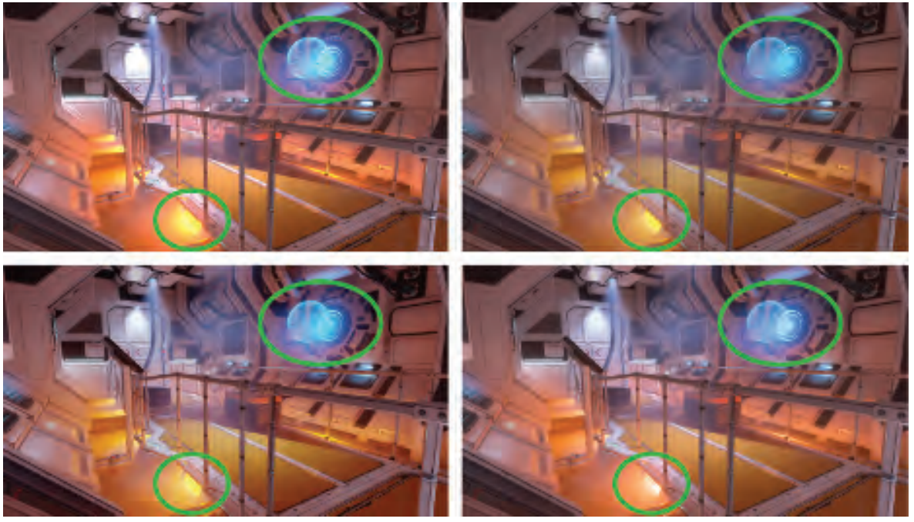
图中，左上：裁剪（外加sRGB OETF）；右上：Reinhard；左下：Duiker；右下：Frostbite（色调保留版本）。Reinhard，Duiker和Frostbite的变换都会保留因裁剪而丧失的高光信息。但是，Reinhard曲线倾向于减小昏暗部分的饱和度，而Duiker曲线会增加昏暗部分的饱和度（有时候这是我们期望的）。Frostbite的变换同时保留了饱和度和色调，避免了其他三幅图中左下角圆圈中比较强烈的色调变换。

#### 曝光

一类广泛使用的计算曝光的技术依赖于分析场景参考亮度值。为了避免延迟，该分析通常通过采样前一帧来完成。一种早期使用的度量是对数平均场景亮度。通常，曝光由该帧计算得到的对数平均值决定。这个计算过程是一系列降采样后处理pass，直到计算出最终单个值。

使用一个平均值会导致结果对异常值十分敏感，即个别非常亮的像素会影响整帧的曝光。后续方法通过使用亮度值的直方图来缓解这一问题。直方图可以计算中位数，更加鲁棒。其他数据也可用来改善结果。例如Valve的半条命2使用了95百分点和中位数来决定曝光。计算着色器可以用来生成亮度直方图。

上述技术的问题是，亮度是曝光的错误的度量。在摄影学中，入射式测光表被用于设置曝光，单独使用光照（没有物体表面反射率的影响）来决定曝光更加可取。这是因为摄像学中的曝光主要用于抵消光照，使得影像主要显示物体表面的颜色，这与人眼视觉系统的颜色一致（*color constancy*）属性相对应。用这种方式处理曝光也可以保证传递给色调变换的值是正确的。尽管这种方法在实时应用中不常见，但越来越流行。

### 8.2.3 颜色分级

之前提到了首选图像重建的概念。其思想是重建的图像看起来要优于原始的图像。这需要对图像颜色进行创造性地操作，叫做颜色分级（*color grading*）。

数字颜色分级在电影工业被广泛使用。其典型做法是以交互的方式操作一个样例场景图像的颜色，直到获得想要的效果。之后这一系列同样的操作被应用于一个电影片段的所有图像。在游戏领域，颜色分级也被广泛使用。

一种技术可以将任意的颜色变换从颜色分级或者图像编辑应用中“烘焙”成一个三维的颜色查找表LUT。使用该表时，输入的RGB颜色值被当做是$xyz$坐标，以用于在该表中查找一个新的颜色。这种方法能够实现任意输入颜色和输出颜色之间的映射，只受限于LUT的分辨率。烘焙过程开始于一张恒等LUT（将每个输入颜色映射到相同的输出颜色），然后将其“切片”以构造一个二维的图像。该LUT图像被载入到一个颜色分级应用中，并将需要的颜色操作应用于该图像。要注意只能应用颜色操作，不能应用模糊之类对的空间操作。编辑好的LUT被保存，然后打包成三维的GPU纹理，供渲染应用所使用以获得相同的颜色操作。在LUT中存储颜色变换时可以使用最小二乘法来减小采样错误。

颜色分级有两类。一种应用在显示参考图像上，一种应用在场景参考图像上。尽管显示参考颜色分级实现简单，但场景参考颜色分级效果更好。实时应用最开始采用显示参考颜色分级，但出于图像质量的考虑，开始逐渐使用场景参考颜色分级。使用场景参考颜色分级还有一个好处是通过将色调映射烘焙至LUT可以减少计算量。在LUT查找之前，场景参考值需要被重新映射至$[0,1]$范围内。颜色分级的效果如下：
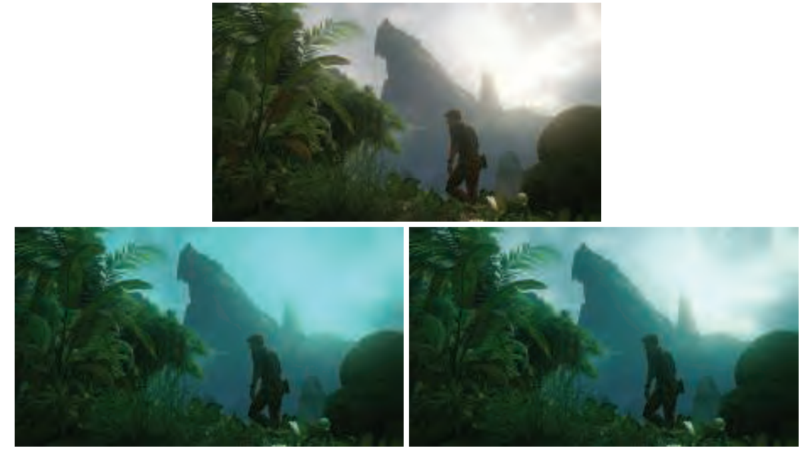
上图来自《神秘海域4》。上面一张图没有使用颜色分级。下面两张图使用了不同的颜色分级方法。为了显示目的，这里使用了比较极端的颜色分级操作（乘以一个高饱和度的青色）。左下，颜色分级应用于显示参考图像（色调映射之后），右下，颜色分级应用于场景参考图像（色调映射之前）。

## 拓展阅读

略