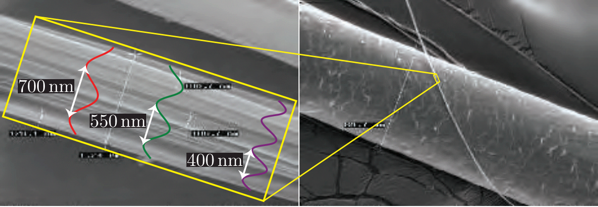
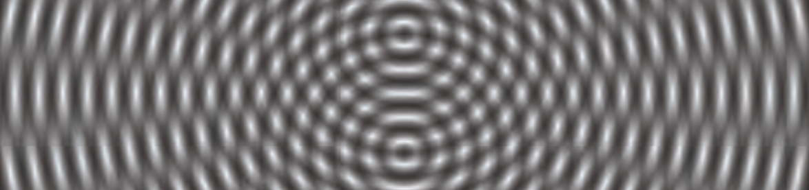
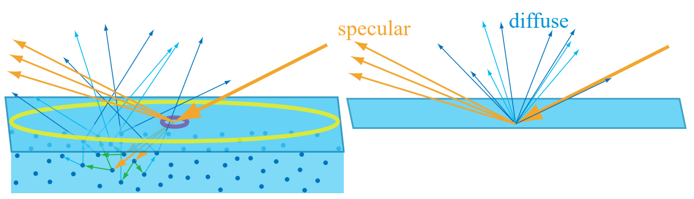
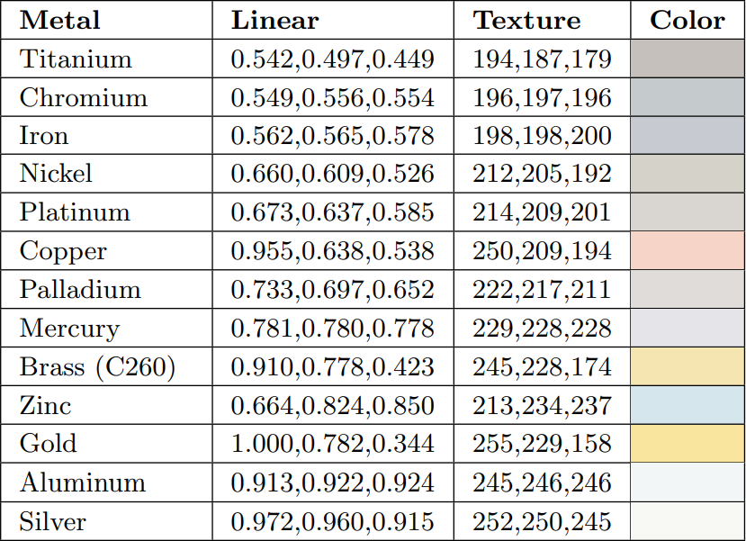
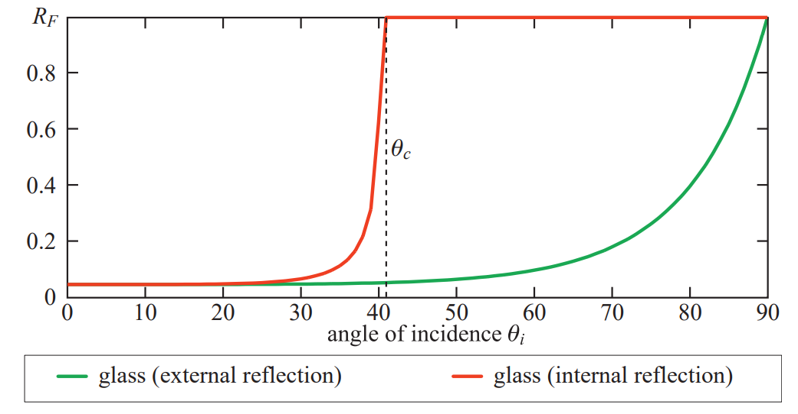

# Chapter 9 基于物理的着色

【s9.1】讨论光与物质的物理交互；【s9.2】到【s9.4】讨论如何将这些物理交互关联到着色过程；【s9.5】到【s9.7】专注用于构建PBS模型的组件；【s9.8】到【s9.12】讨论模型本身，包括各种各样的材质类型；最后，【s9.13】讨论如何混合材质，以及用于避免失真的过滤方法。

## 9.1 光物理学

光与物质的交互构成了PBS的基础。为了理解之中交互，需要理解光的本质。

在物理光学中，光被建模为一个电磁横波（*transverse wave*）。其中电场和磁场在垂直于光传播方向的平面上振动。这两个场的振动是成对的。电场向量和磁场向量互相垂直，其长度的比值是固定的。该比值等于相位速度（*phase velocity*）。

下图是一个简单的光波：

实际上它是最简单的一种：一个完美的正弦函数。该光波有单个波长（*wavelength*），用$\lambda$表示。如【s8.1】所讨论的，光的感知颜色与其波长密切相关。因此，只有一个波长的光叫做单色光（*monochromatic light*）。但是，绝大多数实际中遇到的光波都是多色的（*polychromatic*），包含许多不同的波长。

上图中光波的简单性还体现在另一个方面：它是线性偏振的（*linearly polarized*）。本书关注于非偏振光，因为它更加常见。在非偏振光中，场的振动方向在与光传播方向垂直的平面上均匀分布。单色线性偏振光波很简单，理解他们的行为很有用，因为任意光波都可以分解为这种简单光波的组合。

如果我们跟踪光波上某一相位上的一个固定点，可以看到它以一个恒定的速度穿越空间。这个速度就是相位速度。真空中光的相位速度是$c$，也就是常说的光速，大约每秒300000千米。

可见光的波长范围大约是400纳米到700纳米。这大约是蜘蛛丝的二分之一到三分之一宽。而蜘蛛丝只有人类头发的十五分之一宽不到。如下图所示：

在光学中，通常使用光的波长来作为衡量尺寸的单位。例如，蜘蛛丝的宽度大约是$2\lambda$到$3\lambda$，头发的宽度是$100\lambda$到$200\lambda$。

光波携带能量。能量流的密度等于电场和磁场的振幅的乘积，也就正比于电场振幅的平方（因为这两个振幅互相成正比）。我们专注于电场，因为它对物质的影响远大于磁场。在渲染中，我们关注于相对于时间的平均能量流，它正比于光波振幅的平方。该平均能量流密度叫做辐照度（*irradiance*），用$E$表示，详见【s8.1.1】。

光波线性组合。总的光波是各个分量光波的和。然而，由于辐照度正比于振幅的平方，这似乎会导致一个悖论。例如，两个相同的光波相加，辐照度不就变成了$1+1=4$？并且，由于辐照度衡量能量流，这不就打破了能量守恒定理么？这两者的答案分别是“有时”和“否”。

我们看一个简单的例子。$n$个单色光相加。这些光除了相位以外完全相同。每个光波的振幅都是$a$。如前所述，每个光波的辐照度$E_{1}$正比于$a^{2}$，即$E_{1}=k a^{2}$。下图显示了三种情况：

左图中所有光波相位对其，互相增强。总的光波的辐照度是单个光波的$n^{2}$倍。这种情况叫做相长干涉（*constructive interference*）。中图中每一对光波的相位相反，彼此抵消。总的光波的振幅和辐照度都是0，这叫做相消干涉（*destructive interference*）。

这两种干涉是相干叠加（*coherent addition*）的两种特殊情况。依赖于相位的相对关系，$n$个相同光波的相干叠加的结果光波的辐照度在单个光波的辐照度的0至$n^{2}$倍之间。

然而，绝大多数情况下相互叠加的光波是不相干的，即他们的相位相对随机。这种情况如右图所示。此时总的光波的振幅是$\sqrt{n} a$，辐照度是单个光波的辐照度的$n$倍。

似乎相长干涉和相消干涉会违反能量守恒定理。但上图并没有显示全部内容，它只显示了某一个位置的光的交互。随着光在空间中传播，相位关系会随着位置的变化而变化，如下图：

有些位置相长干涉，有些位置相消干涉。总体能量守恒。

物体中的电荷振动时就会发射光波。部分引起振动的能量（如热能，电能，化学能）会转换成光能量，并从物体辐射出去。在渲染中，这种物体被视为光源。【s5.2】讨论了光源，第10章则会从物理的角度再次讨论光源。

光波发射后在空间传播，直到遇到与其发生交互的物质。大部分光于物质的交互的底层核心现象很简单，与前面讨论的发射光波的例子很类似。振动的电场对物质中的电荷产生力的作用，使得它们也振动起来。振动的电荷又会发射新的光波。这些新的光波将入射光的部分能量导向新的方向。整个反应过程叫做散射（*scattering*），它是许多光学现象的基础。

被散射光波的频率与原始光波的频率相同。通常原始光波包含多个频率的光，每个光都独自与物质进行交互。某一频率的入射光的能量不会对另一频率的发射光的能量有所贡献，除了一些非常稀有的特殊情况，如荧光反应（*fluorescence*）和磷光反应（*phosphorescence*），它们超出了本书的范围。

一个孤立的分子会朝所有方向散射光，不同方向的密度不同。与传播轴接近的方向散射的光最多。分子的散射能力（其周围的光波被完全散射的概率）极大地依赖于波长。短波更容易被散射。

在渲染中我们关注于大量分子的集合。光与这种聚集体的交互并不一定类似于光于单个分子的交互。周围分子散射的光波通常互相一致，造成干涉，因为它们都源自相同的入射光波。下面讨论多分子散射光的几种重要情况。

### 9.1.1 粒子

在理想气体中，分子不会互相影响，因此其相对位置是完全随机且不相关的。尽管这是一种抽象，但该模型在通常气压下可以很好地近似大气。在这种情况下，从不同分子散射的光波的相位差异是随机且不断变化的。因此散射光波不相干，其能量线性叠加。

相比之下，如果分子紧紧挤在一起，形成一个远比波长小的聚集体，那么每个聚集体散射的光波同相位并相长干涉。这意味着对于每立方米分子密度固定的情况，将分子聚集起来会显著增加散射光的亮度。在保持整体分子密度不变的情况下，聚集体越大，散射光越亮，直到聚集体的直径接近光的波长。此后再增大聚集体的尺寸，并不会增加散射光的亮度。

这解释了为什么云和雾散射光的能力会那么强。它们来自于水分子的凝结。空气中的水分子几何体不断变大，散射光的能力也不断变强，即使总的水分子密度仍然保持不变。【s14.4.2】讨论云的渲染。

当讨论光散射时，术语粒子（*particles*）同时指代单个孤立分子和多分子聚集体。由于多分子粒子（直径小于一个波长）的散射是单分子散射的加强版，它们具有相同的方向变化和波长效应。大气粒子的散射叫做瑞利散射（*Rayleigh scattering*），固体中粒子的散射叫做丁达尔散射（*Tyndall scattering*）。

当粒子的尺寸大于一个波长时，散射光波不再同相位，散射的性质也会发生变化。散射光不断偏向传播方向，波长效应不断减弱，直到所有可见光被均匀散射。这种散射叫做米氏散射（*Mie scattering*）。【s14.1】会详细讨论瑞利散射和米氏散射。

### 9.1.2 媒介

另一个重要的情况是光在均匀介质（*homogeneous medium*）中传播。在均匀介质中，相同的分子均匀分布在空间中。分子之间的距离并不一定要想水晶那样完美。液体和非水晶固体如果成分单一（所有分子都一样）并且没有泡泡和裂缝，也可以视为光学上的均匀。

在均匀介质中，散射光互相对其，使得除了原始传播方向的其他方向发生相消干涉。当原始光波与所有经单个分子散射的光波结合后，最终的结果与原始光波相同，除了相位速度和（有时候）振幅。最终的光波不会表现出任何的散射。

原始光波和新的光波的相位速度的比值定义了该介质的一个光学属性：折射率IOR（*index of refraction*），用$n$表示。一些介质是吸收性的（*absorptive*）。它们会将光的部分能量转换为热能，使得光波的振幅随着距离指数下降。下降速率定义为衰减指数（*attenuation index*），用$\kappa$表示。$n$和$\kappa$都随着波长的变化而变化。这两个数字完整定义了介质如何影响给定波长的光，并且它们通常被组合成一个复数$n+i\kappa$，叫做复折射率（*complex index of refraction*）。折射率抽象了光交互的分子层面的细节，使得能够将媒介当做连续体积来对待，这会简单许多。

尽管光的相位速度不直接影响外观，但是速度的变化会有影响。另一方面，光吸收也对视觉有直接影响，因为它会减弱光的亮度并（如果不同波长减弱的程度不一样的话）改变光的颜色。下图是光吸收的几个例子。从左到右分别是清水，加了石榴汁的水，茶和咖啡。它们的吸收属性各不相同。

非均匀介质可以视为嵌入了散射粒子的均匀介质。均匀介质中发生的相消干涉源于分子的对齐排列。任何分子分部的局部变换会打破这一情况，导致散射光的传播。这种局部变化可以使不同分子的集合体，空气间隙，气泡，或者密度的变化。无论哪种情况，它散射光的情况与之前讨论的粒子散射类似，散射性质同样依赖于聚集体的尺寸。甚至气体也可以用这种方式建模。对于气体，“散射粒子”是由分子的不断运动造成的短暂的密度波动。这一模型允许对气体建立一个有意义的$n$值，这对理解其光学属性十分有用。下图是一些光散射的例子。从左到右分别是水，加了几滴牛奶的水，有$10\%$牛奶的水，牛奶，以及乳白色玻璃。绝大多数牛奶的散射粒子的尺寸要大于可见光的波长，因此散射光主要是无色的，只有中间的图有一点点的蓝色。乳白色玻璃的散射粒子小于可见光的波长，因此散射更强的蓝光。根据背景亮暗的不同，左边透射光更明显，右边散射光更明显。

散射和吸收都依赖与尺度。在一个小场景中没有明显散射的媒介可能会在一个大的场景中表现出很强烈的散射。例如，当在一个小房间内观察一杯水的时候，大气的散射和水的吸收不明显。但是，在非常宽广的环境下，这两者会变得非常明显，如下图：

通常，媒介的外观由散射和吸收的组合决定，如下图：

散射程度决定了浑浊度，高散射会形成不透明外观。除了一些稀少的例外情况（如乳白色玻璃），固体和液体媒介中的粒子通常大于光的波长，倾向于均匀散射所有可见光。因此任何颜色通常都是来自于吸收的波长效应。特别的，白色是高散射和低吸收的结合。【s14.1】有更详细的讨论。

### 9.1.3 表面

从光学的角度，物体表面是一个二维平面，将拥有不同折射率的两个体积分隔开。在典型的渲染场景中，外体积包含大气，折射率大约是1.003，通常化简为1。内体积的折射率依赖于组成物体的物质。

当光击中表面，有两方面因素会对结果又重大影响：两边的物质和表面几何。我们先关注物质方面，假定表面是一个完美的平面。外侧的折射率用$n_{1}$表示，内侧的折射率用$n_{2}$表示。

前面讨论过，当光遭遇材质组成或者密度（也就是折射率）的不均匀时会散射。一个分割不同折射率的表面就是一种特殊类型的不均匀，其散射光的方式也很特殊。边界条件要求电场平行于表面的分量是连续的。换句话说，电场向量在表面的投影在表面两侧必须匹配。从而有如下推断：
* 在表面，任何散射波相对于入射波要么同相位，要么偏移$180^{\circ}$。因此在表面，散射光的波峰必须与入射波的波峰或者波谷对齐。这将散射光的传播方向限制为只有两个。一个继续向前进入表面，一个远离表面。前者叫透射波（*transmitted wave*），后者叫反射波（*reflected wave*）。
* 散射波的频率必须与入射波的频率相同。
* 当光波从一个介质传播到另一个介质时，相位速度的变化正比于相对折射率$\left(n_{1} / n_{2}\right)$。由于频率是固定的，因此波长的变化也正比于$\left(n_{1} / n_{2}\right)$。

最终结果如下图：

反射波与入射波的方向与法线成相同的角度$\theta_{i}$。透射波的方向弯曲到角度$\theta_{t}$。有：
$$\sin \left(\theta_{t}\right)=\frac{n_{1}}{n_{2}} \sin \left(\theta_{i}\right)$$
该方程叫做斯涅尔定律（*Snell's law*）。它用于全局折射特效，【s14.5.2】会进一步讨论。

虽然折射通常跟透明材质（例如玻璃和水晶）放在一起说，但是不透明物体的表面也会发生折射。当不透明物体发生折射时，光在物体内部会经历散射和吸收。以金属为例，其内部包含许多自由电子，它们会吸收折射光的能量并将其导向反射波。这就是为什么金属同时拥有高吸收和高反射的原因。

我们所讨论的表面折射现象要求折射率有一个突变，这个突变发生在小于一个波长的距离上。折射率的渐变并不会导致光的分割，而是扭曲它的传播路径。这种现象常见于温度导致的空气密度不均匀，例如海市蜃楼（*mirage*）和热变形（*heat distortion*），如下图：

如果一个物体沉浸在拥有相同折射率的物质内，那么即使它有明确的边界，我们也很难看出来。没有折射率的变化，折射和反射都不会发生。一个例子如下。珠子的折射率和水相同。水面上，珠子有清晰的外表，因为空气的折射率与珠子的折射率不同。而在水中，珠子的表面不可见。珠子本身是可见的，这是因为颜色吸收。

下面讨论另一个影响表面外观的重要因素：几何。严格来说，完美的平面表面是不存在的。即使是由单个原子组成的表面也有一定程度的不规则性。但是，远小于一个波长的表面不规则性对光没有影响，远大于一个波长的表面不规则性不会影响局部平坦性。只有尺寸在1到100个波长的不规则性会导致表面的行为不同于平面。这种现象叫做衍射（*diffraction*），【s9.11】会进一步讨论。

在渲染中，我们通常使用几何光学（*geometrical optics*）。它会忽略诸如干涉和衍射之类的波效应。这等价于假定所有的表面不规则性远小于或者远大于一个波长。在几何光学中，光被建模成射线，而不是波。在光与表面相交的点，表面被认为是局部平坦的。在【s9.11】之前我们局限于几何光学。

远大于一个波长的表面不规则性只是改变了表面的局部朝向。当这些不规则性十分小，以至于无法被单独渲染（换句话说，小于一个像素），我们把它们称作微观几何（*microgeometry*）。反射和折射的方向依赖于表面法向量。微观几何的作用是改变表面不同点的法向量，从而改变反射和折射光的方向。

尽管每个表面点只往一个方向反射光，每个像素包含许多点，因此有各个方向的反射光。最终外观是这些不同方向反射的聚合。下图是一个例子。这两个表面在宏观尺度上有近似的形状，但是微观几何大大不同。

对于渲染，我们不会直接对微观几何进行建模，而是以统计学方式对待它，微观几何法向量均匀地分布在表面上。因此，在我们的模型中，表面在一个连续的方向范围上反射（和折射）光。该范围的宽度，以及反射细节和折射细节的模糊程度，依赖于微观几何法向量的统计方差。换句话说，就是表面微观粗糙度（*roughness*）。见下图：

### 9.1.4 次表面散射

折射光继续与物体内部的物质进行交互。如前所述，金属会反射绝大部分的入射光并快速吸收剩余的部分。相比之下，非金属的散射和折射行为多种多样。低散射和低吸收的材质是透明的，任何折射光都会透过整个物体。渲染这种材质的不考虑折射的简单方法在【s5.5】已有讨论，【s14.5.2】会详细讨论折射。本章我们将专注于不透明物体。在这种情况下，透射光会经历多个散射和吸收，最终部分光被重新发射出表面，如下图：

该次表面散射（*subsurface-scattered*）光离开表面的位置与入射位置之间的距离是变化的。这种进出距离的分布依赖于材质中散射粒子的密度和性质。这些距离与着色尺度（像素的大小，或者着色采样之间的距离）之间的关系十分重要。如果进出距离相对于着色尺度很小，那么出于着色目的，它们可以被假定为事实上的0。这允许将次表面散射和表面反射组合到一个局部着色模型中，此时一个点的出射光只依赖于相同点的入射光。但是，由于次表面散射光与表面反射光在外观上相差很大，将它们分割成两个不同的着色项更加方便。高光项（*specular term*）对表面反射进行建模，漫反射项（*diffuse term*）对局部次表面散射进行建模。

如果进出距离大于着色尺度，那么需要使用专用的渲染技术，以捕捉光从一点进入，然后从另一点出来的视觉效果。【s14.6】详细介绍全局次表面散射（*global subsurface scattering*）技术。局部和全局次表面散射的差异见下图。左图中使用次表面散射渲染材质。黄色和紫色的圆圈表示两个不同的采样大小。黄圈表示着色尺度大于次表面散射距离。因此，这些距离可以被忽略，允许使用一个漫反射项来表示次表面散射，如右图所示。紫圈表示着色尺度小于次表面散射距离，此时需要使用全局技术。

要注意局部和全局次表面散射技术是对完全相同的物理现象进行建模。对技术的选择不仅依赖于材质属性，也依赖于观察尺度。例如，当渲染一个小孩拿塑料玩具的场景时，通常需要使用全局技术来精确渲染孩子的皮肤，而玩具则使用局部技术就够了。这是因为皮肤的散射距离要远大于塑料。但是，当摄像机足够远，那么使用局部技术来渲染皮肤也是准确的。

## 9.2 摄像机

在渲染中我们计算从表面着色点到摄像机的辐射率。这是诸如电影摄像机，数字摄像机和人眼等成像系统的一个简单模拟。

这些系统有一个传感器表面，该表面包含许多离散的微小的传感器。例如人眼中的视干和视锥细胞，数字摄像机的光电二极管，以及电影工业中的染色粒子。每个传感器都会探测其表面的辐照度值并产生一个颜色信号。辐照度传感器本身并不会产生图像，它们只是将来自各个方向的光线平均。因此，一个完整的成像系统包含一个暗箱，暗箱有一个很小的小孔（*aperture*），该小孔用于限制进入并击打传感器的光线的方向。放置在小孔处的透镜对光进行聚焦，使得每个传感器只接收来自很小的方向范围的光线。暗箱，小孔和透镜共同作用，使得传感器是方向特定的（*directionally specific*）。它们只对来自很小方向范围的光进行平均，衡量平均辐射率，从而量化单个光线的亮度和颜色。

历史上，渲染模拟一个十分简单的成像传感器叫做针孔摄像机（*pinhole camera*），如下图的上图所示：

针孔摄像机的小孔极端小，理想情况下是一个没有尺度的数学意义上的点，并且也没有透镜。点状小孔限制传感器表面上的每一点只收集单束光线，一个离散的传感器收集一个很狭窄的锥形区域内的光线。渲染系统模拟针孔摄像机的方式稍稍有些不同（但是等价），如上图中图所示。针孔摄像机的位置用点$\mathbf{c}$表示，也就是常说的摄像机位置或者眼睛位置。该点也是透视变换的投影中心点【s4.7.2】。

渲染时，每个着色采样点对应于一条光线，也就对应于传感器表面上的一个点。抗锯齿【s5.4】的过程可以理解为每个离散传感器表面收集的信号的重建。但是，渲染并不受制于物理传感器的限制。我们可以以更通用的方式将其视为从离散采样上重建连续图像信号。

针孔摄像机与实际使用的摄像机和人眼相差很大。使用透镜的成像系统如上图下图所示。透镜允许使用更大的小孔，这会大大增加收集的光的量。但是，这也会限制摄像机的景深，使得过远或者过近的物体变得模糊。

透镜还有另外一个附加效果。每个传感器收集一个锥形范围内的光线。在理想模型中，每个着色采样点代表一条单一的光线，这有时会引入数学奇点，数字不稳定性，或者视觉失真。

## 9.3 BRDF

最终，PBS就是要计算沿着某一范围内的射线进入摄像机的辐射率。对于一个给定的观察射线，我们要计算$L_{i}(\mathbf{c},-\mathbf{v})$。其中$\mathbf{c}$是摄像机的位置，$-\mathbf{v}$是观察射线的方向，从摄像机指向观察点。

渲染时，场景通常包括物体和媒介。媒介通常是干净的空气，不会显著影响光线的辐射率，因此可以忽略。有时媒介经由散射和吸收会影响光线的辐射率。这种媒介叫做参与媒介（*participating media*），因为它们参与了光的传播。第14章会详细介绍参与媒介。本章假定没有参与媒介。因此进入摄像机的辐射率等于朝着摄像机方向离开最近物体表面的辐射率：
$$
L_{i}(\mathbf{c},-\mathbf{v})=L_{o}(\mathbf{p}, \mathbf{v})
$$
其中$\mathbf{p}$是观察射线与最近物体表面的交点。

有了上式，我们新的目标是计算$L_{o}(\mathbf{p}, \mathbf{v})$。该计算是【s5.1】介绍的着色模型的物理版本。有时候辐射率由表面直接发射。更常见的情况是，离开表面的辐射率源自其他地方并经由表面反射。本章忽略透明和全局次表面散射。换句话说，我们关注于局部反射现象。该现象包含表面反射和局部次表面散射，并且只依赖于入射光方向$\mathbf{l}$和出射观察方向$\mathbf{v}$。局部反射使用双向反射分布函数BRDF（*bidirectional re
ectance distribution function*）来量化，表示为$f(l, \mathbf{v})$。

BRDF最初的定义适用于均匀表面。即，假定表面上的BRDF处处相等。但是现实世界和渲染场景中很少有这种均匀材质。即使一个物体由单一材质组成，例如银质雕像，它也会有刮痕，污点，或者其他引起表面属性变化的情况。技术上来说，一个基于空间位置捕捉BRDF变化的函数叫做SVBRDF（*spatially varying BRDF*），或者SBRDF（*spatial BRDF*）。但是，由于这种情况在现实中十分常见，我们更经常使用BRDF，并隐式假定其依赖于表面位置。

入射方向和出射方向各自有两个自由度。一种经常使用的参数化方法使用两个角度：相对于表面法向量$\mathbf{n}$的海拔$\theta$，和关于$\mathbf{n}$的地平经度（水平旋转）$\phi$。通常，BRDF是4个标量的函数。各向同性（*Isotropic*）BRDF是一种重要的特殊情况。当入射方向和出射方向绕表面法向量旋转并保持两者之间的相对角度不变时，各向同性BRDF也保持不变。下图显示了各个变量。各向同性BRDF是3个标量的函数，因为只需要入射方向和出射方向之间的夹角。当光线和摄像机固定时，一个均匀的各向同性材质无论怎么旋转，外观都不会变。

由于我们忽略荧光反应和磷光反应，我们可以假定给定波长的入射光反射相同的波长。反射光的数量依波长的不同而不同，这可以通过两种方式来建模。一种是把波长作为BRDF的一个额外的输入变量，或者BRDF返回光谱分布值。前者有时候会在离线渲染中使用。在实时渲染中，我们总是使用后者。由于实时渲染使用RGB三元组来表示光谱分布，因此BRDF返回RGB值。

为了计算$L_{o}(\mathbf{p}, \mathbf{v})$，将BRDF并入反射方程（*reflectance equation*）：
$$
L_{o}(\mathbf{p}, \mathbf{v})=\int_{l \in \Omega} f(\mathbf{l}, \mathbf{v}) L_{i}(\mathbf{p}, l)(\mathbf{n} \cdot l) d \mathbf{l}
$$
其中，$l \in \Omega$表示积分范围是表面上的单位半球。$d \mathbf{l}$表示立体角的微分。总的来说，该反射方程表示，出射辐射率等于入射辐射率乘以BRDF乘以$\mathbf{n}$和$\mathbf{l}$的点积，然后在$\Omega$上对$l$积分。

为了简洁性，我们后续会省略表面点$\mathbf{p}$，即：
$$
L_{o}(\mathbf{v})=\int_{l \in \Omega} f(\mathbf{l}, \mathbf{v}) L_{i}(\mathbf{l})(\mathbf{n} \cdot \mathbf{l}) d \mathbf{l}
$$

当计算反射方程时，半球通常使用球面坐标$\phi$和$\theta$进行参数化。此时立体角的微分$d \mathbf{l}$等于$\sin \theta_{i} d \theta_{i} d \phi_{i}$。使用该参数化，可以得到反射方程的二重积分形式（注意$(\mathbf{n} \cdot \mathbf{l})=\cos \theta_{i}$）：
$$
L_{o}\left(\theta_{o}, \phi_{o}\right)=\int_{\phi_{i}=0}^{2 \pi} \int_{\theta_{i}=0}^{\pi / 2} f\left(\theta_{i}, \phi_{i}, \theta_{o}, \phi_{o}\right) L\left(\theta_{i}, \phi_{i}\right) \cos \theta_{i} \sin \theta_{i} d \theta_{i} d \phi_{i}
$$

有时候使用另一个参数化更加方便。令$\mu_{i}=\cos \theta_{i}$，$\mu_{o}=\cos \theta_{o}$，此时立体角的微分$d \mathbf{l}$等于$d \mu_{i} d \phi_{i}$，有：
$$
L_{o}\left(\mu_{o}, \phi_{o}\right)=\int_{\phi_{i}=0}^{2 \pi} \int_{\mu_{i}=0}^{1} f\left(\mu_{i}, \phi_{i}, \mu_{o}, \phi_{o}\right) L\left(\mu_{i}, \phi_{i}\right) \mu_{i} d \mu_{i} d \phi_{i}
$$

BRDF的定义只适用于光方向和视方向都在表面上半部分的情况。光方向在表面之下的情况比较好处理，但是视方向在表面之下的话比较麻烦。理论上视方向不会在表面之下。但是插值的法向量和法向量映射可能会导致这种情况的出现。可以使用截断操作或者绝对值来处理这种情况。但是这两种方法都会导致失真。其他的方法有添加一个很小的值，或者“软截断”。

物理法则要求BRDF满足两个约束。一个是亥姆霍兹互易性（*Helmholtz reciprocity*）。即，当入射角和出射角交换后，函数值不变：
$$
f(\mathbf{l}, \mathbf{v})=f(\mathbf{v}, \mathbf{l})
$$
事实上，渲染中使用的BRDF经常违反亥姆霍兹互易性，并且也不会有明显的失真。只有一些离线渲染算法需要互易性，例如双向路径追踪。当判断一个BRDF是否物理可行时，这是个很有用的工具。

第二个限制是能量守恒。诸如路径追踪的离线渲染算法要求能量守恒以保证收敛。对于实时渲染，精确的能量守恒并不是必须的，但是近似的能量守恒还是很重要的。使用严重违反能量守恒的BRDF进行渲染会导致表面太亮，看起来不真实。

定向半球反射率$R(l)$（*directional-hemispherical reflectance*）是一个与BRDF相关的函数。它用于衡量BRDF能量守恒的程度。它衡量来自给定方向的入射光经过完全反射后经由半球上任意出射方向射出的光的数量。本质上，它衡量给定入射方向的能量损失。该方程的输入时入射方向$\mathbf{l}$，定义如下：
$$
R(l)=\int_{\mathbf{v} \in \Omega} f(l, \mathbf{v})(\mathbf{n} \cdot \mathbf{v}) d \mathbf{v}
$$
一个近似但是意义相反的函数，半球定向函数$R(v)$（*hemispherical-directional reflectance*）定义如下：
$$
R(\mathbf{v})=\int_{l \in \Omega} f(\mathbf{l}, \mathbf{v})(\mathbf{n} \cdot \mathbf{l}) d \mathbf{l}
$$
如果BRDF是互易的，那么这两个函数等价，总称为定向反射率（*Directional albedo*）。

由于能量守恒，$R(l)$的值一定在$[0,1]$范围内。反射率0表示所有入射光被吸收或者丢失。如果所有光被反射，那么反射率就是1。与BRDF一样，$R(l)$也随波长的变化而变化，因此也使用RGB向量来表示。注意BRDF的值并不限制在$[0,1]$范围内。BRDF是一个分布函数，可以在特定方向有任意高的值（例如高光的中心）。要求BRDF能量守恒，也就是要求对于任意可能的$\mathbf{l}$，$R(l)$都不超过1。

最简单的BRDF是【s5.2】讨论的兰伯特着色模型。兰伯特BRDF是一个定值。该模型中广为人知的$(\mathbf{n} \cdot \mathbf{l})$项其实不是来自于BRDF，而是来自于反射方程。尽管兰伯特BRDF很简单，但它在实时渲染中经常被用来表达局部次表面散射（现在正被更精确的模型逐步替代）。兰伯特表面的定向半球反射率也是一个定值。化简$R(l)$有：
$$
R(l)=\pi f(l, \mathbf{v})
$$
兰伯特BRDF的恒定反射率值通常叫做漫反射颜色（*diffuse color*）$c_{diff}$，或者反射率（*albedo*）$\rho$。在本章中，为了强调与次表面散射的联系，我们把该值叫做次表面反射率（*subsurface albedo*）$\rho_{ss}$。【s9.9.1】会详细讨论次表面反射率。代入之前的式子有：
$$
f(l, \mathbf{v})=\frac{\rho_{\mathrm{ss}}}{\pi}
$$
在半球上对余弦积分会产生$\pi$，这就是$1 / \pi$项的由来。许多BRDF都有这一项。

一种理解BRDF的方式是固定入射方向，然后以可视化方式观察。如下图：

## 9.4 光照

反射方程中的$L_{i}(l)$项表示到达着色表面点的来自场景中其他地方的光。全局光照算法（*Global illumination algorithms*）通过模拟光在场景中的传播和反射来计算$L_{i}(l)$。这些算法使用渲染方程（*rendering equation*），反射方程只是渲染方程的一个特例。第11章讨论全局光照。本章和下一章我们关注于局部光照（*local illumination*），即使用反射方程对表面点进行局部着色计算。在局部光照算法中，$L_{i}(l)$给定，不需要计算。

在显示场景中，$L_{i}(l)$包括来自所有方向的辐射率，不论是由光源直接发射的，或者是经由反射的。不像方向光和精确光，现实世界的光是面积光（*area lights*），立体角非零。本章使用的$L_{i}(l)$是一种受限形式，只包括方向光和精确光。第10章讨论更一般的光照环境。

当面积光比较小且距离相对很远时，我们将其抽象为一个方向光。光方向是$l_{c}$，光颜色是$c_{light}$。此时，反射方程中的积分简化为一个BRDF计算：
$$L_{o}(\mathbf{v})=\pi f\left(\mathbf{l}_{c}, \mathbf{v}\right) \mathbf{c}_{\text {light }}\left(\mathbf{n} \cdot \mathbf{l}_{c}\right)$$
点积$(\mathbf{n} \cdot \mathbf{l})$通常需要截断以忽略背面光：
$$L_{o}(\mathbf{v})=\pi f\left(\mathbf{l}_{c}, \mathbf{v}\right) \mathbf{c}_{l \mathbf{g h t}}\left(\mathbf{n} \cdot \mathbf{l}_{c}\right)^{+}$$

当面积光距离不够远时可以抽象为精确光。处理方式类似，只需要$c_{light}$随距离的平方而衰减。当有多个光源时，上式变为：
$$L_{o}(\mathbf{v})=\pi \sum_{i=1}^{n} f\left(\mathbf{l}_{c_{i}}, \mathbf{v}\right) \mathbf{c}_{\text {light }_{i}}\left(\mathbf{n} \cdot \mathbf{l}_{c_{i}}\right)^{+}$$
方程中的$\pi$用于抵消BRDF中的$1 / \pi$项。BRDF在使用前通常需要乘以$\pi$。

## 9.5 菲涅尔反射

本节讨论一个特殊的现象，量化它并将其并入着色方程。我们从来自于平坦表面的反射开始。

物体的表面是一个分界面，分割周围的媒介（通常是空气）和物体本身的物质。光与分割两种物质的平面分界面的交互遵从菲涅尔方程（*Fresnel equations*）。菲涅尔方程要求的平坦界面需要满足几何光学的假设。换句话说，表面在1个波长到100个波长的范围内不能有不规则性。小于该范围的不规则性对光没有影响，更大的不规则性不会影响局部平坦性。

照射到平坦表面的入射光被分割成反射光和折射光。反射光的方向$\mathbf{r}_i$与法向量形成的角$\theta_{i}$，与入射光方向$\mathbf{l}$与法向量形成的角一样。$\mathbf{r}_i$计算如下：
$$\mathbf{r}_{i}=2(\mathbf{n} \cdot \mathbf{l}) \mathbf{n}-\mathbf{l}$$
图示如下：

反射光的量用菲涅尔反射率（*Fresnel reflectance*）$F$来描述，其依赖于入射角$\theta_{i}$。

反射和折射受两侧物质的折射率的影响。$n_1$是界面“上”的物质的折射率，入射光和反射光在此传播。$n_2$是界面“下”的物质的折射率，折射光在此传播。菲涅尔方程描述$F$对于$\theta_{i}$，$n_1$和$n_2$的依赖。我们先不呈现方程本身，而是描述其重要的性质。

### 9.5.1 外部反射

当$n_{1}<n_{2}$时发生外部反射（*External reflection*）。换句话说，入射光的部分折射率更低。这部分通常是空气，折射率大约是1.003。为了简单性，我们假定$n_{1}=1$。【s9.5.3】讨论相反的情况，即内部反射（*internal reflection*）。

对于一个给定的物质，菲涅尔方程定义了一个只依赖于入射光角度的反射方程$F\left(\theta_{i}\right)$。原则上，$F\left(\theta_{i}\right)$的值在可见光谱上连续变化。出于渲染目的，我们使用RGB向量来表示该值。$F\left(\theta_{i}\right)$有如下性质：
* 当$\theta_{i}=0^{\circ}$时，$F\left(\theta_{i}\right)$的值是物质本身的属性。该值定义为$F_{0}$，可以被认为是该物质的特征镜面颜色。$\theta_{i}=0^{\circ}$的情况叫做法向入射（*normal incidence*）。
* 随着$\theta_{i}$的增加，$F\left(\theta_{i}\right)$也会增加。当$\theta_{i}=90^{\circ}$时，$F\left(\theta_{i}\right)$对于所有频率其值达到1。

下图是不同物质的$F\left(\theta_{i}\right)$。从左到右分别是玻璃，铜和铝。第一行是$F$相对于波长和入射角的函数图像。中间的图中，$F$的光谱值被转换为RGB值，每个颜色通道一条曲线。下面的图中，入射角被替换为其正弦值。这些曲线是高度非线性的，并且几乎单调增长（除了一些物质会在白色附近有一点点的波动，如铝）。

在镜面反射中，出射角等于入射角。这意味着，反射率的增加主要在物体的边缘处可见。进一步，表面上反射率增加最迅猛的部分会被透视缩小（从摄像机的角度），因此只会占据很少的像素。为了体现菲涅尔曲线不同部分与其视觉可见性的正比性，通常菲涅尔反射率图像和颜色棒会相对于$\sin \left(\theta_{i}\right)$而不是$\theta_{i}$绘制。下图显示了使用$\sin \left(\theta_{i}\right)$的原因：

自此，我们在菲涅尔方程中会使用$F(\mathbf{n}, l)$来代替$F\left(\theta_{i}\right)$，以强调相关向量。当将菲涅尔方程并入BRDF时，我们通常用两一个向量来代替表面法向量$\mathbf{n}$，【s9.8】有详细介绍。

在掠射角处反射率大大增加的现象叫做菲涅尔效应（*Fresnel effect*）。在其他领域这个术语有其他的含义，与无线电波的传输有关。一个菲涅尔效应的例子如下：拿着一个手机坐在电脑屏目前。手机朝上，放在跟胸部一样高的地方，向下看手机，并调整手机的角度使其反射电脑屏幕。手机屏幕上反射的电脑屏幕应该比较暗。这是因为玻璃的法向入射反射率很低。现在提升手机使其位置大约与眼睛等高，并再次调整其角度以反射电脑屏幕。此时手机屏幕上反射的电脑屏幕应该与电脑屏幕本身一样亮。

由于其复杂性和其他原因，菲涅尔方程无法直接被用于渲染。它需要在可见光谱上采样折射率，并且有些值是复数。Schlick给出了菲涅尔反射的一个近似：
$$F(\mathbf{n}, l) \approx F_{0}+\left(1-F_{0}\right)\left(1-(\mathbf{n} \cdot l)^{+}\right)^{5}$$
该方程是白色和$F_{0}$之间的一个RGB插值。虽然简单，但是近似效果很好。

下图是一些偏离Schlick曲线的物质，注意在接近白色时的凹陷。第一行三个物质是玻璃，铜和铝。第二行的三个物质是铬，铁，锌。实线是完整的菲涅尔曲线，点线是Schlick的近似曲线。每个图像下面的两条颜色棒中，上面一条是完整的菲涅尔方程，下面一条是Schlick的近似。

下面三个物质是特意选择的，因为它们与Schlick曲线的差异很大。但即使这样，从图像下面的颜色棒可以看出，最终的结果还是很不错。在一些特殊场景中如果真的需要精确捕捉这种物质的特性，可以使用更准确的Gulbrandsen曲线。另一种选择是修改Schlick曲线，增大最后一项的指数。这会改变在接近90度时转变为白色的曲线的“锐度”，从而产生更加接近的结果。

当使用Schlick近似时，$F_{0}$是唯一一个控制菲涅尔反射率的参数。这很方便，因为$F_{0}$的合法定义域是$[0,1]$，使用标准的颜色选择界面就可以设置，也可以直接存在颜色纹理中。除此之外，现实中的许多材质有可供参考的$F_{0}$值。折射率也可以用于计算$F_{0}$。通常假定$n_{1}=1$，并用$n$来代替$n_{2}$以表示物体的折射率。有：
$$F_{0}=\left(\frac{n-1}{n+1}\right)^{2}$$
即使折射率是复数（例如一些金属），这方程依然成立（使用结果复数的模）。对于折射率随可见光谱的变化而迅速变化的情况，计算$F_{0}$的准确的RGB值需要先对波长进行密集采样，然后使用【s8.1.3】中的方法将结果光谱向量转换为RGB值。

一些应用中使用Schlick近似的一种更加一般的形式：
$$F(\mathbf{n}, l) \approx F_{0}+\left(F_{90}-F_{0}\right)\left(1-(\mathbf{n} \cdot l)^{+}\right)^{\frac{1}{p}}$$
这不仅可以控制曲线在90度时转变到什么颜色，还可以控制转变的“锐度”。它可以用来模拟更多类型的材质。

### 9.5.2 典型的菲涅尔反射值

根据光学性质，物质分类三类。分别是不导电的绝缘体，导电的导体，和性质介于中间的半导体。

#### 绝缘体的菲涅尔反射值

生活中的绝大多数物质都是绝缘体。水也是。生活中的水导电是因为有杂质。绝缘体的$F_{0}$一般很小，通常小于0.06。这使得绝缘体的菲涅尔反射尤其明显。绝缘体的光学性质在可见光谱上变化很小，因此反射通常是无色的。一些常见绝缘体的$F_{0}$如下表。这些值是标量而不是RGB的原因是这些材质的RGB通道通常都很接近。该表也包含了线性值和sRGB编码的8位数值。

其他绝缘体的$F_{0}$可以根据表中的类似物质进行推断。对于不明的绝缘体，0.04是一个很合理的默认值。

当光线进入绝缘体中后会发生散射和吸收。【s9.9】会详细建模该过程。

#### 金属的菲涅尔反射率值

金属的$F_{0}$通常很大，总是超过0.5。一些金属的光学性质在可见光谱上变化很大，因此造成有颜色的反射。一些金属的$F_{0}$如下表。数据以亮度升序排列。黄金的红值超过sRGB的范围，因此有截断。

表中的RGB使用sRGB（Rec. 709） 颜色空间。可以看到，黄金真的很特殊。

金属会迅速吸收光，因此不表现任何次表面散射和透明性。金属的所有可见颜色均来自于$F_{0}$。

#### 半导体的菲涅尔反射率值

半导体的$F_{0}$介于上述两者之间，如下表。由于这种材质很少见，通常不去渲染它们。

#### 水中的菲涅尔反射率值

之前对外部反射的讨论中，我们假定渲染表面被空气包围。如果不是这样，反射率会发生变化。更一般的方程是：
$$F_{0}=\left(\frac{n_{1}-n_{2}}{n_{1}+n_{2}}\right)^{2}$$
一种场景的情形是渲染水下场景。水的折射率是1.33。这对绝缘体的影响更大，如下表：

#### 参数化菲涅尔值

一种经常使用的参数化将高光颜色$F_{0}$和漫反射颜色$\rho_{ss}$结合起来（s【9.9】讨论漫反射颜色）。这一参数化基于如下观察：金属没有漫反射颜色，绝缘体的$F_{0}$的范围很小。它使用一个RGB表面颜色值$c_{surf}$和一个标量参数$m$。$m$叫做金属度（*metallic*，或者*metalness*）。如果$m=1$，则$F_{0}$被设为$c_{surf}$，$\rho_{ss}$被设为黑色。如果$m=0$，$F_{0}$被设为一个绝缘体值（恒定或者由另一个参数控制），$\rho_{ss}$被设为$c_{surf}$。

金属度最早出现于布朗大学使用的一个早期的着色模型。其现在的形式最早被使用于皮克斯的《机器人总动员》。迪士尼在电影《无敌破坏王》中使用的着色模型增加了额外的“高光”参数来在一个有限的范围内控制绝缘体的$F_{0}$。Unreal也是用了这种参数化。Frostbite做了小小的修改以允许更大范围的绝缘体$F_{0}$。《使命召唤：无限战争》将金属度和高光参数打包成一个参数以节约内存。

使用金属度也有一些缺点。它无法表达一些材质类型，如$F_{0}$有颜色的镀层的绝缘体。金属和绝缘体之间的边界也会出现穿帮。

另一种参数化方法基于以下事实：很少与材质的$F_{0}$会小于0.02。该方法被用于抑制表达空腔的表面的高光。它并不适用另一张高光遮挡纹理，而是用小于0.02的$F_{0}$来表示关闭菲涅尔效果。Unreal和Frosbite都使用了该方法。

### 9.5.3 内部反射

当$n_{1}>n_{2}$时发生内部反射。换句话说，当光在透明物体内部传播并从内部接触物体的表面时，会发生内部反射，如下图：

斯涅尔定律表明，对于内部反射，$\sin \theta_{t}>\sin \theta_{i}$。这也意味着$\theta_{t}>\theta_{i}$。在外部反射中，对于任何可能的$\sin \theta_{i}$，$\sin \theta_{t}$都存在。但是内部反射就不一样了。当$\theta_{i}$大于一个临界角$\theta_{c}$时，$\theta_{t}$不存在。此时所有的入射光都被反射。这种现象叫做全内反射（*total internal reflection*）。

菲涅尔方程是对称的。即当入射向量和透射向量交换时，反射率不变。内部反射的曲线图如下。平均，内部反射的反射率要高一些。例如，水中的空气泡有着高反射率和银色的外观。

内部反射只发生在绝缘体中。由于绝缘体的折射率是实数值，因此其临界角可以用折射率或者$F_{0}$来计算：
$$\sin \theta_{c}=\frac{n_{2}}{n_{1}}=\frac{1-\sqrt{F_{0}}}{1+\sqrt{F_{0}}}$$
Schlick近似也可用于内部反射。

## 9.6 微观几何

小于一个像素的表面不规则性无法显示建模，因此BRDF转而对其聚集效应进行统计性建模。我们仍然要求几何光学，即假定这些不规则性小于一个波长或者远大于100个波长。

每个可见的表面点包含许多的微表面法向量。这些法向量将光朝不同方向反射。由于单个微表面的朝向是随机的，对其统计分布进行建模是有意义的。对于绝大多数表面，微观几何表面法向量的分布是连续的，在宏观表面法向量处有一个峰值。该分布的“紧密度”由表面的粗糙度决定。表面越粗糙，微观几何法向量越发散。

粗糙度越大，反射的环境细节越模糊。在一个很小的很亮的光源的情况下，这会形成一个范围更大的更暗的高光。

下图显示了单个微表面反射后的聚集效果。从上至下，从左至右，凹凸细节在尺度上逐渐变小，直到远小于一个像素。许多小的高光最终聚集成为一个结果高光。周边稀疏的单个高光最终聚集成为结果高光的相对较暗的部分。

对于绝大多数表面，其微观表面法向量的分布是各向同性的（*isotropic*），即旋转对称的。另外一些表面的微观结构是各向异性的（*anisotropic*）。这会造成对反射和高光的方向性模糊，如下图：

一些表面有着高度结构化的微观几何。其微观法向量分布和表面外观很特殊。布料就是一个常见的例子。丝绒和绸缎的独特外观就来自于其微观几何的结构性。【s9.10】讨论布料建模。

尽管微观几何对反射的影响主要体现在表面法向量，其他影响也很重要。阴影（*shadowing*）指代微观表面细节对光源的遮挡，如下图左图。遮挡（*masking*）指代摄像机视角中一些表面对另外一些表面的遮挡，如下图中图。下图右图显示了微观尺度上光的互反射。

如果微观几何的高度与法向量有关系的话，阴影和遮挡会显著影响法向量分布。例如，假设有一个表面。突出的部分由于风化等原因变得平滑，而凹陷的部分仍然很粗糙。以掠射角观察，凹陷的部分会处于阴影中，或者被遮挡，使得表面开起来很光滑。如下图：

对于所有表面类型，表面不规则性的可见尺寸随着入射角$\theta_{i}$的增加而减小。极端情况下，这会使得其可见尺寸小于一个波长，使得它们“消失”。上述效应与菲涅尔效应结合起来，使得表面在观察角和入射角接近90度的情况下表现出很强的反射性和镜面性。

被微表面遮挡的光并不会消失。它会被反射，有可能会被反射到其它微表面。光在进入人眼前可能经历了多次这种反射。这叫做互反射。每一次菲涅尔反射都会衰减光，因此绝缘体中的互反射不易察觉。对于金属，任何可见的漫反射均来自于这种多次反射，因为金属没有次表面散射。有色金属的多次反射会加深颜色。

目前我们讨论了微观几何对于镜面反射的影响，也就是表面反射。在一些特定的场景中，微观表面也会影响次表面反射。如果微观几何的不规则性大于次表面散射距离，那么阴影和遮挡可能会造成逆反射（*retroreflection*）效应。此时光会更倾向于朝入射方向反射回去。当观察方向和照明方向相差很大时，阴影和遮挡会遮住被光照亮的部分，从而发生逆反射。如下图：

逆反射会使得粗糙的表面显得平坦，如下图：

## 9.7 微平面理论

许多BRDF模型基于微平面理论（*microfacet theory*）。该理论从数学上分析了微观几何对反射的影响，其基础是将微观几何建模为微平面（*microfacet*）的集合。

每一个微小的平面都是平坦的，其法向量是$\mathbf{m}$。微平面根据微BRDF $f_{\mu}(\mathbf{l}, \mathbf{v}, \mathbf{m})$独自反射光。所有微平面的反射聚集成为总的表面BRDF。通常的选择是每个微平面被视为一个完美的菲涅尔镜面，使用镜面微平面BRDF来建模表面反射。其他的选择也是可以的。漫反射微BRDF可以用于局部次表面散射模型。衍射微BRDF可以实现更复杂的效果。

微平面模型的一个重要性质是微平面法向量$\mathbf{m}$的统计分布。该分布使用表面的法向量分布函数NDF（*normal distribution function*）来定义。有时候也叫法向量的分布（*distribution of normals*），以跟高斯法向量分布进行区分。我们在方程中使用$D(\mathbf{m})$来表示NDF。

$D(\mathbf{m})$表示法向量为$\mathbf{m}$的微平面的微分面积。对整个球面积分得到微表面的面积。对$D(\mathbf{m})(\mathbf{n} \cdot \mathbf{m})$的积分得到将微表面投影到宏观表面平面的面积，通常约定是1。如下图左图：

换句话说，有：
$$\int_{\mathbf{m} \in \Theta} D(\mathbf{m})(\mathbf{n} \cdot \mathbf{m}) d \mathbf{m}=1$$
这是在整个球面上积分，用$\Theta$表示。之前的积分只在上半球，用$\Omega$表示。在实际中，绝大多数的微观结构模型是高度场，这意味着对于$\Omega$范围之外的$\mathbf{m}$，$D(\mathbf{m})=0$。上式对于非高度场微观结构也成立。

更一般的，微表面和宏观表面到与观察方向$\mathbf{v}$垂直的平面的投影是：
$$\int_{\mathbf{m} \in \Theta} D(\mathbf{m})(\mathbf{v} \cdot \mathbf{m}) d \mathbf{m}=\mathbf{v} \cdot \mathbf{n}$$
这里的点乘不需要截断，如上图右图所示。因为负面积用于抵消重叠的正面积。上述方程要求$D(\mathbf{m})$是一个合法的NDF。

直觉上，NDF是微平面法向量的直方图。绝大多数的NDF在宏观表面法向量处有最大的峰值。

尽管有许多微平面有重叠的投影，最终我们只关心可见的微平面。这暗示另一种关联投影的微平面面积和投影的宏观几何面积：可见微平面的投影面积和等于宏观表面的投影面积。我么可以定义一个遮挡函数（*masking function*）$G_{1}(\mathbf{m}, \mathbf{v})$，其定义法向量为$\mathbf{m}$的微平面在视向量$\mathbf{v}$方向上可见的比率。如下积分给出了宏观表面投影到与$\mathbf{v}$垂直的平面上的面积：
$$\int_{\in \Theta} G_{1}(\mathbf{m}, \mathbf{v}) D(\mathbf{m})(\mathbf{v} \cdot \mathbf{m})^{+} d \mathbf{m}=\mathbf{v} \cdot \mathbf{n}$$
如下图所示：

背向的微平面不可见，因此这里有截断操作。$G_{1}(\mathbf{m}, \mathbf{v}) D(\mathbf{m})$叫做可见法向量分布（*distribution of visible normals*）。

尽管上式对$G_{1}(\mathbf{m}, \mathbf{v})$有约束，但无法唯一地定义它。对于给定的$D(\mathbf{m})$，有无数的函数满足约束。这是因为$D(\mathbf{m})$并没有完整地指定微表面。它只是定义了法向量的分布，没有定义具体的安排。

$G_{1}$通常使用Smith函数，定义如下：
$$G_{1}(\mathbf{m}, \mathbf{v})=\frac{\chi^{+}(\mathbf{m} \cdot \mathbf{v})}{1+\Lambda(\mathbf{v})}$$
其中$\chi^{+}(x)$是正特征函数：
$$\chi^{+}(x)=\left\{\begin{array}{ll}
1, & \text { where } x>0 \\
0, & \text { where } x \leq 0
\end{array}\right.$$
其中$\Lambda$函数随NDF的不同而不同。$\Lambda$的获取请参考文献。

Smith函数有一些缺点。从理论角度，它的要求并不与实际表面的结构相一致，甚至可能是物理上无法实现的。它对随机表面很准确，但当法向量和遮挡之间有很强的依赖性时，其准确率会下降，尤其是表面有重复性的结构，如布料。

总的BRDF如下：
$$f(\mathbf{l}, \mathbf{v})=\int_{\mathbf{m} \in \Omega} f_{\mu}(\mathbf{l}, \mathbf{v}, \mathbf{m}) G_{2}(\mathbf{l}, \mathbf{v}, \mathbf{m}) D(\mathbf{m}) \frac{(\mathbf{m} \cdot \mathbf{l})^{+}}{|\mathbf{n} \cdot \mathbf{l}|} \frac{(\mathbf{m} \cdot \mathbf{v})^{+}}{|\mathbf{n} \cdot \mathbf{v}|} d \mathbf{m}$$
其中积分是在半球上，以避免表面下的光。上式没有使用$G_{1}(\mathbf{m}, \mathbf{v})$，而是使用了联合遮挡阴影函数（*joint masking-shadowing function*）$G_{2}(1, \mathbf{v}, \mathbf{m})$。该函数从$G_{1}$导出，给出了从视方向和光方向都可见的微平面的比率。通过使用$G_{2}$函数，BRDF可以考虑遮挡和阴影，但没有互反射。从上式导出的BRDF都会面临缺乏互反射的问题。这会使结果稍稍变暗。

$G_{2}$有多重形式。最简单的是分离形式，即使用$G_{1}$分别计算遮挡和阴影，然后相乘：
$$G_{2}(\mathbf{l}, \mathbf{v}, \mathbf{m})=G_{1}(\mathbf{v}, \mathbf{m}) G_{1}(\mathbf{l}, \mathbf{m})$$
这种形式假定遮挡和阴影没有关联。但实际上有，这会导致BRDF的结果变暗。

考虑一种极端的情况，当视方向和光方向相同。此时$G_{2}$应该等于$G_{1}$，因为没有阴影。但上式会导致$G_{2}$等于$G_{2}^2$。

如果微表面是一个高度场（在渲染中是通常做法），那么当$\mathbf{v}$和$\mathbf{l}$之间的相对方位角$\phi$等于0时，$G_{2}(\mathbf{l}, \mathbf{v}, \mathbf{m})$应该等于$\min \left(G_{1}(\mathbf{v}, \mathbf{m}), G_{1}(\mathbf{1}, \mathbf{m})\right)$。这暗示了一种将遮挡和阴影之间的关系考虑在内的一般方式：
$$G_{2}(\mathbf{l}, \mathbf{v}, \mathbf{m})=\lambda(\phi) G_{1}(\mathbf{v}, \mathbf{m}) G_{1}(\mathbf{l}, \mathbf{m})+(1-\lambda(\phi)) \min \left(G_{1}(\mathbf{v}, \mathbf{m}), G_{1}(\mathbf{l}, \mathbf{m})\right)$$

其中$\lambda(\phi)$是一个随$\phi$的增加从0到1的函数。一个选择是：
$$\lambda(\phi)=1-e^{-7.3 \phi^{2}}$$

另一个是：
$$\lambda(\phi)=\frac{4.41 \phi}{4.41 \phi+1}$$

还有一个因素会影响给顶点的遮挡和阴影之间的关系。这两者都与该点相对于表面其他点的高度有关。点越低，遮挡的概率越高，阴影的概率也越高。如果使用了Smith遮挡函数，那么这种关系可以使用史密斯高度关联遮挡阴影函数（*Smith height-correlated masking-shadowing function*）来精确刻画：
$$G_{2}(\mathbf{l}, \mathbf{v}, \mathbf{m})=\frac{\chi^{+}(\mathbf{m} \cdot \mathbf{v}) \chi^{+}(\mathbf{m} \cdot \mathbf{l})}{1+\Lambda(\mathbf{v})+\Lambda(\mathbf{l})}$$

另一种形式结合了方向和高度的关系：
$$G_{2}(\mathbf{l}, \mathbf{v}, \mathbf{m})=\frac{\chi^{+}(\mathbf{m} \cdot \mathbf{v}) \chi^{+}(\mathbf{m} \cdot \mathbf{l})}{1+\max (\Lambda(\mathbf{v}), \Lambda(\mathbf{l}))+\lambda(\mathbf{v}, \mathbf{l}) \min (\Lambda(\mathbf{v}), \Lambda(\mathbf{l}))}$$

其中函数$\lambda(\mathbf{v}, \mathbf{l})$可以使经验函数，也可以由NDF获得。

上式在实际中使用最多。

通用的微平面BRDF并不直接用于渲染。它被用来根据给定的微BRDF $f_{\mu}$来导出一个封闭解（精确的或者近似的）。

## 9.8 表面反射的BRDF模型

除了少数例外，PBS中使用的镜面BRDF项从微平面理论导出。在镜面表面反射中，每一个微平面都是一个完美的平滑菲涅尔镜子。这种镜子将每一条入射光反射到一个出射方向。这意味着每个微平面的微BRDF $f_{\mu}(l, \mathbf{v}, \mathbf{m})$只有在$\mathbf{v}$平行于$\mathbf{l}$的时候才不为0。对于给定的$\mathbf{v}$和$\mathbf{l}$向量，这一要求等价于微平面的法向量$\mathbf{m}$必须与$\mathbf{v}$和$\mathbf{l}$中间的半向量（*half vector*）$\mathbf{h}$对齐。如下图。

半向量计算如下：
$$\mathbf{h}=\frac{l+\mathbf{v}}{\|\mathbf{l}+\mathbf{v}\|}$$

推导镜面微平面模型时，$f_{\mu}(l, \mathbf{v}, \mathbf{m})$对于所有的$\mathbf{m} \neq \mathbf{h}$都为0的性质十分方便。这可以避免积分。得到的镜面BRDF项为：
$$f_{\text {spec }}(l, \mathbf{v})=\frac{F(\mathbf{h}, l) G_{2}(l, \mathbf{v}, \mathbf{h}) D(\mathbf{h})}{4|\mathbf{n} \cdot l \| \mathbf{n} \cdot \mathbf{v}|}$$

我们使用$f_{\text {spec }}$来表示上式是为了表明该项只对表面镜面反射建模。在一个完整的BRDF中，通常还有一项对次表面漫反射着色进行建模。便于理解该方程的图示如下：

因此，反射光的量依赖于法向量等于$\mathbf{m}$的微平面的量。该值由$D(\mathbf{h})$（从光方向和视方向都能看到的微平面的比例，等于$G_{2}(l, \mathbf{v}, \mathbf{h})$）和$F(\mathbf{h}, l)$（这种微平面反射光的比例）共同给出。在计算菲涅尔方程时，使用$\mathbf{h}$替换表面法向量。

在遮挡阴影函数中使用半向量可以起到简化作用。因为角度永远不会超过90度，所以$\chi^{+}$可以被剔除。

### 9.8.1 法向量分布函数

法向量分布函数对于表面的外观有着举足轻重的影响。NDF的形状，决定了反射光锥（镜叶）的宽度和形状，从而决定了高光的尺寸和形状。NDF影响对表面粗糙度的总体感知，也影响其他更加不易察觉的视觉效果，如高光是否有明确的边界，还是在边界处渐渐变暗。

但是，镜叶不是NDF形状的简单复制。随着表面曲率和视角的变化，镜叶的形状，以及高光的形状会有不同程度的扭曲。在掠射角情况下平面的高光扭曲最强烈，如下图所示。左图是非物理渲染，中图使用BRDF，右图是照片。

#### 各向同性NDF

渲染中使用的绝大多数NDF都是各向同性的，即关于宏观表面法向量旋转对称。此时，NDF是一个变量的方程，即$\mathbf{n}$和$\mathbf{m}$之间的夹角$\theta_{m}$。理想情况下，NDF可以写成$\cos \theta_{m}$的表达式。

Beckmann NDF出现很早。它也被用于Cook-Torrance BRDF。其形式如下：
$$D(\mathbf{m})=\frac{\chi^{+}(\mathbf{n} \cdot \mathbf{m})}{\pi \alpha_{b}^{2}(\mathbf{n} \cdot \mathbf{m})^{4}} \exp \left(\frac{(\mathbf{n} \cdot \mathbf{m})^{2}-1}{\alpha_{b}^{2}(\mathbf{n} \cdot \mathbf{m})^{2}}\right)$$

其中$\chi^{+}(\mathbf{n} \cdot \mathbf{m})$项确保当微平面法向量指向宏观表面下方时NDF为0。这一性质告诉我们该NDF，包括本节将要讨论的其他NDF，都描述了一个高度场微观结构。$\alpha_{b}$参数控制表面粗糙度。它正比于微观几何表面的坡度的均方根。因此$\alpha_{b}=0$表示一个完美平滑的表面。

为了得到Beckmann NDF的Smith $G_{2}$函数，我们需要一个对应的$\Lambda$函数。Beckmann NDF是形状不变的（*shape-invariant*），这可以简化$\Lambda$函数的获取。对于一个各向同性NDF，如果其粗糙度参数的效果等价于对微观表面进行放缩（拉伸），那么它就是形状不变的。形状不变的NDF可以写成如下形式：
$$D(\mathbf{m})=\frac{\chi^{+}(\mathbf{n} \cdot \mathbf{m})}{\alpha^{2}(\mathbf{n} \cdot \mathbf{m})^{4}} g\left(\frac{\sqrt{1-(\mathbf{n} \cdot \mathbf{m})^{2}}}{\alpha(\mathbf{n} \cdot \mathbf{m})}\right)$$

其中$g$表示一个任意的单变量方程。对于一个任意的各向同性NDF，$\Lambda$函数依赖于两个变量。第一个变量是粗糙度$\alpha$，第二个变量是用于计算$\Lambda$函数的向量（$\mathbf{v}$或者$\mathbf{l}$）的入射角。但是，对于一个形状不变的NDF，$\Lambda$函数只依赖于变量$\alpha$：
$$a=\frac{\mathbf{n} \cdot \mathbf{s}}{\alpha \sqrt{1-(\mathbf{n} \cdot \mathbf{s})^{2}}}$$

其中$\mathbf{s}$是一个向量，表示$\mathbf{v}$或者$\mathbf{l}$。$\Lambda$函数只依赖于一个变量的事实可以简化实现。单变量函数更容易使用近似曲线来拟合，也可以存在一个一维数组中。Beckmann NDF的$\Lambda$函数是：
$$\Lambda(a)=\frac{\operatorname{erf}(a)-1}{2}+\frac{1}{2 a \sqrt{\pi}} \exp \left(-a^{2}\right)$$

上式计算量很大，因为要计算错误函数erf。因此通常使用近似版：
$$\Lambda(a) \approx\left\{\begin{array}{ll}
\frac{1-1.259 a+0.396 a^{2}}{3.535 a+2.181 a^{2}}, & \text { where } a<1.6 \\
0, & \text { where } a \geq 1.6
\end{array}\right.$$

下一个要讨论的NDF是Blinn-Phong NDF。它在早期的计算机图形学中被广泛使用。在一些计算能力有限的设备上，Blinn-Phong NDF仍被使用，因为其计算量小于后续要讨论的NDF。

Blinn-Phong NDF由非物理的Phong着色模型修改而来：
$$D(\mathbf{m})=\chi^{+}(\mathbf{n} \cdot \mathbf{m}) \frac{\alpha_{p}+2}{2 \pi}(\mathbf{n} \cdot \mathbf{m})^{\alpha_{p}}$$

指数$\alpha_{p}$是粗糙度参数。高值表示平滑表面。$\alpha_{p}$的值可以任意高，一个完美的镜子需要$\alpha_{p}=\infty$。一个最大随机表面（均匀NDF）可以通过$\alpha_{p}=0$获得。$\alpha_{p}$参数不太好直接操作，因为它的视觉影像是高度非线性的。当$\alpha_{p}$很小时，小范围的数值变化就会引起很大的视觉变化。因此$\alpha_{p}$通常由一个经过非线性映射的参数来获得。例如，$\alpha_{p}=m^{s}$，其中$s$介于0和1之间，$m$是给定应用中的一个上界。《使命召唤：黑色行动》使用了这种映射，其中$m$的值是8192。

当BRDF参数在感知上不均匀时，这种映射很有用。

Beckmann粗糙度和Blinn-Phong粗糙度之间的关系是$\alpha_{p}=2 \alpha_{b}^{-2}-2$。当参数使用这种方式匹配时，这两个分布十分近似，尤其是对相对平滑的表面。如下图。左上是Blinn-Phong（蓝色虚线）和Beckmann（绿线），$\alpha_{b}$范围从0.025到0.2（使用参数关系$\alpha_{p}=2 \alpha_{b}^{-2}-2$）。右上是GGX（红）和Beckmann（率）。$\alpha_{b}$的值与左图一样。$\alpha_{g}$的值经过调整以匹配高光的尺寸。下面的球使用了相同的数值。第一行使用Beckmann NDF，第二行使用GGX。

Blinn-Phong NDF不是形状不变的，其$\Lambda$函数的解析形式也不存在。不过可以使用一些近似方法。

目前在电影和游戏工业中被广泛使用的是GGX分布：
$$D(\mathbf{m})=\frac{\chi^{+}(\mathbf{n} \cdot \mathbf{m}) \alpha_{g}^{2}}{\pi\left(1+(\mathbf{n} \cdot \mathbf{m})^{2}\left(\alpha_{g}^{2}-1\right)\right)^{2}}$$

控制粗糙度的参数$\alpha_{g}$与Beckmann中的$\alpha_{b}$参数类似。在迪士尼的着色模型中使用了$\alpha_{g}=r^{2}$来控制粗糙度，其中$r$被暴露给用户，范围在0和1之间。使用$r$可以以更加线性的方式来控制效果，许多使用了GGX分布的应用都使用了该方法。

GGX分布是形状不变的，其$\Lambda$函数相对简单：
$$\Lambda(a)=\frac{-1+\sqrt{1+\frac{1}{a^{2}}}}{2}$$

由于GGX分布和史密斯遮挡阴影函数的流行，有许多方法用于优化两者的结合。针对GGX的高度相关的史密斯$G_{2}$有一项在与镜面微平面BRDF的分母结合时可以抵消：
$$\frac{G_{2}(l, \mathbf{v})}{4|\mathbf{n} \cdot l||\mathbf{n} \cdot \mathbf{v}|} \Longrightarrow \frac{0.5}{\mu_{o} \sqrt{\alpha^{2}+\mu_{i}\left(\mu_{i}-\alpha^{2} \mu_{i}\right)}+\mu_{i} \sqrt{\alpha^{2}+\mu_{o}\left(\mu_{o}-\alpha^{2} \mu_{o}\right)}}$$

该方程使用了变量替换：$\mu_{i}=(\mathbf{n} \cdot \mathbf{l})^{+}$和$\mu_{o}=(\mathbf{n} \cdot \mathbf{v})^{+}$。一种针对GGX的史密斯$G_{1}$函数的近似是：
$$G_{1}(\mathbf{s}) \approx \frac{2(\mathbf{n} \cdot \mathbf{s})}{(\mathbf{n} \cdot \mathbf{s})(2-\alpha)+\alpha}$$

其中$\mathbf{s}$可以被$\mathbf{l}$或者$\mathbf{v}$替换。这种近似又可以进一步近似高度相关的史密斯$G_{2}$函数和镜面微平面BRDF的结合：
$$\frac{G_{2}(\mathrm{l}, \mathbf{v})}{4|\mathbf{n} \cdot \mathbf{l}||\mathbf{n} \cdot \mathbf{v}|} \approx \frac{0.5}{\operatorname{lerp}(2|\mathbf{n} \cdot \mathbf{l}||\mathbf{n} \cdot \mathbf{v}|,|\mathbf{n} \cdot \mathbf{l}|+|\mathbf{n} \cdot \mathbf{v}|, \alpha)}$$

其中$\operatorname{lerp}(x, y, s)=x(1-s)+y s$。

GGX和Beckmann分布的差异很大。GGX有更窄的峰部和更长的尾部，因此会在高光的周围产生渐渐变暗的效果。见上图。

许多现实世界的材质显示出类似的高光效果，其尾部甚至比GGX的更长，如下图。NDF被调整以衡量铬。图中的曲线相对于$\theta_{m}$。分别是铬（黑），GGX（红，$\alpha_{g}=0.006$），Beckmann（绿，$\alpha_{b}=0.013$）和Blinn-Phong（蓝色虚线，$n=12000$）。右图是渲染的高光，分别是铬，GGX和Beckmann。

GTR（*generalized Trowbridge-Reitz*）NDF可以对NDF的形状进行更多的控制，尤其是尾部：
$$D(\mathbf{m})=\frac{k(\alpha, \gamma)}{\pi\left(1+(\mathbf{n} \cdot \mathbf{m})^{2}\left(\alpha_{g}^{2}-1\right)\right)^{\gamma}}$$

其中$\gamma$参数控制尾部的形状。当$\gamma=2$时，GTR等同于GGX。随着$\gamma$的减小，尾部越长。$\gamma$值很大时，GTR类似于Beckmann。$k(\alpha, \gamma)$项是标准化因子：
$$k(\alpha, \gamma)=\left\{\begin{array}{ll}
\frac{(\gamma-1)\left(\alpha^{2}-1\right)}{\left(1-\left(\alpha^{2}\right)^{(1-\gamma)}\right)}, & \text { where } \gamma \neq 1 \text { and } \alpha \neq 1 \\
\frac{\left(\alpha^{2}-1\right)}{\ln \left(\alpha^{2}\right)}, & \text { where } \gamma=1 \text { and } \alpha \neq 1 \\
1, & \text { where } \alpha=1
\end{array}\right.$$

GTR分布不是形状不变的，因此找到其史密斯$G_2$函数很困难。目前其$G_2$函数十分复杂。另一方面，其参数$\alpha$和$\gamma$对感知上的粗糙度和光泽的影响是非直觉的。

STD（*Student's t-distribution*）和EPD（*exponential power distribution*）NDFs包含形状控制参数。它们是形状不变的。这些成果刚刚被发表。

另一种更好匹配材质的方法是使用多个镜叶。皮克斯的PxrSurface采用了这种方法，Imageworks也有类似实现。

#### 各向异性NDF

尽管绝大多数材质在统计上是各向同性的，但有一些材质是各向异性的。这需要BRDF，尤其是NDF也是各向异性的。

各向异性NDF无法只是用一个角度$\theta_{m}$来计算。还需要额外的角度信息。通常情况下，微平面法向量需要被变换到由法向量，切向量和双切向量定义的局部坐标系（*local frame*）或者切线空间（*tangent space*）。如下图。实际中，这种变换通常用三个点乘表达：$m \cdot n$，$m \cdot t$和$m \cdot b$。

当把法向量映射和各向异性BRDF相结合时，要保证法向量贴图在扰动法向量的同时也要调整切向量和双切向量。这一过程通常要将修改的格瑞姆-施密特（*modified Gram-Schmidt*）过程应用到扰动过的法向量$\theta_{n}$和插值得到的切向量$\theta_{m_0}$以及双切向量$\theta_{b_0}$。假定$\theta_{n}$已经标准化，则需要：
$$\mathbf{t}^{\prime}=\mathbf{t}_{0}-\left(\mathbf{t}_{0} \cdot \mathbf{n}\right) \mathbf{n} \quad \Longrightarrow \mathbf{t}=\frac{\mathbf{t}^{\prime}}{\left\|\mathbf{t}^{\prime}\right\|}$$
$$\left.\begin{array}{rl}
\mathbf{b}^{\prime} & =\mathbf{b}_{0}-\left(\mathbf{b}_{0} \cdot \mathbf{n}\right) \mathbf{n}, \\
\mathbf{b}^{\prime \prime} & =\mathbf{b}^{\prime}-\left(\mathbf{b}^{\prime} \cdot \mathbf{t}\right) \mathbf{t}
\end{array}\right\}=\frac{\mathbf{b}^{\prime \prime}}{\left\|\mathbf{b}^{\prime \prime}\right\|}$$

其中$\mathbf{b}$也可由$\mathbf{n}$和$\mathbf{t}$的叉乘获得。

对于诸如拉丝金属和卷曲的头发之类的效果，需要修改每个像素的切向量方向，这通常使用切向量贴图（*tangent map*）。切向量通常存储切向量向垂直于法向量的平面的二维投影。这种表示方式与纹理过滤兼容得很好，使用的压缩方法也与法向量贴图类似。一些应用使用另一种方法，即存储一个标量旋转值。该值用来绕法向量旋转切向量。这种表示方法更紧凑，但是在旋转角度由360度转到0度时会有纹理过滤失真的问题。

一种创造各向异性NDF的通用方法是对一个已经存在的各向同性NDF进行一般化处理。这种一般化方法可以用于任何形状不变的各向同性NDF。回忆各向同性的形状不变的NDF有如下形式：
$$D(\mathbf{m})=\frac{\chi^{+}(\mathbf{n} \cdot \mathbf{m})}{\alpha^{2}(\mathbf{n} \cdot \mathbf{m})^{4}} g\left(\frac{\sqrt{1-(\mathbf{n} \cdot \mathbf{m})^{2}}}{\alpha(\mathbf{n} \cdot \mathbf{m})}\right)$$

其中$g$是一个一维的函数，用来表达NDF的形状。则各向异性的版本是：
$$D(\mathbf{m})=\frac{\chi^{+}(\mathbf{n} \cdot \mathbf{m})}{\alpha_{x} \alpha_{y}(\mathbf{n} \cdot \mathbf{m})^{4}} g\left(\frac{\sqrt{\frac{(\mathbf{t} \cdot \mathbf{m})^{2}}{\alpha_{x}^{2}}+\frac{(\mathbf{b} \cdot \mathbf{m})^{2}}{\alpha_{y}^{2}}}}{(\mathbf{n} \cdot \mathbf{m})}\right)$$

参数$\alpha_{x}$和$\alpha_{y}$分别表示沿方向$\mathbf{t}$和$\mathbf{b}$的粗糙度。如果$\alpha_{x}=\alpha_{y}$，上式退化为各向同性的形式。

各向异性NDF的$G_{2}$遮挡阴影函数与各向同性的对应函数一样，除了变量$a$（传给$\Lambda$函数）的计算方法不一样：
$$a=\frac{\mathbf{n} \cdot \mathbf{s}}{\sqrt{\alpha_{x}^{2}(\mathbf{t} \cdot \mathbf{s})^{2}+\alpha_{y}^{2}(\mathbf{b} \cdot \mathbf{s})^{2}}}$$

其中$\mathbf{s}$表示$\mathbf{v}$或者$\mathbf{l}$。

使用这种方法，Beckmann NDF的各向异性版本是：
$$D(\mathbf{m})=\frac{\chi^{+}(\mathbf{n} \cdot \mathbf{m})}{\pi \alpha_{x} \alpha_{y}(\mathbf{n} \cdot \mathbf{m})^{4}} \exp \left(-\frac{\frac{(\mathbf{t} \cdot \mathbf{m})^{2}}{\alpha_{x}^{2}}+\frac{(\mathbf{b} \cdot \mathbf{m})^{2}}{\alpha_{y}^{2}}}{(\mathbf{n} \cdot \mathbf{m})^{2}}\right)$$

GGX的各向异性版本是：
$$D(\mathbf{m})=\frac{\chi^{+}(\mathbf{n} \cdot \mathbf{m})}{\pi \alpha_{x} \alpha_{y}\left(\frac{(\mathbf{t} \cdot \mathbf{m})^{2}}{\alpha_{x}^{2}}+\frac{(\mathbf{b} \cdot \mathbf{m})^{2}}{\alpha_{y}^{2}}+(\mathbf{n} \cdot \mathbf{m})^{2}\right)^{2}}$$

效果如下图。上面是Meckmann，下面是GGX。$\alpha_{y}$恒定，$\alpha_{x}$从左到右不断增加。

尽管参数化各向异性NDF的最直接的方法就是使用各向同性粗糙度参数化两次，一次$\alpha_{x}$，一次$\alpha_{y}$。其他参数化方法也是有的。在迪士尼主着色模型中，除了各向同性粗糙度参数$r$外还有一个标量参数$k_{aniso}$，范围是$[0,1]$。$\alpha_{x}$和$\alpha_{y}$从这些参数中计算得到：
$$\begin{aligned}
k_{\text {aspect }} &=\sqrt{1-0.9 k_{\text {aniso }}} \\
\alpha_{x} &=\frac{r^{2}}{k_{\text {aspect }}} \\
\alpha_{y} &=r^{2} k_{\text {aspect }}
\end{aligned}$$

因子0.9将宽高比限制到10: 1。

Imageworks使用了另一种参数化，允许任意程度的各向异性：
$$\begin{aligned}
&\alpha_{x}=r^{2}\left(1+k_{\text {aniso }}\right)\\
&\alpha_{y}=r^{2}\left(1-k_{\text {aniso }}\right)
\end{aligned}$$

### 9.8.2 多跳表面反射

如【s9.7】所说，微平面BRDF框架不考虑光线在微表面反射多次的情况。这回造成能量损失和颜色变暗，尤其对一些粗糙的金属。

一种技术是往BRDF增加一项用来模拟多跳表面反射：
$$f_{\mathrm{ms}}(l, \mathrm{v})=\frac{\bar{F} \overline{R_{\mathrm{sF} 1}}}{\pi(1-\overline{R_{\mathrm{sF} 1}})(1-\bar{F}(1-\overline{R_{\mathrm{sF} 1}}))}\left(1-R_{\mathrm{sF} 1}(\mathrm{l})\right)\left(1-R_{\mathrm{sF} 1}(\mathrm{v})\right)$$

其中$R_{\mathrm{sF} 1}$是$f_{\mathrm{sF} 1}$的方向反射率【s9.3】，也就是$F_0$为1的镜面BRDF项。$R_{\mathrm{sF} 1}$函数依赖于粗糙度$\alpha$和俯仰角$\theta$。它相对平滑，因此可以预计算，并存在一个很小的二维纹理中。Imageworks发现使用$32 \times 32$的分辨率就够了。

$\overline{R_{\mathrm{SF} 1}}$函数是$R_{\mathrm{sF} 1}$在半球上的余弦加权平均值。它只依赖于$\alpha$，因此可以存在一个一维纹理中，或者用曲线近似。由于$R_{\mathrm{sF} 1}$相对于$\mathbf{n}$旋转对称，$\overline{R_{\mathrm{SF} 1}}$可以用一个一维的积分来计算。我们也使用了变量替换$\mu=\cos \theta$：
$$\begin{aligned}
\overline{R_{\mathrm{sF} 1}} &=\frac{\int_{\mathbf{s} \in \Omega} R_{\mathrm{sF} 1}(\mathbf{s})(\mathbf{n} \cdot \mathbf{s}) d \mathbf{s}}{\int_{\mathbf{s} \in \Omega}(\mathbf{n} \cdot \mathbf{s}) d \mathbf{s}}=\frac{1}{\pi} \int_{\phi=0}^{2 \pi} \int_{\mu=0}^{1} R_{\mathrm{sF} 1}(\mu) \mu d \mu d \phi \\
&=2 \int_{\mu=0}^{1} R_{\mathrm{sF} 1}(\mu) \mu d \mu
\end{aligned}$$

最终，$F$是菲涅尔项的余弦加权平均，计算方式一样：
$$\bar{F}=2 \int_{\mu=0}^{1} F(\mu) \mu d \mu$$

Imageworks提供了上式的一个封闭解，要求$F$使用一般化的Schlick形式：
$$\bar{F}=\frac{2 p^{2} F_{90}+(3 p+1) F_{0}}{2 p^{2}+3 p+1}$$

如果原始的Schlick近似被使用，那么解可以简化为：
$$\bar{F}=\frac{20}{21} F_{0}+\frac{1}{21}$$

对于各向异性的情况，Imageworks使用了介于$\alpha_{x}$和$\alpha_{y}$之间的中间粗糙度来计算$f_{ms}$。这种近似可以避免增加$R_{\mathrm{sF} 1}$查找表的维度，引入的错误很小。

Imageworks多跳镜面项的结果如下。粗糙度从左到右逐渐增加。前两行是黄金材质。第一行没有使用Imageworks多跳项，第二行使用。对于粗糙的球体，差距很明显。下面两行是黑色的绝缘材质。第三行没有使用Imageworks多跳镜面项，第四行使用。此时差距很小，因为镜面反射很弱。

## 9.9 次表面散射的BRDF模型

上一章讨论了表面反射，或者叫镜面反射。本节讨论这个问题的另一面，也就是光在表面下的折射。如【s9.1.4】所讨论的，光在表面下经历了散射和吸收，部分光会被重新发射出表面。我们专注用于局部次表面散射的BRDF模型，或者叫漫反射表面反应，并且限制于不透明绝缘体。金属没有次表面交互。第14章会讨论透明绝缘材质和全局次表面散射。

我们先讨论漫反射颜色的性质和现实世界中这种颜色的可能值。然后解释表面粗糙度对漫反射着色的影响，以及用于决定选择平滑表面着色模型还是粗糙表面着色模型的准则。最后详细介绍这两个模型本身。

### 9.9.1 次表面反射率

不透明绝缘体的次表面反射率$\rho_{ss}$是逃离表面的光的能量与进入材质内部的光的能量的比值。$\rho_{ss}$的值在0（所有光被吸收）和1（没有光被吸收）之间，并且依赖于波长。因此$\rho_{ss}$在渲染中使用RGB向量来表示。$\rho_{ss}$通常被看做是表面的漫反射颜色，就像法向入射菲涅尔反射率$F_{0}$被看作是高光颜色一样。次表面反射率与【s14.1】中讨论的散射反射率有很大关系。

由于绝缘体在表面透射绝大多数的光，而只反射很少的光，因此其次表面反射率$\rho_{ss}$通常更亮，因此视觉上比高光颜色$F_{0}$更重要。由于源自另一个物理过程（内部的吸收，而不是表面的菲涅尔反射），$\rho_{ss}$的光谱分布（即RGB值）通常与$F_{0}$相差很大。例如，有颜色的塑料由透明无色的物质组成，里面嵌有色素粒子。镜面反射光是没有颜色的，但是漫反射光由于色素粒子的吸收而变得有颜色。

次表面反射率可以看成是吸收和散射互相“竞速”的结果：光在被吸收前是否有机会被散射处表面？这就是液体中的泡沫比液体本身还亮的原因。起泡沫的过程并不会改变液体的吸收率，但是无数空气液体交界面会显著增大散射的效果。这使得绝大多数入射光在被吸收前被散射，造成更高的次表面反射率和更亮的外观。新雪是另一个高反射率的例子。在雪颗粒和空气之间的交界面有显著的散射，但吸收很少，从而造成在可见光谱上次表面反射率高达0.8甚至更高。白色油漆稍微低点，大约0.7。许多现实生活中的物质，例如水泥，石头和土壤，其平均反射率在0.15到0.4之间。煤的次表面反射率极低，接近0.0。

许多物质在潮湿的情况下会变暗的过程是液体泡泡例子的反面。如果材质多空，水会渗入材质内部的空间。而这些空间原本被空气占据。绝缘体的折射率与水的折射率更加接近。相对折射率的降低会减弱材质内部的散射效果。光在逃离表面之前会需要传播更长的距离。这使得更多的光被吸收，外观变暗。

关于$\rho_{ss}$有一个通常的误解（甚至出现在一些广受好评的材质编辑指南中）：对于现实中的材质，$\rho_{ss}$的值永远不应该低于大约0.015-0.03。但是，这一下限所基于的颜色度量包括了镜面反射和漫反射，因此太高了。实际的材质可以有更低的值。

当获取现实世界中的表面$\rho_{ss}$值时，需要去除镜面反射。有相应的方法。

并不是所有的RGB三元组都表示一个可能（甚至是物理上可能的）的$\rho_{ss}$值。反射的光谱比发射的光谱功率分布有更大的限制：在任何波长上其值都不能超过1，并且通常很平滑。因此在设置$\rho_{ss}$值的时候需要特别注意。

### 9.9.2 次表面散射和粗糙度的尺度

一些用于局部次表面散射的BRDF模型考虑了表面的粗糙度（使用微平面理论和漫反射微BRDF $f_{\boldsymbol{\mu}}$），另外一些没有考虑。使用哪种模型的决定因素并不是表面的粗糙程度，尽管这是一种常见的误解。正确的决定因素与表面不规则性和次表面散射距离的相对尺度有关。

参考下图。如果微观几何的不规则性大于次表面散射距离（左上图），那么次表面散射会显示与微观几何相关的效果，如逆反射。这种表面应该使用粗糙表面漫反射模型。如前所述，这种模型通常基于微平面理论，次表面散射发生在每个微平面的局部区域，因此只影响微BRDF $f_{\boldsymbol{\mu}}$。

如果散射距离大于不规则性（右上图），那么在对次表面散射进行建模时应该将表面视为平坦的，逆反射之类的效果不会发生。次表面散射对于一个微平面来说不是局部的，因此不能使用微平面理论来建模。此时需要使用平滑表面漫反射模型。

对于表面粗糙度既有大于散射距离也有小于散射距离的中间情况，应该使用粗糙表面漫反射模型，但是要使用有效表面（*effective surface*）。该有效表面只包含大于散射距离的表面不规则性。漫反射和镜面反射都可以使用微平面理论进行建模，但是两者使用不同的粗糙度值。高光项使用的值基于实际表面的粗糙度值，漫反射项使用的值会小一点，基于有效表面的粗糙度值。

观察尺寸也与此息息相关，因为它决定了什么是“微观几何”。例如，月亮应该使用粗糙表面漫反射模型，因为它的不规则性的尺度从地球来看非常大，表现出很强的逆反射。

### 9.9.3 平滑表面漫反射模型

平滑表面漫反射模型用于表达表面不规则性小于次表面散射距离的材质。在这种材质中，表面粗糙度并不直接影响漫反射着色。如果漫反射项和高光项结合在一起（本节的一些模型就是这样），那么表面粗糙度会间接影响漫反射着色。

【s9.3】提到过，实时渲染应用通常将局部次表面散射建模为兰伯特项。在BRDF中漫反射项是：
$$f_{\text {diff }}(\mathbf{l}, \mathbf{v})=\frac{\rho_{\mathrm{ss}}}{\pi}$$

兰伯特项将表面反射的光也放在了次表面散射中，这是不正确的。为了改善模型，需要有一个能量权衡。一种基本的方式是减去高光项的菲涅尔部分。如果高光项是一个平坦的镜子，那么得到的漫反射项是：
$$f_{\text {diff }}(l, \mathbf{v})=(1-F(\mathbf{n}, l)) \frac{\rho_{\mathrm{ss}}}{\pi}$$

如果高光项是微平面BRDF项，那么得到的漫反射项是：
$$f_{\text {diff }}(l, \mathbf{v})=(1-F(\mathbf{h}, l)) \frac{\rho_{\mathrm{ss}}}{\pi}$$

上两项会导致均匀分布的出射光，因为BRDF的值并不依赖与出射方向$\mathbf{v}$。这有一定的道理，因为光会在表面下发生多次散射，使得其出射方向随机分布。但是，有两个因素没有考虑。首先，由于漫反射BRDF项随入射方向的变化而变化，根据赫姆霍兹互易性，它也应该随出射方向的变化而变化。其次，光在被射出的时候会发生折射，这会使得出射光有一定的方向性。

Shirley等人提出了一种组合的漫反射项以用于平坦表面。它解决了菲涅尔效应和表面次表面反射之间的平衡，并且满足能量守恒和赫姆霍兹互易性。它使用Schlick近似：
$$f_{\mathrm{diff}}(\mathbf{l}, \mathbf{v})=\frac{21}{20 \pi}\left(1-F_{0}\right) \rho_{\mathrm{ss}}\left(1-\left(1-(\mathbf{n} \cdot \mathbf{l})^{+}\right)^{5}\right)\left(1-\left(1-(\mathbf{n} \cdot \mathbf{v})^{+}\right)^{5}\right)$$

上式只适用于镜面反射是完美菲涅尔镜子的情况。一种可以与任意镜面项结合的通用版本是：
$$f_{\text {diff }}(\mathbf{l}, \mathbf{v})=\rho_{\text {ss }} \frac{\left(1-R_{\text {spec }}(\mathbf{l})\right)\left(1-R_{\text {spec }}(\mathbf{v})\right)}{\pi(1-\overline{\left.R_{\text {spec }}\right)}}$$

其中，$R_{spec}$是镜面项的方向反射率【s9.3】，$\overline{R_{\mathrm{spec}}}$是其在半球上的余弦加权平均。$R_{spec}$的值可以预计算。$\overline{R_{\mathrm{spec}}}$的计算跟$\overline{R_{\mathrm{sF1}}}$一样。

Imageworks实现了上式，效果如下：

关于上式的详细讨论和其他相关技术见原文。

### 9.9.4 粗糙表面次表面模型

迪士尼主着色模型中引入了一个漫反射BRDF项，以包含粗糙度效果：
$$f_{\text {diff }}(l, \mathbf{v})=\chi^{+}(\mathbf{n} \cdot l) \chi^{+}(\mathbf{n} \cdot \mathbf{v}) \frac{\rho_{\mathrm{ss}}}{\pi}\left(\left(1-k_{\mathrm{ss}}\right) f_{\mathrm{d}}+1.25 k_{\mathrm{ss}} f_{\mathrm{ss}}\right)$$

其中：
$$\begin{aligned}
f_{\mathrm{d}} &=\left(1+\left(F_{\mathrm{D} 90}-1\right)(1-\mathbf{n} \cdot l)^{5}\right)\left(1+\left(F_{\mathrm{D} 90}-1\right)(1-\mathbf{n} \cdot \mathbf{v})^{5}\right) \\
F_{\mathrm{D} 90} &=0.5+2 \sqrt{\alpha}(\mathbf{h} \cdot \mathbf{l})^{2} \\
f_{\mathrm{ss}} &=\left(\frac{1}{(\mathbf{n} \cdot \mathbf{l})(\mathbf{n} \cdot \mathbf{v})}-0.5\right) F_{\mathrm{SS}}+0.5 \\
F_{\mathrm{SS}} &=\left(1+\left(F_{\mathrm{SS} 90}-1\right)(1-\mathbf{n} \cdot \mathbf{l})^{5}\right)\left(1+\left(F_{\mathrm{SS} 90}-1\right)(1-\mathbf{n} \cdot \mathbf{v})^{5}\right) \\
F_{\mathrm{SS} 90} &=\sqrt{\alpha}(\mathbf{h} \cdot \mathbf{l})^{2}
\end{aligned}$$

其中$\alpha$是镜面粗糙度。如果是各向异性，一个$\alpha_{x}$和$\alpha_{y}$之间的中间值被使用。该方程被叫做迪士尼漫反射（*Disney diffuse*）模型。

迪士尼漫反射模型用于电影和游戏（尽管没有次表面项）。完整的迪士尼漫反射项还包括一个光泽项。它主要用于模拟布料，也用于弥补由于缺乏多跳反射项做造成的能量损失。【9.10】会详细讨论。

由于迪士尼漫反射模型使用的粗糙度与镜面BRDF相同，它在模拟特定材质时会有困难。但是，使用一个单独的漫反射粗糙度值可以很容易地解决。

许多其他的粗糙表面漫反射BRDF基于微平面理论。见原文。许多的实时渲染应用仍然使用简单的兰伯特项，但是对高质量的要求也在不断增加。

## 9.10 布料BRDF模型

布料的微观几何很不同。根据布料的类型，它会有重复性的微观结构，垂直伸出表面的圆柱（线）。因此，布料需要特定的着色模型，例如各向异性镜面高光，粗糙散射（光在突出透明的布料间散射所造成的亮边效果），甚至是跟随视角的颜色偏移（不同颜色的线条穿过布料）。

除了BRDF，绝大多数的布料拥有高频的空间变化，这是模拟布料的关键。如下图。左上使用标准的BRDF，包括一个GGX微平面镜面和兰伯特漫反射。中上使用布料BRDF。其他分别加了一种不同类型的逐像素变动，依次是布料编制细节，布料老化，缺陷细节和微笑褶皱。

布料BRDF模型有三大类：有观察得到的经验模型，基于微平面理论的模型，和微圆柱模型。

### 9.10.1 经验布料模型

在《神秘海域2》中的布料使用如下的漫反射BRDF项：
$$f_{\text {diff }}(\mathbf{l}, \mathbf{v})=\frac{\rho_{\mathrm{ss}}}{\pi}\left(k_{\text {rim }}\left((\mathbf{v} \cdot \mathbf{n})^{+}\right)^{\alpha_{\text {rim }}}+k_{\text {inner }}\left(1-(\mathbf{v} \cdot \mathbf{n})^{+}\right)^{\alpha_{\text {inner }}}+k_{\text {diff }}\right)$$

其中$k_{rim}$，$k_{inner}$和$k_{diff}$是用户控制的标量，用来分别控制边缘光照项，正面光照项和兰伯特项。这是非物理的。

为了模拟布料，迪士尼在其漫反射模型中增加了一个光泽项以模拟粗糙散射：
$$f_{\text {sheen }}(\mathbf{l}, \mathbf{v})=k_{\text {sheen }} \mathbf{c}_{\text {sheen }}\left(1-(\mathbf{h} \cdot \mathbf{l})^{+}\right)^{5}$$

### 9.10.2 微平面布料模型

在《教团：1886》中使用的布料模型中，通用天鹅绒NDF是：
$$D(\mathbf{m})=\frac{\chi^{+}(\mathbf{n} \cdot \mathbf{m})}{\pi\left(1+k_{\mathrm{amp}} \alpha^{2}\right)}\left(1+\frac{k_{\mathrm{amp}} \exp \left(\frac{(\mathbf{n} \cdot \mathbf{m})^{2}}{\left.\alpha^{2}(\mathbf{n} \cdot \mathbf{m})^{2}-1\right)}\right)}{\left(1-(\mathbf{n} \cdot \mathbf{m})^{2}\right)^{2}}\right)$$

完整的布料BRDF是：
$$f(l, \mathbf{v})=(1-F(\mathbf{h}, l)) \frac{\rho_{\mathrm{ss}}}{\pi}+\frac{F(\mathbf{h}, l) D(\mathbf{h})}{4(\mathbf{n} \cdot l+\mathbf{n} \cdot \mathbf{v}-(\mathbf{n} \cdot \mathbf{l})(\mathbf{n} \cdot \mathbf{v}))}$$

Imageworks使用了另一个NDF。使用该NDF的光泽项可被加到任意的BRDF：
$$D(\mathbf{m})=\frac{\chi^{+}(\mathbf{n} \cdot \mathbf{m})\left(2+\frac{1}{\alpha}\right)\left(1-(\mathbf{n} \cdot \mathbf{m})^{2}\right)^{\frac{1}{2 \alpha}}}{2 \pi}$$

尽管该NDF的史密斯遮挡阴影函数没有闭式解，但是Imageworks提出了一个近似的数值解。使用Imageworks光泽项进行渲染的例子如下：

目前所讨论的布料模型只针对摸一个具体的布料模型。下一节讨论的模型将以一种通用的方式对布料建模

### 9.10.3 微圆柱布料模型

微圆柱模型与【s14.7.2】中的头发建模很类似。其基本思想是表面被一维的线所覆盖。详见原文。

## 9.11 波光学BRDF模型

我们之前套路的模型基于几何光学，它将光视为线而不是波。几何光学假设表面的不规则性小于一个波长或者大于100个波长。

现实世界的表面并不总是满足上述要求。其不规则性可能在1到100波长之间。我们把这种尺度的不规则性叫做纳米几何（*nanogeometry*）。纳米几何对反射的影响不能使用几何光学来模拟。这种影响依赖于光的本质，需要使用波光学（*wave optics*），也叫物理光学（*physical optics*）。

表面层，或者膜，如果其厚度接近一个波长，那么其产生的光学现象也跟光的波本质有关。

本节讨论一些波光学现象，如衍射，薄膜干涉，以及它们在真实渲染中的重要性。

### 9.11.1 衍射

纳米几何会发生衍射（*diffraction*）。为了解释，需要用到惠更斯菲涅尔原理（*Huygens-Fresnel principle*）。原理见原文。相关图示如下：

以及：

### 9.11.2 薄膜干涉模型

当光线在一个很薄的绝缘层的上下界面不断反射时会发生薄膜干涉（*Thin-film interference*）。原理见原文。相关图示如下：

以及：

## 9.12 分层材质

在现实生活中，材质通常会一层一层地叠加在一起。例如表面会被灰尘，水，雪所覆盖。一种最简单但是对视觉效果非常重要的材质分层的例子就是透明图层（*clear coat*），即一种材质上还有一层平滑透明材质。例如粗糙木头上的油漆。迪士尼主着色模型包含了一个透明图层项，Unreal，PxrSurface，Dreamworks Animation和Imageworks都有类似的实现。

详情见原文。图示如下：

## 9.13 混合和过滤材质

材质混合是一个将多个材质的属性（也就是BRDF的参数）结合的过程。例如，为了模拟有锈斑的金属片，我们可以绘制一个掩码纹理来控制锈斑的位置，并使用它在金属和锈斑材质属性（高光颜色$F_{0}$，漫反射颜色$\rho_{\mathrm{ss}}$和粗糙度$\alpha$）之间进行混合。每个被混合的材质可以随空间变化，参数存在纹理中。混合可以是一种创建新材质的预处理过程，叫做烘焙，或者运行时由着色器动态计算。尽管表面法向量并不是BRDF的参数，但是其空间变化对外传至关重要，因此材质混合通常也包括法向量贴图混合。

材质混合对许多实时渲染应用至关重要。许多游戏和工具都使用了材质混合。

在运行时进行材质混合可以再节省内存的前提下提供多种效果。例如：
* 显示建筑，交通工具和生物上面的动态损伤
* 用户定制装备和服装
* 提升人物和环境的视觉多样性

先计算着色模型然后混合结果是严格正确的，但是先混合BRDF参数然后计算着色模型更快。后者要求材质属性参数跟着色模型的输出有线性或者近似线性的关系，如漫反射参数和高光颜色参数。不过，大多数情况下，即使参数与着色模型的输出高度非线性，造成的误差也很小。

混合法向量贴图需要做额外的处理。

材质过滤与材质混合是相关联的。材质属性通常存在纹理中，会经过诸如GPU双线性过滤和mipmap之类的过滤。这要求被过滤的量（着色方程的输入）与最终的颜色（着色方程的输出）线性相关。有时候这种要求是不满足的。这回造成失真，例如对法向量贴图或者粗糙度贴图做mipmap。这种失真显示为高光失真（闪烁的高光），或者表面的亮度随着距离摄像机的距离的变化而发生跳变。其中高光失真最为明显，用于缓解这种问题的技术叫做高光抗失真（*specular antialiasing*）技术。下一节讨论这些技术。

### 9.13.1 过滤法向量和法向量分布

绝大部分材质过滤失真和相关解决办法都跟法向量和NDF的过滤相关，我们将着重讨论它。

NDF是子像素表面结构的统计分布。当摄像机和表面之间的距离增加时，之前覆盖多个像素的表面结构会减小到子像素尺寸，从凹凸映射的领域进入NDF的领域。这一转换与mipmap息息相关。

考虑一个圆柱体是如何被渲染的，如下图。左图中，圆柱体使用原始的法向量贴图进行渲染。中间，使用了一个分辨率很低的法向量贴图，其中的法向量经过了平均和标准化操作。右图，渲染使用的分辨率跟中图一样低，但是使用了合适的NDF。宏观（*Macroscale*）几何使用三角形表达，中观（*mesoscale*）几何使用纹理表达，微观（*microscale*）几何使用BRDF表达。

在图中给定的尺度下，合适的做法是使用平滑网格（宏观）来表达圆柱体，使用法向量贴图（中观）来表达表面的凹凸。使用粗糙度$\alpha_{b}$固定的Beckmann NDF来表达微观发向量分布。这种结合的表达方式在这一尺度表现很好，但如果观察尺度发生变化呢？

观察下图。下图上图是表面的一个小部分，被四个法向量贴图的图素所覆盖。假设现在的尺度是每个法向量图素平均被一个像素覆盖。对于每一个图素，法向量（分布的平均）用红色箭头表示，被黑色的Beckmann NDF包围。法向量和NDF隐式指定了一个表面结构。中间巨大的突起来自于法向量贴图，小的锯齿是表面微观结构。

假设现在摄像机远离该物体，一个像素覆盖四个图素。在这一分辨率下的最佳表示是被每个像素覆盖的更大的表面上的所有法向量的分布。这一分布可以通过计算四个图素位置的NDF的平均来获得。上图左图显示了该理想法向量分布。这一结果在低分辨率下也能够正确表达表面的外观。

上图中图显示了分别对法向量平均（每个分布的均值）和粗糙度平均（与每个分布的宽度有关）的结果。结果的平均法向量是正确的（红色），但是分布过于狭窄。这会使得表面显得过于平滑。如果NDF过于狭窄，会导致失真，例如闪烁高光。

我们无法使用Beckmann NDF来直接表达完美的法向量分布。一种近似方法如上图右图所示。

为了获得更好的结果，mipmap之类的操作应该应用在发向量分布上，而不是法向量或者粗糙度值。这需要我们以另一种稍稍不同的方式来思考NDF和法向量之间的关系。通常NDF定义在一个局部切线空间，该空间由法向量贴图中的每像素的法向量定义。当在不同的法向量之间过滤NDF时，应该将法向量贴图和粗糙度贴图的组合定义为一种切线空间下的扭曲的NDF。

用于解决NDF过滤问题的相关技术见原文。

## 拓展阅读

略